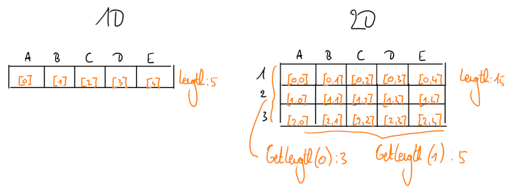

# Afsluiter: TextCell2D

## Inleiding

In deze laatste les zullen we nog een waardevolle verbetering toevoegen aan het TextCell project. Meerbepaald zullen we er voor zorgen dat we rijen _en_ kolommen hebben, zoals een echte spreadsheet.

We starten hierbij vanaf de code die we vorige keer hebben opgebouwd.

## Tweedimensionaal werken

Om deze uitbreiding te doen, onthouden we best dat een tweedimensionale array een uitbreiding is op een ééndimensionale. Je denkt altijd best na over wat er gebeurt los van de code en doet dan pas de aanpassing.

### Schematische weergave

Bekeken van uit het perspectief van de eindgebruiker:

Bekeken uit het perspectief van de programmeur:

### Aanpassing `TextCellMain`

Bij het aanmaken van het rooster, vragen we nu hoe veel rijen en hoe veel kolommen het rooster zal tellen in plaats van hoe veel cellen. We vullen deze ook allemaal op met lege stringwaarden.

### Aanpassing `WijzigCel`

In plaats van te vragen welke cel je wil wijzigen (als lettercode), vraag je nu welke rij (als getalcode) en welke kolom (nog steeds als lettercode) je wil wijzigen.

### Aanpassing `BerekenEnToonRooster`

Het is de bedoeling dat deze methode een berekende weergave van ons achterliggend rooster bepaalt. Deze berekende weergave heeft dezelfde afmetingen als ons achterliggend rooster. Verder moeten we nu meerdere niet één rij tonen, maar meerdere rijen. We nummeren de rijen voortaan ook in de visuele weergave.

### Aanpassing `KopieerCellenZonderFormule`

Het idee blijft hetzelfde: als een cel een letterlijke waarde bevat, kunnen we ze meteen overnemen in de overeenkomstige cel van de uitgerekende versie van het rooster. We moeten alleen rekening houden met het feit dat we nu niet één rij kopiëren, maar meerdere rijen.

### Aanpassing `BevatNullWaarden`

Het idee blijft hetzelfde: we doorlopen alle cellen. Als we er een tegenkomen die null bevat, is het antwoord meteen `true`.

### Aanpassing `BerekenOntbrekendeWaardenEenKeer`

Zowel ons inputrooster als ons outputrooster zijn nu tweedimensionaal. We moeten dus meerdere rijen doorlopen in plaats van één rij, maar het idee blijft hetzelfde: als we een cel tegenkomen waarvan we de waarde nog niet eerder konden invullen, bekijken zullen we bekijken of we de formule intussen kunnen uitrekenen.

### Aanpassing `BerekenOntbrekendeCelRechtstreeks`

We splitsen een som nog steeds door op zoek te gaan naar de plustekens. Het enige verschil is dat ons berekend rooster van type verandert.

### Aanpassing `WaardeVanCel`

Deze methode diende om een symbolenreeks te vertalen naar een (tekstvoorstelling van een) getal. Deze symbolenreeks kon al een getal voorstellen, of het kon een verwijzing naar een andere cel zijn. Deze verwijzingen zijn iets complexer geworden. Eerder was het gewoon een (reeks) letter(s) die een kolom aanduidde, zoals `A` of `B`. Die werden dan vertaald naar 1 of 2 en dan werd het zoveelste element van de ééndimensionale array opgezocht. Nu is een verwijzing een reeks letters (voor de kolom) gevolgd door een reeks cijfers (voor de rij). Om deze aanpassing te doen, moeten we de twee delen van elkaar scheiden. We kunnen dat doen door te kijken waar in de celnaam we het eerste cijfer tegenkomen. Eens we de rij en kolom hebben in een gebruiksvriendelijke notatie, zetten we ze om naar array indexen.

## Outro

Onze spreadsheet ziet er al een stuk nuttiger uit. Zoals eerder gezegd vormt een uitbreiding op dit project een oefening van het examen. Zorg dus dat je de code hebt, maar ook dat je de structuur ervan goed begrijpt. Je kan je ook voorbereiden door zelf wat uitbreidingen te verzinnen en deze in aangepaste kopieën van je klasse te schrijven. Enkele goede oefeningen voor jezelf:

* zorgen dat rijnummers mooi blijven weergeven boven 2 cijfers (door eerst uit te rekenen hoe veel cijfers de laatste rij nodig heeft)
* zorgen dat je kolommen vanzelf breed genoeg zijn om de breedste waarde in die kolom volledig voor te stellen (door eerst alle waarden in de kolom te doorlopen)
* positieve getalwaarden groen kleuren en negatieve getalwaarden rood kleuren
* niet alleen sommen, maar ook vermenigvuldigingen ondersteunen
* je spreadsheet omzetten naar een CSV-bestand (dat je dan zou kunnen openen in een volwaardige spreadsheet editor)
* hoofdingen en/of content automatisch centreren of rechts uitlijnen
