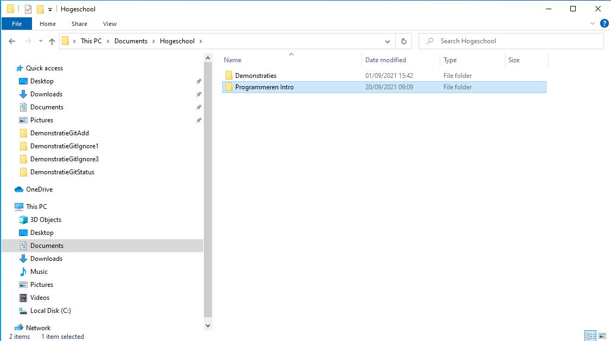
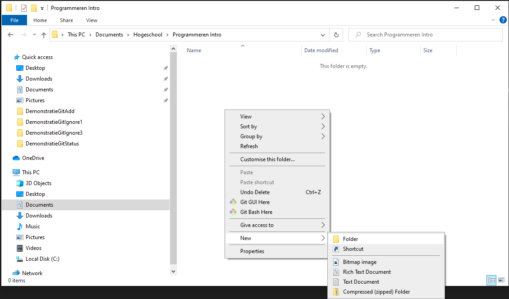
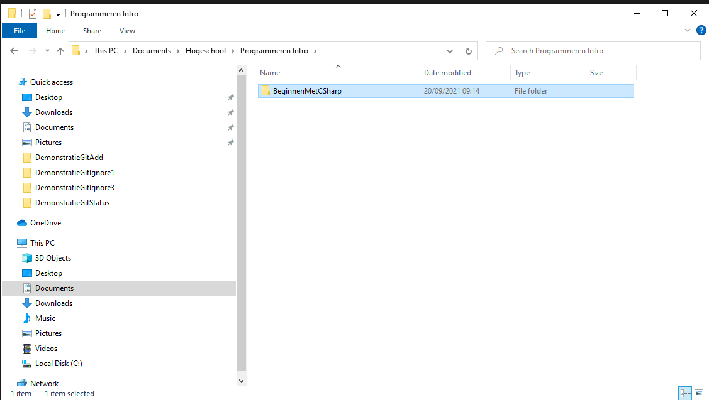
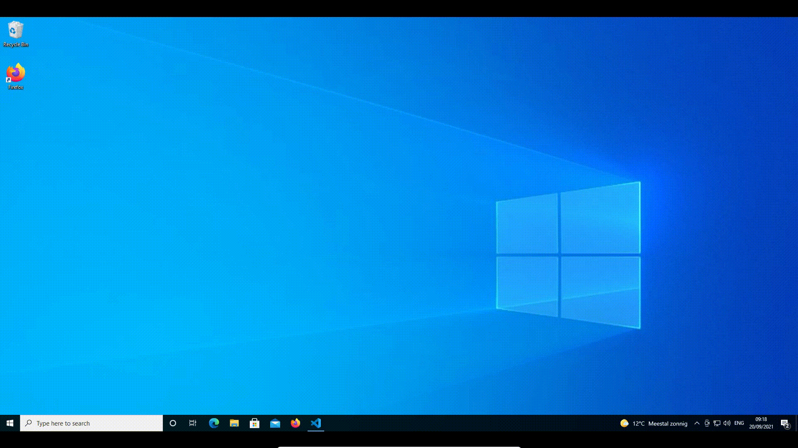

# Een C\# project maken in Visual Studio Code

## Het belang van het maken van afspraken voor het geven namen

1. We kunnen niet genoeg benadrukken hoe belangrijk het is om afspraken te maken en te volgen bij het schrijven van programma's. Goede afspraken zorgen ervoor dat je:
   1. code gemakkelijk kan delen met andere programmeurs; zonder afspraken kan je niet in een team werken;
   2. veel sneller fouten in je programma zal vinden;
   3. code leesbaar blijft, ook als je maanden later opnieuw bekijkt;
   4. sneller en beter gaan leren programmeren;
2. We vinden het warm water niet opnieuw uit en volgen de richtlijnen van Microsoft:
   1. een overzicht van alle afspraken vind je op [Naming Guidelines](https://docs.microsoft.com/en-us/dotnet/standard/design-guidelines/naming-guidelines)
   2. een overzicht van algemene afspraken, wat hier van toepassing is, vind je op [General Naming Conventions](https://docs.microsoft.com/en-us/dotnet/standard/design-guidelines/general-naming-conventions)
3. De basis voor de naamgevingsafspraken zijn:
   1. **PascalNotatie**: geen spaties tussen de woorden en alle woorden beginnen met een hoofdletter: `EenProgrammaOmJeGoedBijTeVoelen`
   2. **camelCasenotatie**: geen spaties tussen de woorden en alle woorden, behalve het eerste, beginnen met een hoofdletter, bijvoorbeeld: `eenProgrammaOmJeGoedBijTeVoelen`

## Rootmap

Ik raad jullie aan een rootmap te maken voor alle vakken die je op AP volgt. Je geeft die bijvoorbeeld de naam "AP" of "Hogeschool". Daarin maak je een map met de naam Programmeren Intro. In deze map zullen we alle projecten plaatsen die we in dit vak zullen maken.


Voor vakken waarin met Git gewerkt wordt, vermijden we mappen die automatisch gesynchroniseerd worden. Zet je rootmap dus niet in OneDrive of Dropbox of Google Drive. Dat kan voor technische problemen zorgen. Meer info vind je in [de cursus Git](https://apwt.gitbook.io/leerlijn-git/).


## **Een map voor een project maken**

Als je een nieuw project wil aanmaken, heb je er nog een map voor nodig. Een map aanmaken doe je zo, via rechtermuisklik:

Geef daarna je map een naam die omschrijft over welk project het gaat. Bijvoorbeeld BeginnenMetCSharp:

## Belangrijke bestanden voor C\# aanmaken:

Nu kunnen we deze map openen in Visual Studio Code en van daaruit een nieuw project opstarten. Hiervoor gebruiken we File -&gt; Open Folder -&gt; \(we openen de map voor ons project\) -&gt; View -&gt; Terminal -&gt; \(een tekstvenster verschijnt en we klikken daar in\) -&gt; `dotnet new console` -&gt; \(er zijn bestanden verschenen, waaronder Program.cs en een bestand met de extensie .csproj\)

