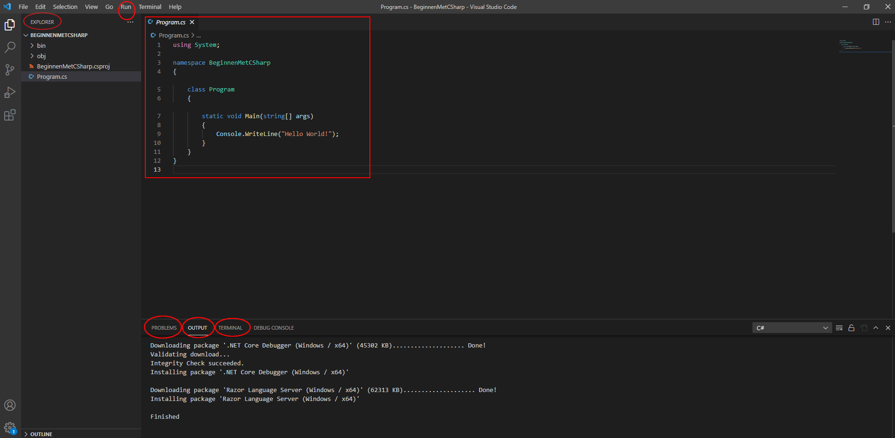
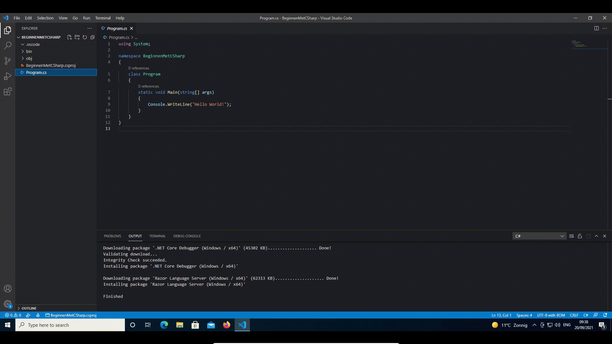
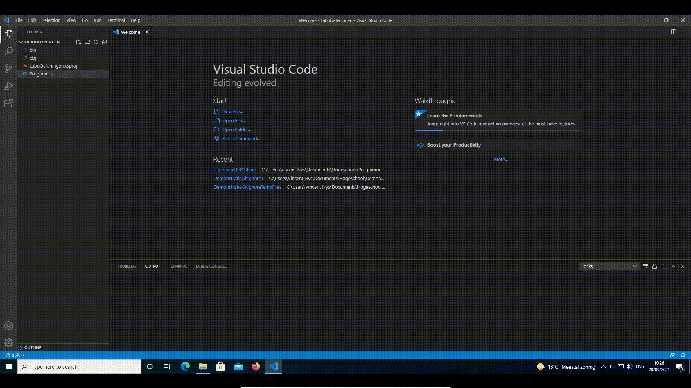
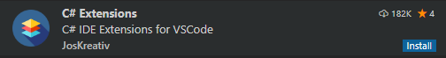

# Beginnen met C\# in Visual Studio Code

In dit onderdeel:

1. analyseren we wat Visual Studio Code voor ons gemaakt heeft;
2. gebruiken we Visual Studio Code om een C\# programma te uit te proberen;

## **IDE**

Het hele programmeerproces wordt een stuk aantrekkelijker met een handig gereedschap. En dat is het idee achter de geïntegreerde ontwikkelingsomgeving oftewel IDE \(Integrated Development Environment\). We gebruiken in deze lessen Visual Studio Code. We maken kennis met de essentiële onderdelen ervan:

* "Explorer": hier vind je een overzicht van je bestanden. De bestanden met de extensie .cs bevatten je C\#-code. Het bestand met extensie .csproj bevat "metadata", extra informatie die nodig is om je C\#-code juist te interpreteren.
* "Run": via dit menu kan je je code starten.
* Het centrale venster is je "editor". Hier staat de code waar je momenteel aan werkt.
* "Problems": als je code geen geldige C\# is, wordt dat hier gemeld. Ook waarschuwingen over zaken die wel geldig zijn, maar misschien niet doen wat je wil, komen hier. Let op: de IDE is niet slim genoeg om te raden wat je programma eigenlijk hoort te doen. Hij kan alleen aangeven dat iets de regels van C\# niet volgt, niet of het een **nuttig** programma is.
* "Output": hier komt informatie over wat Visual Studio Code zelf aan het doen is.
* "Terminal": hier kan je commando's invoeren. Als je programma aan het uitvoeren is \(zie volgend onderdeel\), verschijnt hier ook de uitvoer van je programma.

## Je programma uitvoeren


Krijg je op een gegeven moment een bericht "Required assets to build and debug are missing ... Add them?" **Klik dan op "yes".** 


Je programma uitvoeren doe je via het "Run" menu, of via de sneltoets F5. De eerste keer wordt gevraagd om wat extra instructies. Eerst kies je voor ".NET Core". Dat wordt, samen met wat extra info, opgeslagen in het bestand launch.json. In dit bestand pas je de tekst `internalConsole` aan naar `integratedTerminal`. Anders kunnen er problemen ontstaan met de `Console.ReadLine` methode, die we later nog vaak zullen gebruiken. Na deze aanpassingen kan je je programma uitvoeren en vind je onder "Terminal" de tekst "Hello World!" terug, die geproduceerd is door je programma.

## De C\# extensies installeren

Visual Studio Code is taalonafhankelijk. Om het werken met C\# te vergemakkelijken, gebruiken we een extensie. Om deze te installeren, ga je naar het extensions venster en zoek je C\#. Dan klik je op de knop "install".

Voor het gemak gebruiken we ook de extensie "C\# Extensions". Typ in de zoekbalk voor de extensies gewoon "C\#" en kies dan de extensie "C\# Extensions", als volgt:

