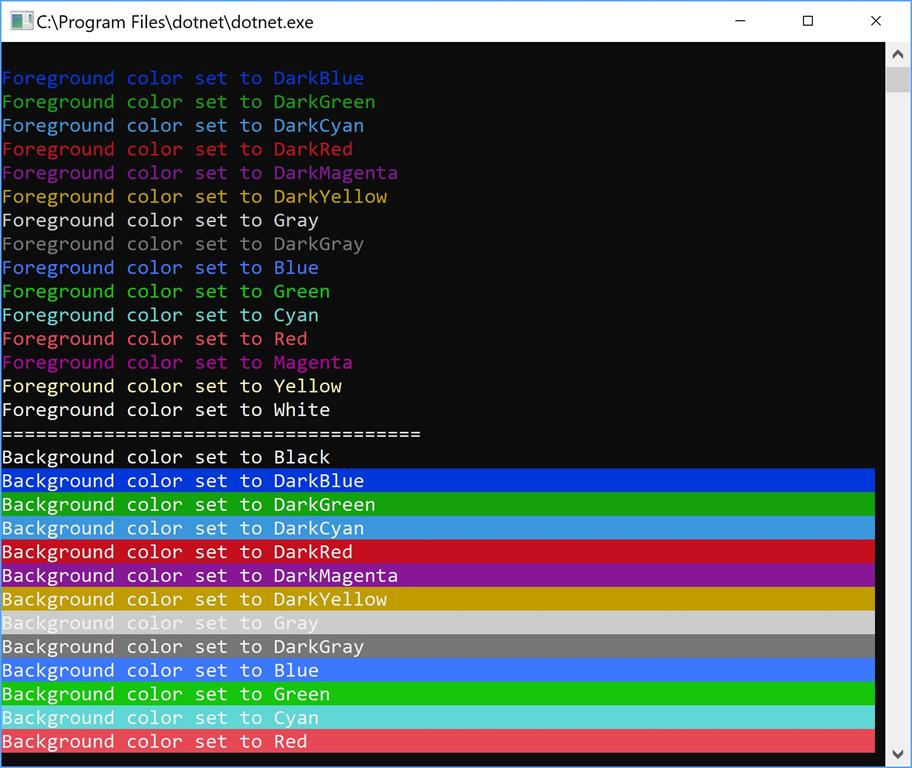

# Kleuren in Console

## Kleuren in console

Je kan in console-applicaties zelf bepalen in welke kleur nieuwe tekst op het scherm verschijnt. Je kan zowel de kleur van het lettertype instellen \(via `ForegroundColor`\) als de achtergrondkleur \(`BackgroundColor`\).

Je kan met de volgende expressies de console-kleur veranderen, bijvoorbeeld de achtergrond in blauw en de letters in groen:

```csharp
Console.BackgroundColor = ConsoleColor.Blue;
Console.ForegroundColor = ConsoleColor.Green;
```

Vanaf dan zal alle tekst die je na deze 2 expressies via `WriteLine` naar het scherm stuurt met deze kleuren werken.

Een voorbeeld:

```csharp
Console.WriteLine("Tekst in de standaard kleur");
Console.BackgroundColor = ConsoleColor.Blue;
Console.ForegroundColor = ConsoleColor.Green;
Console.WriteLine("Deze tekst komt in het groen met blauwe achtergrond");
Console.ForegroundColor = ConsoleColor.Red;
Console.WriteLine("En deze in het rood met blauwe achtergrond");
```

Als je deze code uitvoert krijg je als resultaat:



Kleur in console gebruiken is nuttig om je gebruikers een minder eentonig en meer informatieve applicatie aan te bieden. Je zou bijvoorbeeld alle foutmeldingen in het rood kunnen laten verschijnen.


## Kleur resetten

Soms wil je terug de originele applicatie-kleuren hebben. Je zou manueel dit kunnen instellen, maar wat als de gebruiker slecht ziend is en in z'n besturingssysteem andere kleuren als standaard heeft ingesteld?!

De veiligste manier is daarom de kleuren te resetten door de `Console.ResetColor()` methode aan te roepen zoals volgend voorbeeld toont:

```csharp
Console.ForegroundColor = ConsoleColor.Red;
Console.WriteLine("Error!!!! Contacteer de helpdesk");
Console.ResetColor();
Console.WriteLine("Het programma sluit nu af");
```

## Mogelijke kleuren

Alle kleuren die beschikbaar zijn zijn beschreven in `ConsoleColor` deze zijn:

* `ConsoleColor.Black`
* `ConsoleColor.DarkBlue`
* `ConsoleColor.DarkGreen`
* `ConsoleColor.DarkCyan`
* `ConsoleColor.DarkRed`
* `ConsoleColor.DarkMagenta`
* `ConsoleColor.DarkYellow`
* `ConsoleColor.Gray`
* `ConsoleColor.DarkGray`
* `ConsoleColor.Blue`
* `ConsoleColor.Green`
* `ConsoleColor.Cyan`
* `ConsoleColor.Red`
* `ConsoleColor.Magenta`
* `ConsoleColor.Yellow`



