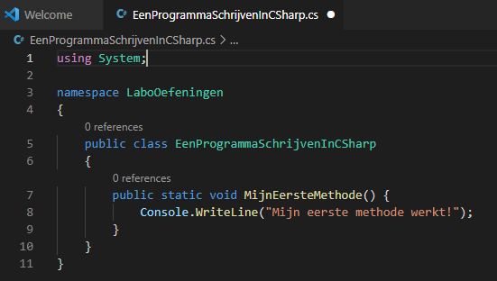
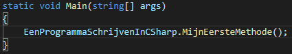
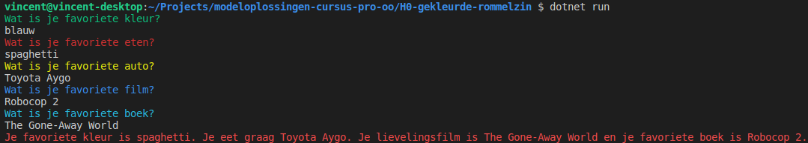

# Oefeningen

## Structuur van je oefeningen

Om je oefeningen ordelijk bij te houden, gaan we al een aantal zaken gebruiken die je pas verder in de cursus in detail leert. Hieronder krijg je een korte inleiding.

### Stap 1: een project LaboOefeningen maken

Volg hiervoor de instructies op [Een C# project maken in Visual Studio Code](3-een-c-project-maken-in-visual-studio.md).

### Stap 2: een klasse maken `EenProgrammaSchrijvenInCSharp`

Dit is nieuw. Klassen zijn een extra organisatie-eenheid van code. Ze spelen een grote rol in objectgeoriënteerd programmeren, maar kunnen ook gebruikt worden om stukken code verder te groeperen. Dit is voorlopig het enige dat wij er mee zullen doen.


Dit zal alleen werken als je de extensies juist hebt geïnstalleerd! Zie [Beginnen met C# in Visual Studio Code](4-beginnen-met-c-in-visual-studio.md).


In de verkenner kies je via rechterklik voor "New C# class". Je noemt deze `EenProgrammaSchrijvenInCSharp.cs`. De extensie `.cs` geeft aan dat het om een bestand gaat met daarin C#-code.

### Stap 3: een eigen methode maken

Een definitie van een methode bevat één taak die kan worden uitgevoerd. Onze eerste oefenprogramma's zullen telkens één methode zijn. De werking van methodes wordt verder in de cursus in detail omschreven. **Soms moet je eerst iets overnemen voor je de functie van elk onderdeeltje kan begrijpen!**

Neem aandachtig volgende code over, zodat jouw bestand **exact** dit bevat:



Belangrijke onderdelen:

* `using System;` maakt onderdelen uit de `System` namespace toegankelijk. Zonder dit kan je geen gebruik maken van `Console`.
* `namespace LaboOefeningen` geeft aan dat alles wat binnen de buitenste accolades (de symbolen op regels 4 en 11) staat behoort tot die namespace. Het is de "achternaam" van jouw code. Als er bijvoorbeeld twee stukken code `EenProgrammaSchrijvenInCSharp` zijn, kan je ze uit elkaar houden door te zeggen over welke namespace het gaat. Dit is hetzelfde als twee personen die dezelfde voornaam hebben, maar een andere achternaam.
* `public`: hier komen we pas een stuk later op terug. Voorlopig zetten we het standaard bij klassen en methoden.
* `class`: zie dit voorlopig als een verdere onderverdeling van je code. Eigenlijk zijn klassen veel meer dan dat, maar dat is voor later.
* `static`: dit is sowieso nodig wanneer we klassen enkel zien als een verdere onderverdeling van je code. We zetten het bij onze methoden.
* `void`: voorlopig zetten we dit altijd bij onze methoden. Het betekent ongeveer: "deze methode voert een commando uit, eerder dan een antwoord te geven op een vraag".
* `MijnEersteMethode`: dit is de naam van onze methode. We kiezen deze zelf.
* `()`: dit betekent dat de methode geen extra informatie nodig heeft om uit te voeren. Soms zetten we ook zaken tussen deze haakjes, de zogenaamde "parameters". Dit komt later aan bod.
* Alles tussen de accolades op regel 7 en 9: de "body" van de methode. Dit is eigenlijk wat er gebeurt als we de methode gebruiken.

### Stap 4: je eigen methode oproepen

Standaard voert de code in de klasse `Program`, in de methode `Main` uit. Dat is het beginpunt van ons programma. We kunnen de body van `Main` aanpassen. We zullen hierin aangeven dat onze eigen methode moet worden opgeroepen als volgt:



We noemen de code in de body een "oproep" van de methode `MijnEersteMethode`. Hierin staat niet hoe die methode werkt. Er staat alleen dat we ze willen gebruiken.

### Stap 5: opkuisen

Je mag nu zowel de definitie als de oproep van `MijnEersteMethode` wissen. In de oefeningen die volgen, maak je telkens nieuwe methodes. Test ze telkens uit door de **oproep** te vervangen.** Laat de definitie staan** wanneer je overgaat naar de volgende oefening. Later zullen we een keuzemenu maken dat ons toestaat makkelijk een oefening naar keuze te demonstreren.

## Oefening: H1-MijnEersteProgramma

### **Leerdoelen**

* een eigen programma kunnen uitvoeren
* input en output via `Console.ReadLine` en `Console.WriteLine`

### **Functionele analyse**

Binnen een zgn. dos-box wordt een titel weergegeven, nl. dit is mijn eerste c# programma.\
Vervolgens wordt gevraagd je naam te noteren.\
Wanneer je je naam hebt genoteerd en op enter hebt gedrukt, verschijnt de tekst “hallo \[en je ingegeven naam]”.

### **Technische analyse**

#### voorbeeldinteractie(s)

.png>)

### Technische hulp

maak een methode met de naam `MijnEersteProgramma`

#### Programmaverloop

Wat het lezen en schrijven van tekst betreft moet gebruik gemaakt worden `Console.WriteLine` en `Console.ReadLine`.

#### Testscenario's

* Probeer meer dan 200 tekens in te voeren
* Probeer geen tekst in te voeren

## Oefening: H1-rommelzin

### Leerdoelen

* een eigen programma kunnen uitvoeren
* input en output via `Console.ReadLine` en `Console.WriteLine`
* de computer leren zien als "domme verwerker"

### Functionele analyse

Dit programma verwerkt tekst die door de gebruiker wordt ingetypt. Het print nieuwe berichten die deze tekst bevatten uit. Het print niet de berichten die je verwacht: het zal de antwoorden door elkaar halen en je favoriete kleur tonen wanneer het beweert je favoriete eten te tonen, enzovoort. De verbanden worden duidelijk uit de voorbeeldinteractie.

### Technische analyse

#### Organisatie van de code

Schrijf dit programma als een methode met de naam `Rommelzin` binnen de klasse `EenProgrammaSchrijvenInCSharp`. Test uit door deze methode op te roepen binnen de `Main` methode.

#### voorbeeldinteractie(s)

```
Wat is je favoriete kleur?
> blauw
Wat is je favoriete eten?
> spaghetti
Wat is je favoriete auto?
> Toyota Aygo
Wat is je favoriete film?
> Robocop 2
Wat is je favoriete boek?
> The Gone-Away World
Je favoriete kleur is spaghetti. Je eet graag Toyota Aygo. Je lievelingsfilm is The Gone-Away World en je favoriete boek is Robocop 2.
```

### Technische hulp

#### Programmaverloop

Per regel die getoond wordt op het scherm, maak je gebruik van `Console.WriteLine`. Per regel die je zelf intypt, maak je gebruik van `Console.ReadLine`. Zorg zelf voor de juiste ondersteunende code.

#### Testscenario's

* Test uit met een héél lang stuk tekst (meer dan 200 tekens) voor je favoriete kleur.
* Test uit met tekst met internationale karakters, bijvoorbeeld de ç.
* Ga na wat er gebeurt als je een lege regel invoert, dus als je meteen op ENTER duwt wanneer gevraagd wordt om invoer.

## Oefening: H1-gekleurde-rommelzin

### Leerdoelen

* de kleur van tekst in de console aanpassen
* herhaling van de leerdoelen uit H1-rommelzin

### Functionele analyse

Dit programma werkt net als H1-rommelzin, maar elke regel die aan de gebruiker wordt getoond, krijgt een andere kleur. De namen van de kleuren die je gebruikt (in deze volgorde) zijn:

1. `DarkGreen`
2. `DarkRed`
3. `DarkYellow`
4. `Blue`
5. `Cyan`
6. `Red`

### Technische analyse

#### Organisatie van de code

Schrijf deze oefening als een nieuwe methode met de naam `GekleurdeRommelzin` in de klasse `EenProgrammaSchrijvenInCSharp`. Test uit door deze methode op te roepen binnen de `Main` methode.

#### voorbeeldinteractie(s)



### Technische hulp

#### Programmaverloop

Voor elke regel die in kleur getoond wordt, wissel je de voorgrondkleur. Op de juiste plaatsen in de code herstel je de oorspronkelijke kleuren van de terminal.

#### Testscenario's

* Test opnieuw uit met een kleur, maaltijd, auto, film en boek naar keuze.
