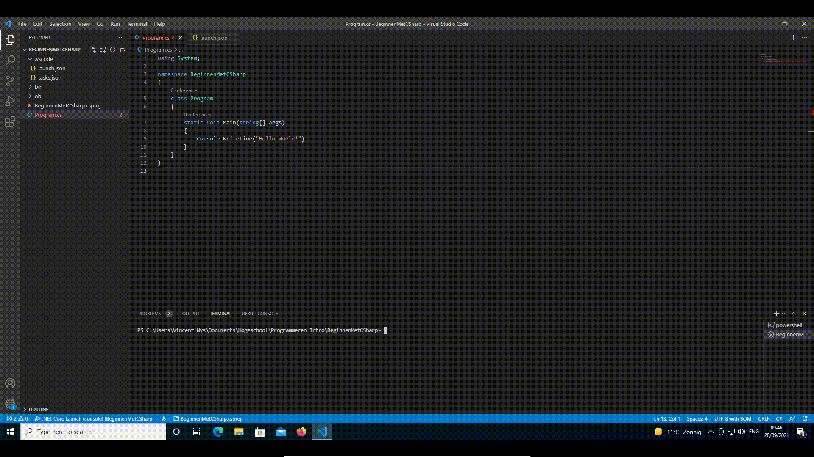

# Fouten in je code


[Kennisclip voor deze inhoud](https://youtu.be/seZ8MfWdRf4)




Je code kan niet gecompileerd en uitgevoerd worden zolang er fouten in je code staan.


### Opzettelijk een fout maken

We willen zien wat er gebeurt als er een fout in het programma staat. We verwijderen het puntkomma aan het einde van het statement in de Main functie. We vervangen

```csharp
Console.WriteLine("Hello World!");
```

door

```csharp
Console.WriteLine("Hello World!")
```

Het enige dat we hebben gewijzigd is de puntkomma op het einde.

### Opzettelijke fout testen

Probeer het programma opnieuw uit te voeren. Je krijgt een melding dat er iets mis is. Vink eerst aan dat er onthouden moet worden wat je nu doet en geef dan aan dat je de fouten wil tonen via "Show Errors". Dit geeft je een overzicht, waarin je opmerkt dat er iets niet klopt op de regel en in de kolom waar de puntkomma ontbreekt. In de screenshot staat \[9,46\] en dat wijst op regel 9 van de code, positie 46. Waar de puntkomma moet staan, dus.



Je ziet ook dat het haakje net na "World!" rood onderlijnd is. Dat wijst op de positie van de fout. Let op: ook hier weet de ontwikkelomgeving niet precies wat je uiteindelijk wil, dus zie dit eerder als een hint.

### Fout corrigeren

Plaats de puntkomma opnieuw op het einde van het statement op regel 9.

### Opnieuw testen

Voer het programma opnieuw uit door op F5 te duwen.

## Meest voorkomende fouten

De meest voorkomende fouten in deze eerste weken zullen zijn:

* **Puntkomma** vergeten.
* **Schrijffouten** in je code RaedLine i.p.v. ReadLine.
* Geen rekening gehouden met **hoofdletter gevoeligheid** Readline i.p.v. ReadLine \(zie volgende hoofdstuk\).
* Per ongeluk **accolades verwijderd**.
* Code geschreven op plekken waar dat niet mag.

