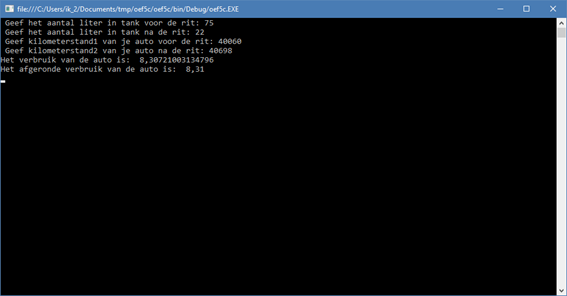

# Oefeningen

## Oefening: H1-variabelen\_hoofdletters

### Leerdoelen

* gebruik van variabelen om input en output via `Console.ReadLine` en `Console.WriteLine` op te slaan en terug te tonen

### Functionele analyse

Een applicatie vraagt je tekst in te voeren die dan daarna zal worden getoond met allemaal hoofdletters.

### Technische analyse

#### UI

console applicatie

#### voorbeeldinteractie\(s\)


### Technische hulp

#### Programmaverloop

Lees de gebruikersinvoer van de console en slaag dit op in een variabele.

Zet de inhoud van deze variabele om in hoofdletters. Je kan dit doen door `ToUpper()` toe te voegen aan een variabele van het type `string`. Bijvoorbeeld `myText.ToUpper()` in plaats van `myText`.

Uiteindelijk geef je dan deze variabele weer in de console.

#### Testscenario's

* Voer tekst in met spaties
* Voer tekst in van meer dan 100 karakters
* Voer tekst in van 1 karakter
* Voer geen tekst in

### Ondersteunend materiaal

Hou het voorlopig op de cursus.

## Oefening: H1-optellen

### Leerdoelen

* gebruik van variabelen om input via `Console.ReadLine` op te slaan 
* berekeningen met de opgeslagen data uitvoeren
* het resultaat dat werd opgeslagen in een variabele via `onsole.WriteLine` te tonen

### Functionele analyse

Een applicatie vraagt je twee getallen in te voeren. Na de invoer van het tweede getal worden beide getallen bij elkaar opgeteld. Het resultaat wordt uiteindelijk weergeven.

### Technische analyse

#### UI

console applicatie

**Werking**

1. De vraag wordt gesteld om een getal in te typen en daarna op enter/return te drukken.
2. Er wordt gevraagd een tweede getal in te typen en dan op enter/return te drukken.
3. De twee getallen worden opgeteld.
4. Het resultaat wordt weergegeven.

#### voorbeeldinteractie\(s\)

```text
Wat is het eerste getal?
> 1
Wat is het tweede getal?
> 4
De som is 5.
```

### Technische hulp

#### Programmaverloop

Lees de gebruikersinvoer van de console en slaag dit op in een variabele voor wat het eerste getal betreft. Herhaal dit voor het tweede getal. Tel de twee getallen samen en bewaar deze in een derde variabele. Uiteindelijk geef je dan de inhoud van deze derde variabele weer in de console. Tip: getal1 = Convert.ToInt32\(invoer1\);

#### Testscenario's

* Voer tekst in.
* Voer een getal met 100 cijfers in.
* Voer geen getal in.

### Ondersteunend materiaal

Hou het voorlopig op de cursus.

## Oefening: H1-verbruik-wagen

### Leerdoelen

* gebruik van variabelen om input via `Console.ReadLine` op te slaan 
* berekeningen met de opgeslagen data uitvoeren
* het resultaat dat werd opgeslagen in een variabele via `onsole.WriteLine` te tonen

### Functionele analyse

Een applicatie zal voor jou het gemiddelde verbruik van een wagen berekenen.

Hiervoor worden volgende vragen gesteld:

1. Hoeveel liter is er nog aanwezig in de benzinetank. 
2. Hoeveel liter zit er nog in de benzinetank na de rit. 
3. Ook de kilometerstand van bij de aanvang van de rit wordt gevraagd en ook deze nadat de rit werd uitgevoerd. 

Op basis van deze parameters wordt het gemiddelde verbruik berekend en weergegeven.

### Technische analyse

#### UI

console applicatie

**Werking**

1. De vraag wordt gesteld om het aantal liter, aanwezig in de benzinetank, op te geven. 
2. Daarna wordt gevraagd om ook het aantal liter op te geven na de rit. 
3. De kilometerstand van de aanvang van de rit wordt gevraagd. 
4. Uiteindelijk ook de kilometerstand na het beëindigen van de rit wordt opgevraagd.

#### voorbeeldinteractie\(s\)


De screenshot vermeldt het afgeronde verbruik, maar dat hoef je niet te tonen. De instructie om af te ronden heb je nog niet gezien.




### Technische hulp

#### Programmaverloop

Lees de gebruikersinvoer van de console en slaag dit op in variabelen.

Zorg ervoor dat je het juiste gegevenstype kiest voor de verschillende variabelen.

Nadien voer je de berekening uit om op basis van de ingevoerde gegevens het gemiddeld verbruik te berekenen \(100 \* \(aantalLiterinTank1 - aantalLiterinTank2\) / \(kilometerstand2 - kilometerstand1\)\)

Uiteindelijk geef je dan het resultaat weer in de console.

#### Testscenario's

* Voer tekst in.
* Voer een getal met 100 cijfers in.
* Voer geen getal in.

### Ondersteunend materiaal

Hou het voorlopig op de cursus.

## Oefening: H1-beetje-wiskunde

### Leerdoelen

* expressies schrijven
* voorrang van operatoren
* effect van operaties naargelang datatype begrijpen

### Functionele analyse

Je schrijft een programma dat de rol vervult van een rekenmachine. Het voert volgende berekeningen uit:

* -1 + 4 \* 6
* \( 35+ 5 \) % 7
* 14 + -4 \* 6 / 11
* 2 + 15 / 6 \* 1 - 7 % 2

### Technische analyse

#### UI

console applicatie

#### voorbeeldinteractie\(s\)

```text
23
5
12
3
```

### Technische hulp

#### Programmaverloop

Eerst wordt een resultaat berekend, daarna wordt het geprint.

#### Testscenario's

* Test uit met getallen van het type `int`.
* Test uit met getallen van het type `float`.

### Ondersteunend materiaal

[Hier](https://www.programiz.com/csharp-programming/operator-precedence-associativity) vind je een tabel terug die uitlegt welke operaties voorrang hebben.

## Oefening: H1-gemiddelde

### Leerdoelen

* expressies schrijven
* voorrang van operatoren
* effect van operaties naargelang datatype begrijpen

### Functionele analyse

Je schrijft een programma dat het gemiddelde van 18, 11 en 8 berekent, d.w.z. deze drie getallen optelt en de som deelt door drie.

### Technische analyse

#### UI

console applicatie

#### voorbeeldinteractie\(s\)

```text
12
```

### Technische hulp

#### Programmaverloop

Eerst wordt het resultaat berekend, daarna wordt het geprint.

#### Testscenario's

* Test uit met getallen van het type `int`.
* Test uit met getallen van het type `float`.

### Ondersteunend materiaal

Hou het voorlopig op de cursus.

## Oefening: H1-maaltafels

### Leerdoelen

* de console leegmaken
* werken met wiskundige operatoren
* interactie met de gebruiker

### Functionele analyse

Je schrijft een programma dat de tafel van vermenigvuldiging voor 411 geeft. Dit programma wacht steeds tot de gebruiker op ENTER duwt voor het het volgend resultaat toont. Verder maakt het steeds het scherm leeg voor het een nieuw resultaat toont. Zie "programmaverloop".

### Technische analyse

#### UI

console applicatie

#### voorbeeldinteractie\(s\)

```text
1 * 411 is 411.
```

```text
2 * 411 is 822.
```

\(enzovoort\)

```text
10 * 411 is 4110.
```

### Technische hulp

#### Programmaverloop

Voor elk resultaat wordt het scherm eerst leeggemaakt. Daarna pas wordt het resultaat getoond. Wanneer de gebruiker op ENTER duwt, wordt deze handeling herhaald voor het volgende resultaat \(of eindigt het programma, na het tiende resultaat\). Het scherm leegmaken doe je met `Console.Clear()`. Plaats 411 ook in een variabele.

#### Testscenario's

* Test uit zoals gegeven.
* Test uit voor 511. Je zou maar één teken in je code moeten aanpassen als je de instructies hebt gevolgd.

### Ondersteunend materiaal

Hou het voorlopig op de cursus.

## Oefening: H1-ruimte

### Leerdoelen

* werken met kommagetallen

### Functionele analyse

Je massa is overal dezelfde en wordt uitgedrukt in kilogram. Je gewicht daarentegen is afhankelijk van de zwaartekracht van de plek waar je bent en wordt uitgedrukt in Newton. Je hebt dus een ander gewicht op andere planeten. Zo is je gewicht veel groter op Jupiter dan op Mars, omdat Jupiter meer zwaartekracht uitoefent dan Mars. Schrijf een programma dat je gewicht op aarde omzet naar je gewicht op een ander hemellichaam. Je krijgt volgende omzettingstabel:

* Mercurius: 0.38 \(een persoon van 100kg voelt zich alsof hij 38kg weegt\) 
* Venus: 0.91
* Aarde: 1.00 \(een persoon van 100kg voelt zich alsof hij 100kg weegt\)
* Mars: 0.38
* Jupiter: 2.34
* Saturnus: 1.06
* Uranus: 0.92
* Neptunus: 1.19
* Pluto: 0.06 

### Technische analyse

#### UI

console applicatie

#### voorbeeldinteractie\(s\)

```text
Op Mercurius heb je een schijnbaar gewicht van 26.22kg.
Op Venus heb je een schijnbaar gewicht van 62.79kg.
Op Aarde heb je een schijnbaar gewicht van 69kg.
Op Mars heb je een schijnbaar gewicht van 26.22kg.
Op Jupiter heb je een schijnbaar gewicht van 161.46kg.
Op Saturnus heb je een schijnbaar gewicht van 73.14kg.
Op Uranus heb je een schijnbaar gewicht van 63.48kg.
Op Neptunus heb je een schijnbaar gewicht van 82.11kg.
Op Pluto heb je een schijnbaar gewicht van 4.14kg.
```

### Technische hulp

#### Programmaverloop

Plaats je gewicht in een variabele. Kies zelf een geschikt type.

#### Testscenario's

* Test uit voor je eigen gewicht.
* Test uit voor het gewicht van een persoon met een massa van 100kg.

### Ondersteunend materiaal

Hou het voorlopig op de cursus.

