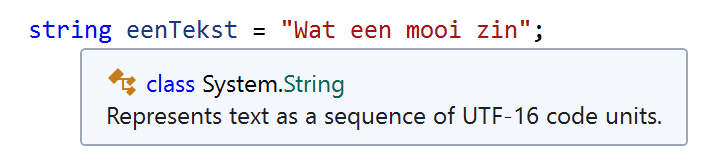

# Strings en chars

## Char

Een **enkel karakter** \(cijfer, letter, leesteken, etc.\) als 'tekst' opslaan kan je doen door het `char`-type te gebruiken. Zo kan je bijvoorbeeld een enkel karakter als volgt tonen:

```csharp
char eenLetter = 'X';
Console.WriteLine("eenLetter=" + eenLetter);
```

Het is belangrijk dat je de apostrof \(`'` \) niet vergeet voor en na het karakter dat je wenst op te slaan daar dit de literal voorstelling van `char`-literals is \(zie ook [hier](../h1-variabelen-en-datatypes/1_datatypes.md)\).

Je kan eender welk [UNICODE-teken](https://en.wikipedia.org/wiki/Unicode) in een `char` bewaren, namelijk letters, cijfers en speciale tekens zoals `%`, `$`, `*`, `#`, etc. Merk dus op dat volgende lijn: `char eenGetal = '7';` weliswaar een getal als teken opslaat, maar dat intern de compiler deze variabele steeds als een character zal gebruiken. Als je dit cijfer zou willen gebruiken als effectief cijfer om wiskundige bewerkingen op uit te voeren, dan zal je dit eerst moeten converteren naar een getal \(zie [Convert en Casting](../h3-werken-met-data/4_converteren_casting.md)\).

## String

Een string is een reeks van 0, 1 of meerdere `char`-elementen, zoals je ook kan zien als je even met je muis boven een string keyword _hovert_ in je code:



### Strings declareren

Merk op dat we bij een string literal gebruik maken van aanhalingstekens \(`"`\) terwijl bij chars we een apostrof gebruiken \(`'`\). Dit is de manier om een string van een char te onderscheiden.

Volgende code geeft dus drie keer het cijfer 1 onder elkaar op het scherm, maar de eerste keer behelst het een char \(enkelvoudig teken\), dan een een string \(reeks van tekens\) en dan een int \(effectief getal\):

```csharp
char eenKarakter = '1'; 
string eenString = "1"; 
int eenGetal = 1;

Console.WriteLine(eenKarakter);
Console.WriteLine(eenString);
Console.WriteLine(eenGetal);
```

De output van dit programma zal dan zijn:

```text
1
1
1
```

Fout gebruik van strings en chars zal code geven die niet zal gecompileerd worden:

```csharp
char eenKarakter = "1"; //fout
string eenString = '1'; //fout
int eenGetal = '1'; //fout
```

1. In de eerste toekenning proberen we dus een literal van het type **string** toe te kennen een variabele van het type **char**.
2. In de tweede toekenning proberen we een literal van het type **char** toe te kennen een variabele van het type **string**.
3. In de laatste toekenning proberen we een literal van het type **char** toe te kennen aan een variabele van het type **int**.

## Escape characters

Naast letters en tekens mogen in string en chars ook escape characters staan. Escape characters worden met een backslash \(`\`\) gestart, gevolgd door het karakter dat we wensen te tonen. In C\# hebben bepaalde tekens namelijk een speciale functie, zoals de dubbele aanhalingstekens \(`"`\) om het begin of einde van een string-literal aan te geven.

Zonder aan te geven dat we letterlijk dat teken willen tonen, en het niet in z’n C\# functie gebruiken, zouden we problemen krijgen.

Denk bijvoorbeeld aan de apostrof… Volgende code zou de compiler verkeerd interpreteren, daar hij denkt dat we een leeg karakter wensen op te slaan:

```csharp
char apostrof= ''';
```

De juiste manier is om het teken dus door een backslash vooraf te laten gaan:

```csharp
char apostrof= '\'';
```

Er zijn echter nog een heleboel andere escape characters die je geregeld zal moeten gebruiken, waaronder `\n` om een nieuwe lijn aan te geven en \t om een tab in de tekst te plaatsen.

Er zijn verschillende escape characters in C\# toegelaten, we lijsten hier de belangrijkste op \(voor een totaal overzicht kijk [hier](https://blogs.msdn.microsoft.com/csharpfaq/2004/03/12/what-character-escape-sequences-are-available/)\):

* `\'` – Single quote, needed for character literals
* `\"` – Double quote, needed for string literals
* `\\` – Backslash
* `\n` – New line \(zogenaamde 'enter'\)
* `\t` – Horizontal tab 
* `v\uxxxx` – Unicode escape sequence for character with hex value xxxx

Je kan in grote Unicode-tabellen opzoeken wat de unicode \(voorstelling van het teken in een geheel getal\) van eender welk teken is. Je kan deze code dan gebruiken om eender welk teken, zelfs die die niet op je toetsenbord staan, toch te gebruiken. Je kan de unicode opzoeken op [https://unicode-table.com/en/](https://unicode-table.com/en/).

> Wil je weten hoe je coole 'console'-tekeningen kan maken? Kijk dan zeker naar de appendix-sectie ["Vreemde tekens in console tonen"](../../semester-1-appendix/prostuff/).

### Escape characters in strings

We gebruiken vooral escape characters in strings, om bijvoorbeeld witregels en tabulaties aan te geven. Test bijvoorbeeld volgende lijn eens:

```csharp
string eenString = "Eerst een zin.\t dan een zin na een tab \n Dan eentje op een nieuwe regel";
```

Het is belangrijk dat je vlot kan werken met escape characters in string, daar we dit geregeld nodig zullen hebben.

**De belangrijkste escape chars zijn: `\t \n \" \'`**

`\a` mag je enkel gebruiken als je een koptelefoon op hebt daar dit het escape character is om de computer een biep te laten doen \(mogelijk doet dit niets bij jou, dit hangt van de je computerinstellingen af\).

### Optellen van char

Stel dat we volgende char-variabelen aanmaken. Bij string mogen we de +-operator gebruiken om 2 strings aan elkaar te plakken. Bij char mag dat niet!

```csharp
char letter1 = 'A';
char letter2 = 'B';
Console.WriteLine(letter1 + letter2);
```

**Wanneer je deze code uitvoert dan krijg je `131` te zien?!**

Had je dit verwacht? Herinner je dat het char-type z’n waarde als getallen bijhoudt, de zogenaamde UNICODE voorstelling van het karakter. Als de compiler het volgende ziet staan:

`letter1 + letter2`

dan zal de compiler deze twee waarden letterlijk optellen en het nieuw verkregen getal als resultaat geven:

* De UNICODE voorstelling van `A` is 0X041 oftewel **`65`** decimaal \(zie [hier](https://unicode-table.com/en/#0041)\)
* `B` is **`66`** decimaal
* als we dus de variabelen `letter1` en `letter2` optellen geeft dit **131**.

