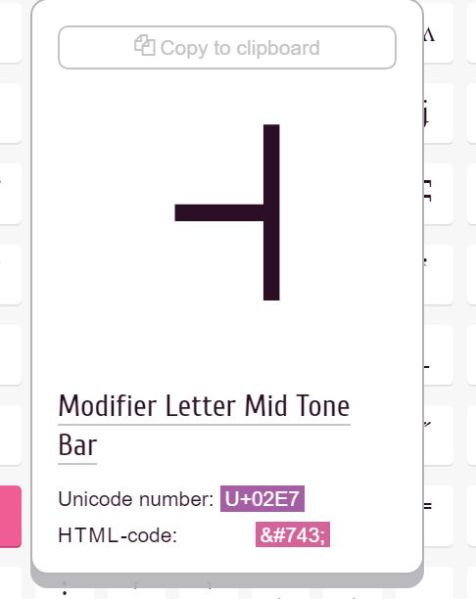

# Unicode tonen

## Unicode tonen

Niets is zo leuk als de vreemdste tekens op het scherm tonen. In oude console-games werden deze tekens vaak gebruikt om _complexe_ tekeningen op het scherm te tonen: om je filmpjes nog cooler te maken leggen we daarom uit hoe je dit kan doen, gebruikmakende van je kennis over converteren.


### Unicode karakters tonen

Zonder een uitleg te geven over het verschil tussen ASCII en Unicode is het vooral belangrijk te weten dat je best met Unicode werkt.

1. Zoek het teken\(s\) dat je nodig hebt in een Unicode-tabel \([deze is handig](https://unicode-table.com/en/)\)
2. Plaats bovenaan je Main: `Console.OutputEncoding = System.Text.Encoding.UTF8;`
3. Je kan nu op 2 manieren dit teken in console plaatsen

#### Manier 1: copy/paste

Kopieer het karakter zelf en plaats het in je code waar je het nodig hebt, bijvoorbeeld:

```csharp
Console.WriteLine("˧");
```

#### Manier 2: hexadecimale code casten naar char

Noteer de hexadecimale code van het karakter dat in de tabel staat.



In dit geval is de code 0x02e7.

Om dit teken te tonen schrijf je dan:

```csharp
char blokje = (char)0x02e7;
Console.WriteLine(blokje);
```

In C\# schrijf je hexadecimale getallen als volgt als je ze rechstreeks in een string wilt plaatsen: \u02e7

Wil je dus bovenstaande teken schrijven dan kan dan ook als volgt:

```csharp
Console.WriteLine("\u02e7");
```

## Ascii-art tonen

Soms zou je multiline ASCII-art willen tonen in je C\# applicatie. Dit kan je eenvoudig oplossen door gebruik te maken van het `@` teken voor een string.

Stel dat je een toffe titel of tekening via een van volgende sites hebt gemaakt:

* [Asciiflow.Com](http://asciiflow.com/)
* [Ascii title generator](http://patorjk.com/software/taag/#p=display&f=Graffiti&t=Type%20Something%20)
* [Ascii generator](http://www.network-science.de/ascii/)

Je kan het resultaat eenvoudig naar je klembord kopiëren en vervolgens in je C\#-code integraal copy pasten als literal voor een `string` op voorwaarde dat je het laat voorafgaan door `@"` en uiteraard eindigt met `";`.

Bijvoorbeeld:

```csharp
string myname=@"
___________________   
\__    ___/\______ \  
  |    |    |    |  \ 
  |    |    |    `   \
  |____|   /_______  /
                   \/ ";

Console.WriteLine(myname);
```

