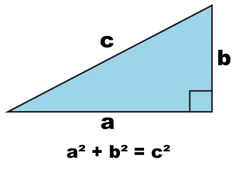

# Oefeningen

\*\*\*\*

**Sla de oefeningen van dit hoofdstuk op in een klasse `HoofdstukVier`, behalve de oefeningen rond apdotcom.**


Krijg je tijdens deze oefeningen onverwachte of vreemde resultaten? Gebruik de debugger!


## H4-BMI-berekenaar

### Leerdoelen

* gebruik van de `Math` klasse
* kommagetallen parsen
* stringinterpolatie en formattering

### Functionele analyse

Maak een programma dat aan de gebruiker z'n lengte en gewicht vraagt en vervolgens z'n berekende BMI \(Body Mass Index\) toont.

### Technische analyse

De formule voor de BMI is BMI = kg / m², waarbij kg het de massa van een persoon \(in kilogram\) voorstelt en m zijn lengte in meter \(dus typisch als kommagetal tussen 1 en 2\). Gebruik stringinterpolatie om alle uitvoer met twee cijfers na de komma te tonen.

Noem je methode voor deze oefening `BMIBerekenaar`.

#### voorbeeldinteractie\(s\)

```text
Hoeveel weeg je in kg?
> 69,0
Hoe groot ben je in m?
> 1,78
Je BMI bedraagt 21,78.
```

## H4-Pythagoras

### Leerdoelen

* gebruik van de `Math` klasse
* kommagetallen parsen
* stringinterpolatie en formattering

### Functionele analyse

Schrijf een programma dat de stelling van Pythagoras toepast. Anders gezegd: bereken de lengte van de schuine zijde als je de lengte kent van de twee rechthoekige zijden.



### Technische analyse

Je moet de gebruiker eerst om `a` en om `b` vragen. Maak dan gebruik van `Math` om de som van de kwadraten te bepalen en vervolgens om de vierkantswortel van die som te achterhalen.


De vierkantswortel, in het Engels, is de "square root". Een voorbeeld: de vierkantswortel van 49 is 7, want 7² = 7 \* 7 = 49.


Noem je methode voor deze oefening `Pythagoras`.

#### voorbeeldinteractie\(s\)

```text
Geef de lengte van de eerste rechthoekszijde: 
> 4
Geef de lengte van de tweede rechthoekszijde:
> 3
De lengte van de schuine zijde is 5
```

## H4-Cirkels

### Leerdoelen

* gebruik van de `Math` klasse
* kommagetallen parsen
* stringinterpolatie en formattering

### Functionele analyse

Schrijf een programma dat de omtrek en oppervlakte van een cirkel met een gegeven straal bepaalt.

### Technische analyse

Je moet de gebruiker eerst om de straal van de cirkel vragen. De omtrek van een cirkel wordt gegeven door de formule omtrek = 2 \* π \* straal. De oppervlakte wordt gegeven door de formule straal² \* π.

Noem je methode voor deze oefening `Cirkels`.

#### voorbeeldinteractie\(s\)

```text
Geef de straal:
> 5
De omtrek van een cirkel met straal 5 is 31,42.
De oppervlakte is 78,54.
```

## H4-orakeltje

### Leerdoelen

* werken met willekeurige getallen

### Functionele analyse

Maak een orakel/waarzegger, namelijk de kleine broer of zus van het [Orakel van Delphi](https://nl.wikipedia.org/wiki/Orakel_van_Delphi). Het programma zal aan de gebruiker vertellen hoe lang deze nog zal leven. Bijvoorbeeld: "Je zal nog 34 jaar leven.".

Het orakel zal enkel voorzichtige voorspellingen doen. Met andere woorden, de gebruiker zal minstens 20 jaar ouder worden en hooguit 125 jaar ouder.

### Technische analyse

Je moet hier een willekeurig getal bepalen en dat dan in een mooie vorm presenteren aan de gebruiker. Gebruik hiervoor de klasse `Random`.

Noem je methode voor deze oefening `Orakeltje`.

#### voorbeeldinteractie\(s\)

```text
Hoe oud ben je nu?
> 24
Je zal nog 20 jaar leven. Je zal dus 44 worden.
```

```text
Hoe oud ben je nu?
> 50
Je zal nog 64 jaar leven. Je zal dus 114 worden.
```

## Oefening: apdotcom \(deel 1\)

### Leerdoelen

* tussenresultaten bijhouden
* invoer verwerken
* resultaten formatteren
* getaltypes

### Functionele analyse

We zullen een uitgebreider programma maken, dat we apdotcom noemen. Het is een systeem om bestellingen te plaatsen. In de loop van de cursus zullen we er nog vaak op terugkomen, zodat we naar een nuttiger en realistischer systeem bewegen.

In deze eerste versie moet je de prijzen van een paar producten ingeven en de aantallen die je van deze prijzen wil aankopen. Op het einde kan je ook een kortingsbon toepassen.

### Technische analyse

Maak een aparte klasse `APDotCom`. Maak daarin een methode `Bestel`. Deze methode vraagt om de prijs van een boek, een CD, een servies en een springkasteel. Daarna vraagt ze om de prijs per stuk. Ten slotte om de waarde van een kortingsbon, uitgedrukt als een geheel percentage. Dan wordt een overzicht gegeven van de kosten en krijg je de totaalprijs.

Zorg ervoor dat je code maar één keer de totaalprijs voor korting berekent en deze in een variabele bijhoudt. Dan kan je makkelijk de totaalprijs na korting bepalen.

Toon alle geldbedragen met twee cijfers na de komma, zelfs als de laatste cijfers `00` zijn.

Als je ergens 10% korting op krijgt, betekent dat dat je de prijs met 0.9 mag vermenigvuldigen want 1 - \(10/100\) = 0.9.

#### voorbeeldinteractie\(s\)

```text
Prijs van een boek?
> 12.00
Prijs van een CD?
> 9.95
Prijs van een servies?
> 75
Prijs van een springkasteel?
> 150
Aantal boeken?
> 4
Aantal CD's?
> 2
Aantal serviezen?
> 1
Aantal springkastelen?
> 1
Percentage korting?
> 40
Uw kasticket
------------
boek x 4: 48.00
CD x 2 : 19.90
servies x 1: 75.00
springkasteel x 1: 150.00
KORTING: 40%
TOTAAL VOOR KORTING: 292.90
TOTAAL: 175.74
```

## Oefening: apdotcom \(deel 2\)

### Leerdoelen

* verwerken Random

### Functionele analyse

De markt wordt gestuurd door vraag en aanbod. Alle items hebben dan wel een vaste prijs, maar schijnbaar willekeurige factoren bepalen de prijs die in de winkel gevraagd wordt.

### Technische analyse

Maak in de klasse `APDotCom` een methode `BestelMetVraagEnAanbod`. Deze methode werkt zoals eerder, maar verhoogt of verlaagt de basisprijs van elk item met willekeurig met maximum 50%.

#### voorbeeldinteractie\(s\)

```text
Basisprijs van een boek?
> 12.00
Basisprijs van een CD?
> 9.95
Basisprijs van een servies?
> 75
Basisprijs van een springkasteel?
> 150
Aantal boeken?
> 4
Aantal CD's?
> 2
Aantal serviezen?
> 1
Aantal springkastelen?
> 1
Percentage korting?
> 40
Uw kasticket
------------
vraag en aanbod boeken: 20%
vraag en aanbod CD's: -18%
vraag en aanbod serviezen: 10%
vraag en aanbod springkastelen: 48%
boek x 4: 57.60
CD x 2 : 16.32
servies x 1: 82.50
springkasteel x 1: 222
KORTING: 40%
TOTAAL VOOR KORTING: 378.42
TOTAAL: 227.05
```

## 

