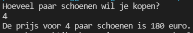

# Oefeningen

Al deze oefeningen maak je in een klasse `Beslissingen`

## **Oefening: H4-Schoenenverkoper**

#### Leerdoelen

* flowchart omzetten naar conditionele code
* Eenvoudige conditie
* Uitbreiding: samengestelde booleaanse expressie

**Functionele analyse**

**Basis**: Maak een programma dat aan de gebruiker vraagt hoeveel paar schoenen hij/zij wenst te kopen. Ieder paar schoenen kost normaal 50 euro. Indien de gebruiker 2 paar of meer koopt, is er 10% korting. Toon aan de gebruiker de totale prijs.

**Uitbreiding**: Breid in een tweede stap je programma uit zodat de korting enkel geldt als de gebruiker een klantenkaart heeft.

**Technische analyse**

Maak een methode met de naam `SchoenenVerkoper`. Maak gebruik van een `if. `Zet volgende flowchart om in code. Een `Real` in Flowgorithm stemt overeen met een `double` in C#.

**Basis**:

.png>)

 **Uitbreiding:**

#### **Voorbeeldinteractie(s)**

**Basis:**

**Uitbreiding:**

## **Oefening: H4-EvenOneven**

#### **Leerdoelen**

* flowchart omzetten naar conditionele code
* tweevoudige conditie
* gebruik modulo

#### **Functionele analyse**

Maak een programma dat aan de gebruiker een geheel getal vraagt. Het programma geeft terug of het ingegeven getal even of oneven is.

#### **Technische analyse**

Maak een methode met de naam `EvenOneven`.

Een getal is even als de rest van de deling door 2 nul is. Hiervoor kan je de modulo operator gebruiken. Het teken voor de modulo is het `%` -teken.\
Voorbeelden:\
7%2 geeft 1 => 7 is oneven\
8%2 geeft 0 => 8 is even

Zet volgende flowchart om in code:

#### **Voorbeeldinteractie(s)**

## **Oefening: H4-PositiefNegatiefNul**

#### **Leerdoelen**

* flowchart omzetten naar conditionele code
* meervoudige conditie

#### **Functionele analyse**

Maak een programma dat aan de gebruiker een geheel getal vraagt. Het programma geeft terug of het ingegeven getal positief, negatief of 0 is.

#### **Technische analyse**

Maak een methode met de naam `PositiefNegatiefNul`.

Maak gebruik van een `if `– `else if` - `else`.

Zet volgende flowchart om in code:

**Voorbeeldinteractie(s)**

## **Oefening: H4-BMIBerekenaar**

#### **Leerdoelen**

* meervoudige conditie
* gebruik van `else if`

#### **Functionele analyse**

Maak een programma om de BMI van de gebruiker te berekenen. ([Meer info over BMI](https://nl.wikipedia.org/wiki/Queteletindex)) De BMI wordt berekend aan de hand van de lengte en het gewicht van de persoon.

De formule is: BMI = gewicht / lengte².

Je toont niet enkel de BMI maar ook een beoordeling over de BMI:

\-       BMI lager dan 18,5 => ondergewicht

\-       BMI vanaf 18,5 maar lager dan 25 => normaal gewicht

\-       BMI vanaf 25 maar lager dan 30 => overgewicht

\-       BMI vanaf 30 maar lager dan 40 => zwaarlijvig

\-       BMI hoger dan 40 => ernstige obesitas

####  **Technische analyse**

Maak een methode met de naam `BMIBerekenaar`.

Maak gebruik van een `if `– `else if` – `else if` …

#### **Voorbeeldinteractie**

## **Oefening: H4-GrootsteVanDrie**

#### **Leerdoelen**

* meervoudige conditie
* samengestelde booleaanse expressie
* gebruik van `else if`

#### **Functionele analyse**

Maak een programma om van 3 ingegeven getallen, het grootste te bepalen.

#### **Technische analyse**

Maak een methode met de naam `GrootsteVanDrie`.

Maak gebruik van een `if `– `else if` - `else`

**Voorbeeldinteractie**

## **Oefening: H4-Examens**

#### **Leerdoelen**

* conditie
* samengestelde booleaanse expressie

#### **Functionele analyse**

Maak een programma waarmee je aan de gebruiker het resultaat van 3 examens opvraagt. De opgevraagde resultaten zijn de behaalde punten op 100. Om te slagen moet de student een gemiddelde van meer dan 50% hebben én maximaal 1 onvoldoende.

#### **Technische analyse**

Maak een methode met de naam `Examens`.

Maak gebruik van een `if `– `else`.

**Voorbeeldinteractie**

## Oefening: H4-Wet van Ohm

#### Leerdoelen 

\-        conditionele berekeningen

#### Functionele analyse

De Wet van Ohm houdt in dat een elektrische stroom (voorgesteld als I) gelijk is aan een spanningsverschil (U) gedeeld door een weerstand (R), dus I = U / R.

Vraag aan de gebruiker wat hij wenst te berekenen: Spanning, Weerstand of Stroomsterkte. Vraag vervolgens de twee andere waarden. Als dus de gebruiker "Spanning" kiest, vraag je aan de gebruiker de waarden van de stroomsterkte en de weerstand. Bereken m.b.v. de Wet van Ohm de gewenste waarde en toon aan de gebruiker.

#### Technische analyse 

Maak een nieuwe methode genaamd `WetVanOhm`.

Denk eraan dat de gegeven formule wiskundig gedefinieerd is. Houd rekening met het feit dat deze drie maten uitgedrukt kunnen worden in kommagetallen.

#### **V**oorbeeldinteractie(s)

## Keuzemenu's maken

#### Leerdoelen: 

\-        Conditionele functionaliteit

#### Functionele analyse: 

We willen dat de gebruiker een menu ter beschikking heeft om eerst te kiezen uit welk hoofdstuk er een oefening moet gekozen worden en vervolgens welke oefening er moet uitgevoerd worden.

#### Technische analyse

Maak in je klasse Program een hoofdmenu. Deze methode laat de gebruiker kiezen uit één van de hoofdstukken. Na de keuze wordt het scherm leeggemaakt en dan wordt de methode `Keuzemenu` van de juiste klasse opgeroepen.\
Elke klasse die je tot hiertoe in dit project gemaakt hebt, voorzie je dus van een methode Keuzemenu, zodat de gebruiker kan kiezen uit de oefeningen (=methodes) binnen het gekozen hoofdstuk.

#### Voorbeeldinteractie

