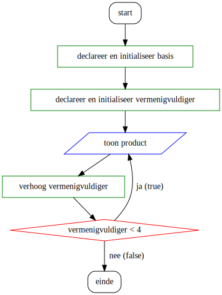
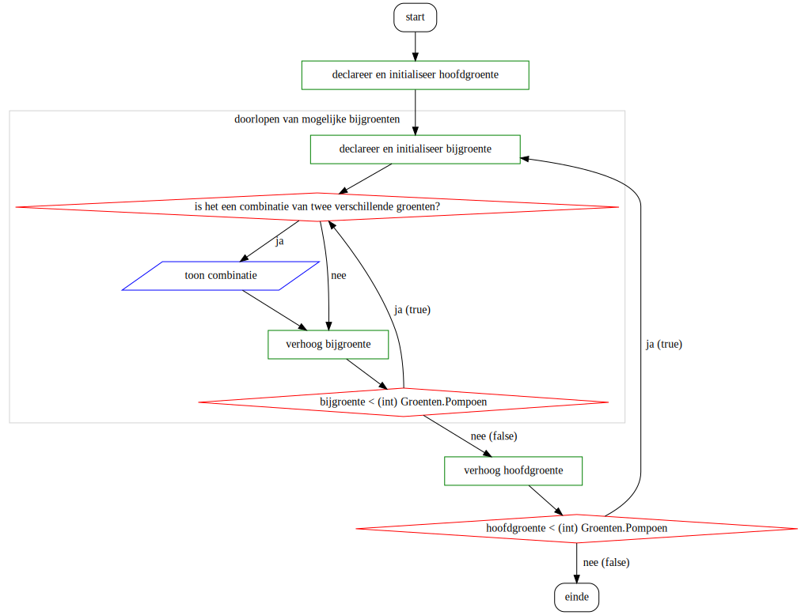

# Nesting

## Geneste loops

Het is toegelaten een lus binnenin een andere lus te schrijven. Technisch brengt dit geen enkel nieuw concept met zich mee, maar het kan wel een uitdaging zijn om dit proces te begrijpen.

We spreken steeds over de **outer loop** als de omhullende of "grootste" loop. Waarbij de binnenste loop de **inner loop** is.


Wij beperken ons tot één niveau van nesting, maar je raadt misschien al dat je ook een lus in een lus in een lus kan schrijven.



[Kennisclip](https://youtu.be/QPCowROx0rE)


### Voorbeeld: echte maaltafels

In [de oefening rond maaltafels](broken-reference) hebben we de maaltafels van een specifiek getal, de "basis", laten zien. We hebben hiervoor volgende flowchart gevolgd:



Dit is niet hoe je de maaltafels op school hebt geleerd. Je hebt eerder iets geleerd in de aard van:

* 1 x 1 is 1
* 1 x 2 is 2
* ... (nog 8 regels die beginnen met "1 x", dan nog 89 regels die je wel kent)
* 10 x 10 is 100

Als we deze maaltafels willen reproduceren, moeten we niet alleen de vermenigvuldiger (het tweede getal) aanpassen, maar moeten we onze code herhalen **voor elke basis van 1 tot 10**. Code herhalen voor verschillende waarden is nu net waarvoor we loops hebben gebruikt. In flowchartvorm kan je dit zo noteren (het afgebakende deel stemt overeen met onze simpelere versie van de maaltafels):

.svg>)

We kunnen dit omzetten naar een lus als eerder. Als we het afgebakende deel zien als één blok code, merken we dat "declareer en initialiseer basis" de setup is van een lus, "basis < 11" de voorwaarde om uit te voeren, "verhoog basis" de stap die na een uitvoering wordt genomen. Dat levert volgende code op als je kiest voor een for-lus:

```csharp
for(int basis = 1; basis < 11; basis++) {
    for(int vermenigvuldiger = 1; vermenigvuldiger < 11; vermenigvuldiger++) {
        Console.WriteLine($"{basis} x {vermenigvuldiger} is {basis * vermenigvuldiger}");
    }
}
```


De flowchart sluit meer aan bij een `do`-`while`, maar als je op voorhand vastlegt hoe vaak een lus moet uitvoeren, levert een `for` vaak cleanere code op.


### Voorbeeld: soep maken

Bij een geneste lus varieert de binnenste lus sneller dan de buitenste lus. Dit zorgt ervoor dat alle combinaties van mogelijke waarden worden gemaakt.

Soep maak je typisch met een hoofdgroente en een bijgroente. We zullen een soepgenerator schrijven door alle combinaties van een hoofdgroente en een bijgroente te tonen:



```csharp
enum Groenten {
  Tomaat,
  Paprika,
  Wortel,
  Selder,
  Pompoen
}

public static void GenereerSoepen() {
    for(int hoofdGroente = (int) Groenten.Tomaat; hoofdGroente <= (int) Groenten.Pompoen; hoofdGroente++) {
        for(int bijGroente = (int) Groenten.Tomaat; bijGroente <= (int) Groenten.Pompoen; bijGroente++) {
            if(hoofdGroente != bijGroente) {
                Console.WriteLine($"{hoofdGroente} en {bijGroente}");
            }
        }
    }
}
```

### Voorbeeld: chronometer

Een voorbeeld van een geneste lus dat je zeker kent is een klok. Hierin doorloop je alle uren van de dag, maar binnenin elk uur doorloop je alle minuten. Als flowchart wordt dat:

.svg>)

In code wordt dit:

```csharp
for(int minuut=0; minuut < 60; minuut++) {
  for(int seconde=0; seconde < 60; seconde++) {
    Console.WriteLine($"{minuut:D2}:{seconde:D2}");
    System.Threading.Thread.Sleep(1000);
  }
}
```

Bovenstaande code is makkelijk uitbreidbaar naar uren en hondersten van seconden door nog meer lussen toe te voegen, maar we beperken ons tot één niveau van nesting.


**Een nuttige vuistregel: **als je een proces hebt waarbij twee of meer variabelen sytematisch wijzigen, maar de ene wijzigt sneller dan de andere, dan is een geneste loop waarschijnlijk een goede keuze.


## `break` of `continue` in nested loop

Let er op dat `break` je enkel uit de huidge loop zal halen. Indien je dit dus gebruik in de inner loop dan zal de outer loop nog steeds voortgaan. Nog een reden om zéér voorzichtig om te gaan in het gebruik van `break`. Idem voor `continue`.
