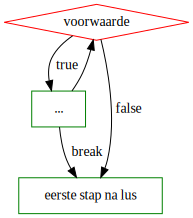
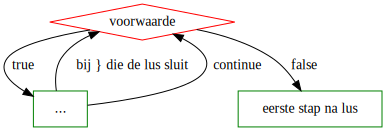

# Break en continue


[Kennisclip](https://youtu.be/VVG_Iri0v48)


Niet elke flowchart of elk stappenplan van een herhalend proces kan mooi in een van de behandelde lusstructuren gegoten worden. Dat is niet noodzakelijk een slechte zaak. Het kost wat flexibiliteit, maar leidt tot meer overzichtelijke code.

Toch zijn er twee constructies die de zuivere lusstructuur doorbreken die we hier zullen behandelen, omdat je ze in echte code regelmatig aantreft: de `break` instructie en de `continue` instructie.

### `break`

Als we een actieve lus volledig willen beëindigen, schrijven we `break`. Dit statement verlaat dan de `for`, `while` of `do-while` lus waarin de break rechtstreeks is ingebed. Dit kan je gebruiken als je vaststelt dat het niet meer zinvol is het proces voort te zetten.

In flowchartvorm ziet dit er zo uit:



Volgende code \(die geen goede schrijfstijl is\) telt bijvoorbeeld maar tot vijf:

```csharp
public static void Tel() {
    for(int i = 1; i <= 100; i++) {
        Console.WriteLine(i);
        if (i == 5) {
            break;
        }
    }
    Console.WriteLine("Ik ben klaar voor vandaag!");
}
```

Zoals we verder zullen zien, is het mogelijk een lus in een lus te plaatsen. Een `break` in de binnenste lus verlaat alleen de binnenste lus!

### `continue`

Als we een actieve lus willen herstarten, schrijven we `continue`. Dit statement is vergelijkbaar met break, maar springt niet naar code na de lus, wel naar het einde van de lus. In het geval van een `for`-lus wordt na een `continue` de update-stap nog uitgevoerd.

In flowchartvorm:



Merk op: je zou dus aan het einde van elke loop body die je al hebt `continue` kunnen schrijven en dat zou geen effect hebben.

Volgende code demonstreert dit statement:

```csharp
public static void Tel() {
    for(int i = 1; i <= 100; i++) {
        if (i == 5) {
            continue;
        }
        Console.WriteLine(i);
    }
    Console.WriteLine("Ik ben klaar voor vandaag!");
}
```

Het getal 5 verschijnt niet op het scherm.


Nogmaals: je kan een lus met `break` of `continue` altijd herschrijven zodat ze deze constructies niet bevat. Vaak doe je dit met een hulpvariabele en/of een extra conditioneel blok.


