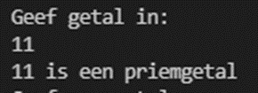

# Oefeningen

Al deze oefeningen maak je in een klasse `Loops`

## Oefeningen WHILE en DO WHILE

## Oefening: H5-CountDown

### **Leerdoelen**

* flowchart omzetten naar code
* gebruik van een `while`-lus

### **Functionele analyse**

Je vraagt de gebruiker een positief geheel getal en vervolgens ga je aftellen. Alle getallen vanaf dat getal tot 1 worden getoond onder elkaar. Na het tonen van het laatste getal toon je “Start!”.

### **Technische analyse**

Maak een methode met de naam `CountDown`

Zet volgende flowchart om in code:

#### **Voorbeeldinteractie(s)**

#### **Testscenario's**

Voer een negatief getal in.

## Oefening: H5-Wachtwoord

## **Leerdoelen**

* Gebruik van een `do while`-lus

### **Functionele analyse**

De gebruiker wordt gevraagd om een wachtwoord in te geven totdat het juiste antwoord (“AP”) wordt gegeven. Toon daarna “Wachtwoord in orde!”.

Tel ook het aantal pogingen dat de gebruiker nodig had om het juiste antwoord te geven en toon het aantal pogingen.

### **Technische analyse**

Maak een methode met de naam `Wachtwoord`

Zet volgende flowchart om in code:

#### **Voorbeeldinteractie(s)**

#### **Testscenario's**

·       Duw meteen op ENTER

## Oefening: H5-Gemiddelde

### **Leerdoelen**

* Gebruik van een `while `of `do while` lus.

### **Functionele analyse**

Bereken het gemiddelde van een aantal ingegeven getallen. De invoer van de getallen stopt met ingeven van de waarde 0.

### **Technische analyse**

Maak een methode met de naam `Gemiddelde`. Het gemiddelde bereken je door de ingegeven getallen te delen door het aantal ingegeven getallen. De 0 die de reeks getallen stopt, wordt niet meegeteld als ingegeven getal.

Werk een oplossing uit met gebruik van een while lus of een do while lus. Zorg ervoor dat je gemiddelde ook de cijfers na de komma bevat.

**Voorbeeldinteractie(s**

#### &#x20;**Testscenario's**

* Test met negatieve waarden
* Geef dadelijk een 0 in. Wat wordt er dan getoond als waarde van het gemiddelde en wat betekent dit?

## Oefening: H5-Feestje

### **Leerdoelen**

·       Gebruik van een `while `met samengestelde booleaanse expressie

### **Functionele analyse**

Je organiseert een feestje en met een programma ga je de inschrijvingen noteren. Je kan echter maximaal 20 personen inschrijven én je kan elk moment beslissen dat je geen volgende persoon meer wil inschrijven. Op het einde toon je alle namen van de ingeschrevenen.

### **Technische analyse**

Maak een methode met de naam `Feestje`

Werk een oplossing uit met gebruik van een while lus.

#### **Voorbeeldinteractie(s)**

#### **Testscenario's**

* Geef dadelijk “nee” in.
* Probeer meer dan 20 personen in te schrijven.

## Oefening: H5-AantalDigits

### **Leerdoelen**

* Gebruik van een `do while`

### **Functionele analyse**

Schrijf een programma dat het aantal cijfers in een getal telt (het getal 12348 heeft bijvoorbeeld 5 cijfers). Het is de bedoeling dat je dit doet met een loop, dus **niet door het getal als tekst te behandelen**.

### **Technische analyse**

Maak een methode met de naam `AantalCijfers`

Het is de bedoeling dat je het aantal digits telt  met een do while loop, dus niet door het getal als tekst te behandelen.

#### **Voorbeeldinteractie(s)**

## Oefening: H5-SomEvenGetallen

### **Leerdoelen**

* Gebruik van een `while `met een geneste `if`.
* Flowchart omzetten in code

### **Functionele analyse**

Schrijf een programma dat de som maakt van alle even getallen van 1 tot een waarde n. Toon niet enkel de eindsom maar ook alle even getallen met de tussentijdse sommen.

### **Technische analyse**

Maak een methode met de naam `SomEvenGetallen`

Zet volgende flowchart om in code:

#### **Voorbeeldinteractie(s)**

#### **Testscenario's**

* Druk dadelijk op ENTER.
* Geef 0 in.
* Geef 1 in.

## Oefening: H5-Factoren

### **Leerdoelen**

* Gebruik van een `while `met geneste `if`’s.

### **Functionele analyse**

Schrijf een programma een getal _n_ ontbindt in [factoren](https://nl.wikipedia.org/wiki/Factorisatie). Factoren zijn de getallen waardoor je _n_ kan delen zonder rest (van bijvoorbeeld het getal 100 zijn de factoren 1,2,4,5,10,20,25,50,100.

### **Technische analyse**

Maak een methode met de naam `Factoren`

Gebruik een while loop. Gebruik een extra if om ervoor te zorgen dat er op het einde van de factoren geen komma teveel staat.

#### **Voorbeeldinteractie(s)**

#### **Testscenario's**

* Geef 0 in.
* Geef 1 in.
* Geef een negatief getal in.
* Geef een priemgetal in.

## Oefening: H5-RNA

### Leerdoelen

·       Gebruik van een `do while` met geneste `if`.

### Functionele analyse

DNA heeft steeds een RNA-complement (DNA is het gevolg van RNA transscriptie). Schrijf een programma dat een ingevoerde DNA-string omzet naar een RNA-string. De gebruiker voert steeds 1 DNA-nucleotide (m.a.w. één letter) in per keer en duwt op enter, de RNA string wordt steeds groter. De omzetting is als volgt:

·       G wordt C

·       C wordt G

·       T wordt A

·       A wordt U

·       “stop” dan stopt de gebruiker met letters ingeven en wordt het resultaat getoond.

·       Andere letters of meer dan één letter worden genegeerd

### Technische analyse

Noem de methode voor deze oefening `RNATranscriptie`.

#### Voorbeeldinteractie(s)

#### **Testscenario's**

* Geef andere letters in dan G, T, C of A.
* Geef meerdere letters in.
* Geef een getal in.
* Druk op ENTER.

## Oefening: H5-boekhouder

### Leerdoelen

* Gebruik van een `do while `met geneste `if`
* Gebruik van een oneindige lus

### Functionele analyse

Maak een 'boekhoudprogramma': de gebruiker kan continu positieve en negatieve getallen invoeren. Dit programma houdt volgende zaken bij:

·       de totale balans

·       de som van de positieve getallen

·       de som van de negatieve getallen

·       het gemiddelde

### Technische analyse

Maak een methode met de naam `Boekhouder`&#x20;

Voor de eerste drie zaken kom je toe met een variabele. Voor de laatste is dit lastiger, omdat elk nieuw getal een kleiner effect heeft op het gemiddelde dan het vorige. Je houdt beter een teller bij met het aantal ingevoerde getallen. Dan is het gemiddelde de totale balans gedeeld door het aantal ingevoerde getallen.

#### voorbeeldinteractie(s)

&#x20;(Dit programma kan blijven verder lopen zo lang je wil.)

#### **Testscenario's**

·       Druk dadelijke op ENTER.&#x20;

## Oefeningen FOR

## Oefening: H5-VanMin100Tot100

### **Leerdoelen**

* Gebruiken van een `for`-lus
* Aanpassen 'update'
* Flowchart omzetten in code

### **Functionele analyse**

Basis: Toon alle natuurlijke getallen van -100 tot 100.

Uitbreiding: Toon alle even natuurlijke getallen van -100 tot 100.

### **Technische analyse**

Maak een methode met de naam `VanMin100Tot100`.

Zet volgende flowcharts om in code: (als er geen update vermeld is, wordt de wachtervariabele verhoogd met 1)

**Basis:**

**Uitbreiding:**

**voorbeeldinteractie(s)**

**Basis**

Uitbreiding:

## Oefening: H5-EenTafel

### **Leerdoelen**

* Gebruiken van een `for`-lus

### **Functionele analyse**

Vraag aan de gebruiker van welk getal de tafel van vermenigvuldiging tot 10 moet getoond worden.\
Toon elke vermenigvuldiging onder elkaar.

### **Technische analyse**

Maak een methode met de naam `EenTafel`.

**voorbeeldinteractie(s)**

**Testscenario's**

Geef 0 in.

## Oefening: H5-Veelvouden6En8

### **Leerdoelen**

* Gebruiken van een `for`-lus met een geneste `if `met een samengestelde booleaanse expressie

### **Functionele analyse**

Toon alle getallen van 1 tot en met 100 die een veelvoud zijn 6 en die een veelvoud zijn van 8.

### **Technische analyse**

Maak een methode met de naam `Veelvouden6En8`.

**voorbeeldinteractie(s)**

&#x20;

## Oefening: H5-Priemchecker

### **Leerdoelen**

* Gebruiken van een `for`-lus met geneste `if`.

### **Functionele analyse**

Je krijgt een getal van de gebruiker. Je moet nagaan of dit een priemgetal is, d.w.z. of het precies 2 gehele delers heeft.

### **Technische analyse**

Maak een methode met de naam `PriemChecker`.

Elk geheel getal vanaf 2 heeft minstens 2 gehele delers: 1 en zichzelf. Als dat de enige delers van het gegeven getal zijn, is het priem. Je kan dus nagaan of een getal een priemgetal is door alle getallen vanaf 2 tot het getal zelf te overlopen en na te gaan of deze delers zijn van het getal.\
Je mag veronderstellen dat de gebruiker minstens 2 intypt**.**

**voorbeeldinteractie(s)**

**Testscenario's**

Test met een negatief getal.

## Oefening: H5-PriemGenerator

### **Leerdoelen**

* Gebruiken van een `while `lus met een geneste `for `lus

### **Functionele analyse**

Je toont de priemgetallen tussen een laagste waarde en een hoogste waarde die door de gebruiker worden ingegeven.

### **Technische analyse**

Maak een methode met de naam `PriemGenerator`.

Je kan een deel van de code van de vorige oefening gebruiken

**voorbeeldinteractie(s)**

**Testscenario's**

Test met een negatieve laagste waarde.

&#x20;
