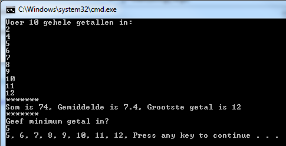
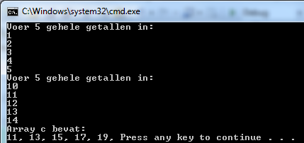
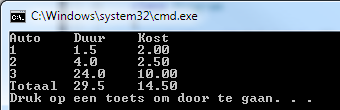
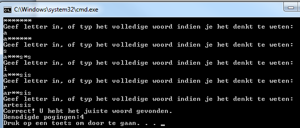

# Oefeningen deel 1

> Een aantal oefeningen is geïnspireerd op oefeningen van [Exercism.io](https://exercism.io/tracks/csharp/exercises).

## Opwarmers

Een kort programma om op te warmen. Iedere opdracht hieronder is een apart programma \(uiteraard mag je dit ook in 1 project oplossen\).

Gebruik steeds een loop om dit op te lossen.

* Maak een array gevuld met de getallen 0 tot 10
* Maak een array gevuld met de getallen van 100 tot 1
* Maak een array gevuld met de letters a tot z
* Maak een array gevuld met willekeurige getallen tussen 1 en 100 \(de array is 20 lang\)
* Maak een array gevuld met afwisselend `true` en `false` \(de array is 30 lang\)

Per array: output de array naar het scherm, maar ieder element naast elkaar met komma gescheiden. Dus niet:

```text
true
false
true
\\etc
```

maar wel: `true, false, true, ...`

### ArrayOefener 1

Maak een programma dat aan de gebruiker vraagt om 10 waarden \(int\) in te voeren in een array. Vervolgens toont het programma de som, het gemiddelde en het grootste getal van deze 10.

Vervolgens vraagt het programma de gebruiker om een getal in te voeren. Het programma toont dan alle getallen die groter of gelijk zijn aan dit ingevoerde getal zijn die in de array aanwezig zijn. Indien geen getallen groter zijn dan verschijnt een bericht `Niets is groter` op het scherm.



### ArrayOefener 2

Maak een programma dat aan de gebruiker vraagt om 2 keer 5 getallen in te voeren. Bewaar de eerste reeks waarden in een array A, de tweede reeks waarden in array B. Maak een nieuwe array C aan die steeds de som bevat van het respectievelijke element uit arrays A en B. Toon het resultaat.



### Vraag Array

Maak een array die 6 strings kan bevatten. Ieder element van de array bevat een vraag \(naar keuze te verzinnen\) als string waar de gebruiker met een getal op moet antwoorden. Maak een array aan die tot 6 ints kan bevatten. Lees 1 voor 1 de vraag uit de string-array uit en toon deze op het scherm. Lees vervolgens het antwoord uit dat de gebruiker intypt en bewaar dit als int in de 2e array.

Na de 6 vragen toon je vervolgens de vragen opnieuw met achter iedere vraag het antwoord van de gebruiker.


### Array Zoeker

Maak een programma dat eerst weer aan de gebruiker om 10 waarden vraagt die in een array worden gezet.

Vervolgens vraagt het programma welke waarde verwijderd moet worden. Wanneer de gebruiker hierop antwoordt met een nieuwe waarde dan zal deze nieuw ingevoerde waarde in de array gezocht worden. Indien deze gevonden wordt dan wordt deze waarde uit de array verwijderd en worden alle waarden die erachter komen met een plaatsje naar links opgeschoven, zodat achteraan de array terug een lege plek komt.

Deze laatste plek krijgt de waarde -1.

Toon vervolgens alle waarden van de array.

Indien de te zoeken waarde meer dan 1 keer voorkomt, wordt enkel de eerst gevonden waarde verwijderd.


### LeveringsBedrijf

Maak een programma voor een koeriersbedrijf. Maak een array die 10 postcodes bevat \(zelf te kiezen\) van gemeenten waar het bedrijf naar levert. Maak een tweede array die de prijs bevat per kg van iedere respectievelijke gemeente. Het eerste element van deze array bevat dus de prijs/kg om naar de gemeente die als eerste in de array met postcodes staat.

Vraag aan de gebruiker een postcode en het gewicht van het pakket. Vervolgens wordt de prijs opgezocht voor die gemeente en wordt deze berekend gegeven het ingegeven gewicht.

Indien het bedrijf niet levert aan de ingetypte postcode dan wordt een foutmelding weergegeven.

```text
Geef gewicht pakket
45
Naar welke postcode wenst u dit pakket te versturen?
2020
Dit zal 9630 euro kosten.
```

### Bob

"Bob is a lackadaisical teenager. In conversation, his responses are very limited.

Bob answers 'Sure.' if you ask him a question.

He answers 'Whoa, chill out!' if you yell at him.

He answers 'Calm down, I know what I'm doing!' if you yell a question at him.

He says 'Fine. Be that way!' if you address him without actually saying anything.

He answers 'Whatever.' to anything else."

Bekijk steeds de laatste 2 tekens die de gebruiker invoert om de response van Bob te bepalen.

Kan je een gesofisticeerdere bot maken? \(tip: `myInputstring.Contains(somestring)` geeft een `bool` terug indien `somestring` voorkomt in de variabele `myInputstring` van het type `string` \)

Gebruik een array om de antwoorden in te bewaren.

PRO: kan je met een array eerdere vragen van de gebruiker bewaren om zo complexere antwoorden te genereren?

### Hamming distance

De hamming distance is het aantal tekens dat twee reeksen verschillen indien we ieder element vergelijken op dezelfde plaats in de andere reeks.

Maak een programma dat aan de gebruiker vraagt om twee DNA strings in te voeren \(een reeks bestaande uit de letters G, A, C & T\). Beide reeksen moeten even lang zijn.

Bereken de hamming distance tussen beide reeksen.

De hamming distance van volgende twee DNA strings is 7, omdat er 7 elementen in beide strings staan die niet gelijk zijn aan mekaar op dezelfde plek \(aangeduid met `^`\).

```text
GAGCCTACTAACGGGAT
CATCGTAATGACGGCCT
^ ^ ^  ^ ^    ^^
```

## Methoden met arrays als parameter

### Parkeergarage

Een parkeergarage vraagt sowieso €2.00 om tot maximum 3uur te parkeren. Per extra uur NA die 3uur wordt telkens €0.5 aangerekend \(dus 4uur parkeren kost €2.5. Er wordt maximum €10 aangerekend per dag. En veronderstel dat er nooit langer dan 1 dag \(24u\) kan geparkeerd worden.

Schrijf een programma dat het verschuldigde bedrag toont gegeven de duur van een auto. Bij het opstarten van het programma wordt eerst gevraagd hoeveel auto’s ingevoerd zullen worden, dan wordt per auto de duur van het parkeren gevraagd. Finaal wordt, netjes getabuleerd, alle informatie getoond, inclusief het totaal bedrag. Gebruik minstens 1 methode ‘berekenKosten’ die de kost voor 1 gebruiker telkens teruggeeft, gegeven de duur als parameter. Gebruik ook een methode die een array als parameter aanvaard \(bijvoorbeeld de array met daarin de respectievelijke uren per auto\).

Voorbeeldoutput: Opstart:


Resultaat:



### Voetbalcoach

Maak een console-applicatie voor een assistent voetbaltrainer \(of een sport naar keuze\)

De voetbalcoach wil na de match iedere knappe en domme actie van een speler weten. Op die manier weet hij aan het einde van de match wie er de meeste goede en slechte acties doet. De spelers hebben rugnummers 1 tot en met 12. \(het gaat om een voetbal variant waar m'n geen elftal maar een twaalftal gebruikt :p\)

Wanneer de coach een rugnummer intypt kan hij vervolgens ingeven of hij \(a\) een knappe actie of \(b\) een domme actie wil ingeven. Vervolgens geeft hij een getal in . Gebruik een 2dimensionale array die per speler het aantal domme en goede acties bijhoudt \(de array is dus 12 bij 2 groot: 1 lijn per speler, bestaande uit 2 kolommen voor goede en domme actie. De index van de lijn is de rugnummer van speler -1 \).

Een typische invoer kan dus zijn:

```text
2

a

6
```

De coach kiest dus de speler met rugnummer 2, hij kiest voor een knappe actie, en voert 6 in als aantal goede acties.

In de array op index 1 \(rugnummer -1 \) zal in de de 0'de kolom\(0=goede, 1=slechte\) het getal 6 geplaatst worden.

Vervolgens kan de coach een ander rugnummer \(of hetzelfde\) invoeren en zo verder.

Wanneer de coach 99 invoert stopt het programma en worden de finale statistieken getoond: per speler/rugnummer wordt het aantal goede en domme acties getoond, met daarnaast het verschil tussen beide:

\(gebruik `\t` om goede tabs te zetten tussen de data\)

```text
Rugnummer   Goede   Domme   Verschil
1               5       2        3
2               6       7       -1
```

Het programma toont ook welke speler\(s\) het meest performant waren, namelijk zij met het grootste positieve verschil tussen goede en domme acties, alsook de minst performante en de meeste “gemiddelde” speler \(i.e. verschil == 0 \)

### Array Viewer

Maak een programma dat een methode VisualiseerArray implementeert. De methode zal een array \(type int\) als parameter hebben en niets teruggeven \(void\). Echter, de methode zal met behulp van Write\(\) de array, van eender welke grootte, op het scherm tonen. Tussen ieder element van dezelfde rij dient een tab \(‘\t’\) gezet te worden. Je dient in de methode gebruik te maken van een for-loop. Voorbeeld van main:

```csharp
int[] array={15,6,9};
int[] array2={0,1,2,3,4,5,6};
VisualiseerArray(array);
VisualiseerArray(array2);
```

Geeft volgende output:


### Caesar-encryptie

Maak 2 methoden `Encrypt` en `Decrypt` die als parameters telkens een chararray krijgen en een integer. Bedoeling is dat de Encrypt-methode de array van het type string versleuteld gegeven de sleutel x volgens het Caesar cipher \(zie hieronder\). Als resultaat komt er uit de methode de geëncrypteerde array.

De decrypt-methode doet hetzelfde maar omgekeerd: je kan er een versleutelde tekst insteken en de sleutel en de ontcijferde tekst komt terug \(merk op dat je decrypt-methode gebruik kan maken van de encrypt-methode!\).

Toon in je main aan dat je methoden werken \(door bijvoorbeeld aan de gebruiker een stuk tekst als string te vragen en een sleutel en deze dan te encrypteren/de-crypteren\).

> Encryptie is de kunst van het vercijferen van data. Hierbij gaat men een gewone tekst zodanig omvormen \(_versleutelen_\) zodat deze onleesbaar is en enkel kan ontcijferd worden door de ontvanger die weet hoe de tekst terug kan verkregen worden en enkel indien deze ook de ‘private’ sleutel heeft.
>
> Een klassiek encryptie-algoritme uit de oudheid is de Caesar substitutie. Hierbij gaan we het alfabet met x plaatsen opschuiven en vervolgens de te vercijferen tekst letter per letter te vervangen met z’n respectievelijke opgeschoven versie. Hierbij is x dus de geheime sleutel die zender en ontvanger moeten afspreken.


Stel bijvoorbeeld dat x=3 dan krijgen we volgende nieuwe alfabet:

```text
DEFGHIJKLMNOPQRSTUVWXYZABC
```

Waarbij dus de A zal vervangen worden door een D, de Z door een C, etc.

Willen we deze tekst dus encrypteren:

```text
the quick brown fox jumps over the lazy dog
```

dan krijgen we:

```text
WKH TXLFN EURZQ IRA MXPSV RYHU WKH ODCB GRJ
```

### Ondernemingsnummer

[Originele bron voor dit idee](https://www.c-sharp.be/c-sharp/functies/)

Ontwerp een methode waarmee je een Belgisch ondernemingsnummer kan controleren. Een Belgisch ondernemingsnummer is als volgt opgebouwd: BE 0xxx.xxx.xxx waarbij BE de landcode is die standaard gevolgd wordt door een spatie en dan een 0. Wanneer je de volgende 7 cijfers deelt door 97 in een gehele deling, dan is het getal gevormd door de laatste 2 cijfers gelijk aan 97 minus de rest van deze gehele deling. Bij een geldig ondernemingsnummer verschijnt de tekst "Geldig ondernemingsnummer.", bij een ongeldig ondernemingsnummer "Ongeldig ondernemingsnummer.". De methode aanvaardt een string waarin je de ondernemingsnummer staat.

## Meer-dimensionale arrays

### Determinant

Schrijf een programma dat een methode BerekenDeterminant heeft. Deze methode heeft één paramater als input: een 2 bij 2 array van integers. Als resultaat geeft de methode de determinant als integer terug. Zoek zelf op hoe je de determinant van een matrix kunt berekenen.

Volgende voorbeeld-main dient te werken,

```csharp
int[,] aMatrix={ 
                  {2,4},
                  {3,5}
                };
Console.WriteLine($"Determinant van matrix is {BerekenDeterminant(aMatrix)}");
```

geeft als output:

```text
Determinant van matrix is -2
```

Extra: Breid uit zodat de BerekenDeterminant-methode ook werkt voor 3-bij-3 matrices. De methodeaanroep blijft dezelfde, enkel de interne code van de methode zal nu rekening moeten houden met de grootte van de matrix .

### 2D Array Viewer

Breid het ArrayViewer programma uit zodat ook 2-dimensionale arrays gevisualiseerd kunnen worden. \(Hint: gebruik de GetLength\(\) methode van een array\).

Voorbeeld van main:

```csharp
int [,] array= { {15,6,9},{1,2,3},{6,9,12}};
VisualiseerArray(array);
```

Output:

```text
15  6  9
1   2  3
6   9  12
```

### MatrixMultiplier

Schrijf een methode VermenigvuldigMatrix die 2 matrices als invoer verwacht en als resultaat een nieuwe matrix teruggeeft die het product van beide matrices bevat.

### Robot Simulator

Volgende opgave komt uit [Exercism.io](https://exercism.io.io)

" Write a robot simulator.

A robot factories' test facility needs a program to verify robot movements. The robots have three possible movements:

* turn right
* turn left
* advance

  Robots are placed on a hypothetical infinite grid, facing a particular direction \(north, east, south, or west\) at a set of {x,y} coordinates, e.g., {3,8}, with coordinates increasing to the north and east.

The robot then receives a number of instructions, at which point the testing facility verifies the robot's new position, and in which direction it is pointing.

The letter-string "RAALAL" means:

* Turn right
* Advance twice
* Turn left
* Advance once
* Turn left yet again

Say a robot starts at {7, 3} facing north. Then running this stream of instructions should leave it at {9, 4} facing west."

Teken het gevolgde pad in de console \(gebruik `Console.SetCursorPosition()`\).

## Pro

### Galgje

Maak een spel , vergelijkbaar als galgje, waarin de speler een woord moet raden. Zie [Wiki](http://nl.wikipedia.org/wiki/Galgje) voor de spelregels indien je deze niet kent.

Voorbeeld output:



### Grote Som

Maak een methode Som\(\) die eender welke hoeveelheid paramaters van het type `int` aanvaardt en vervolgens de som van al deze parameters teruggeeft \(als int\).

Toon in je main aan dat de methode werkt door onder andere 1, 3, 5 en 10 als gehele getalen mee te geven.

Toon ook aan dat je een array van 50 ints als parameter kan meegeven aan de methode. \(hint:je moet het `params` keyword gebruiken\)

