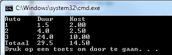
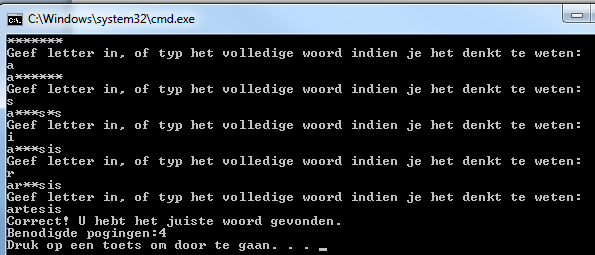

# Oefeningen deel 2

## Methoden met arrays als parameter

### Parkeergarage

Een parkeergarage vraagt sowieso €2.00 om tot maximum 3uur te parkeren. Per extra uur NA die 3uur wordt telkens €0.50 aangerekend \(dus 4uur parkeren kost €2.50. Er wordt maximum €10 aangerekend per dag. Veronderstel dat er nooit langer dan 1 dag \(24u\) kan geparkeerd worden.

Schrijf een programma dat het verschuldigde bedrag toont gegeven de duur dat de parkeergarage gebruikt werd. Bij het opstarten van het programma wordt eerst gevraagd hoeveel auto’s ingevoerd zullen worden, dan wordt per auto de duur van het parkeren gevraagd. Finaal wordt, netjes getabuleerd, alle informatie getoond, inclusief het totaal bedrag. Gebruik minstens 1 methode ‘berekenKosten’ die de kost voor 1 gebruiker telkens teruggeeft, gegeven de duur als parameter. Gebruik ook een methode die een array als parameter aanvaard \(bijvoorbeeld de array met daarin de respectievelijke uren per auto\).

Voorbeeldoutput: Opstart:


Resultaat:



### Array Viewer

Maak een programma dat een methode VisualiseerArray implementeert. De methode zal een array \(type int\) als parameter hebben en niets teruggeven \(void\). Echter, de methode zal met behulp van Write\(\) de array, van eender welke grootte, op het scherm tonen. Tussen ieder element van dezelfde rij dient een tab \(‘\t’\) gezet te worden. Je dient in de methode gebruik te maken van een for-loop. Voorbeeld van main:

```csharp
int[] array={15, 6, 9};
int[] array2={0, 1, 2, 3, 4, 5, 6};
VisualiseerArray(array);
VisualiseerArray(array2);
```

Geeft volgende output:


### Caesar-encryptie

Maak 2 methoden `Encrypt` en `Decrypt` die als parameters telkens een chararray krijgen en een integer. Bedoeling is dat de Encrypt-methode de array van het type string versleuteld gegeven de sleutel x volgens het Caesar cipher \(zie hieronder\). Als resultaat komt er uit de methode de geëncrypteerde array.

De decrypt-methode doet hetzelfde maar omgekeerd: je kan er een versleutelde tekst insteken en de sleutel en de ontcijferde tekst komt terug \(merk op dat je decrypt-methode gebruik kan maken van de encrypt-methode!\).

Toon in je main aan dat je methoden werken \(door bijvoorbeeld aan de gebruiker een stuk tekst als string te vragen en een sleutel en deze dan te encrypteren/de-crypteren\).

> Encryptie is de kunst van het vercijferen van data. Hierbij gaat men een gewone tekst zodanig omvormen \(_versleutelen_\) zodat deze onleesbaar is en enkel kan ontcijferd worden door de ontvanger die weet hoe de tekst terug kan verkregen worden en enkel indien deze ook de ‘private’ sleutel heeft.
>
> Een klassiek encryptie-algoritme uit de oudheid is de Caesar substitutie. Hierbij gaan we het alfabet met x plaatsen opschuiven en vervolgens de te vercijferen tekst letter per letter vervangen met z’n respectievelijke opgeschoven versie. Hierbij is x dus de geheime sleutel die zender en ontvanger moeten afspreken.


Stel bijvoorbeeld dat x=3 dan krijgen we volgende nieuwe alfabet:

```text
DEFGHIJKLMNOPQRSTUVWXYZABC
```

Waarbij dus de A zal vervangen worden door een D, de Z door een C, etc.

Willen we deze tekst dus encrypteren:

```text
the quick brown fox jumps over the lazy dog
```

dan krijgen we:

```text
WKH TXLFN EURZQ IRA MXPSV RYHU WKH ODCB GRJ
```

### Ondernemingsnummer

[Originele bron voor dit idee](https://www.c-sharp.be/c-sharp/functies/)

Ontwerp een methode waarmee je een Belgisch ondernemingsnummer kan controleren. Een Belgisch ondernemingsnummer is als volgt opgebouwd: BE 0xxx.xxx.xxx waarbij BE de landcode is die standaard gevolgd wordt door een spatie en dan een 0. Wanneer je de volgende 7 cijfers deelt door 97 in een gehele deling, dan is het getal gevormd door de laatste 2 cijfers gelijk aan 97 minus de rest van deze gehele deling. Bij een geldig ondernemingsnummer verschijnt de tekst "Geldig ondernemingsnummer.", bij een ongeldig ondernemingsnummer "Ongeldig ondernemingsnummer.". De methode aanvaardt een string waarin je het ondernemingsnummer staat.

## Meer-dimensionale arrays

### Determinant

Schrijf een programma dat een methode BerekenDeterminant heeft. Deze methode heeft één paramater als input: een 2 bij 2 array van integers. Als resultaat geeft de methode de determinant als integer terug. Zoek zelf op hoe je de determinant van een matrix kunt berekenen.

Volgende voorbeeld-main dient te werken,

```csharp
int[,] aMatrix = { 
                  {2, 4},
                  {3, 5}
                 };
Console.WriteLine($"Determinant van matrix is {BerekenDeterminant(aMatrix)}");
```

geeft als output:

```text
Determinant van matrix is -2
```

Extra: Breid uit zodat de BerekenDeterminant-methode ook werkt voor 3-bij-3 matrices. De methodeaanroep blijft dezelfde, enkel de interne code van de methode zal nu rekening moeten houden met de grootte van de matrix .

### 2D Array Viewer

Breid het ArrayViewer programma uit zodat ook 2-dimensionale arrays gevisualiseerd kunnen worden. \(Hint: gebruik de GetLength\(\) methode van een array\).

Voorbeeld van main:

```csharp
int [,] array = { {15, 6, 9}, {1, 2, 3}, {6, 9, 12}};
VisualiseerArray(array);
```

Output:

```text
15  6  9
1   2  3
6   9  12
```

### MatrixMultiplier

Schrijf een methode VermenigvuldigMatrix die 2 matrices als invoer verwacht en als resultaat een nieuwe matrix teruggeeft die het product van beide matrices bevat.

### Voetbalcoach

Maak een console-applicatie voor een assistent voetbaltrainer \(of een sport naar keuze\).

De voetbalcoach wil na de match iedere knappe en domme actie van een speler weten. Op die manier weet hij aan het einde van de match wie er de meeste goede en slechte acties doet. De spelers hebben rugnummers 1 tot en met 12. \(het gaat om een voetbal variant waar m'n geen elftal maar een twaalftal gebruikt :p\)

Wanneer de coach een rugnummer intypt kan hij vervolgens ingeven of hij \(a\) een knappe actie of \(b\) een domme actie wil ingeven. Vervolgens geeft hij een getal in. Gebruik een 2dimensionale array die per speler het aantal domme en goede acties bijhoudt \(de array is dus 12 bij 2 groot: 1 lijn per speler, bestaande uit 2 kolommen voor goede en domme actie. De index van de lijn is de rugnummer van speler -1\).

Een typische invoer kan dus zijn:

```text
2

a

6
```

De coach kiest dus de speler met rugnummer 2, hij kiest voor een knappe actie, en voert 6 in als aantal goede acties.

In de array op index 1 \(rugnummer -1\) zal in de 0'de kolom \(0 = goede, 1 = slechte\) het getal 6 geplaatst worden.

Vervolgens kan de coach een ander rugnummer \(of hetzelfde\) invoeren en zo verder.

Wanneer de coach 99 invoert stopt het programma en worden de finale statistieken getoond: per speler/rugnummer wordt het aantal goede en domme acties getoond, met daarnaast het verschil tussen beide:

\(gebruik `\t` om goede tabs te zetten tussen de data\)

```text
Rugnummer   Goede   Domme   Verschil
1               5       2        3
2               6       7       -1
```

Het programma toont ook welke speler\(s\) het meest performant waren, namelijk zij met het grootste positieve verschil tussen goede en domme acties, alsook de minst performante en de meeste “gemiddelde” speler \(i.e. verschil == 0 \)

## Pro

### Robot Simulator

Volgende opgave komt uit [Exercism.io](https://exercism.io.io)

" Write a robot simulator.

A robot factories' test facility needs a program to verify robot movements. The robots have three possible movements:

* turn right
* turn left
* advance

  Robots are placed on a hypothetical infinite grid, facing a particular direction \(north, east, south, or west\) at a set of {x, y} coordinates, e.g., {3, 8}, with coordinates increasing to the north and east.

The robot then receives a number of instructions, at which point the testing facility verifies the robot's new position, and in which direction it is pointing.

The letter-string "RAALAL" means:

* Turn right
* Advance twice
* Turn left
* Advance once
* Turn left yet again

Say a robot starts at {7, 3} facing north. Then running this stream of instructions should leave it at {9, 4} facing west."

Teken het gevolgde pad in de console \(gebruik `Console.SetCursorPosition()`\).

### Galgje

Maak een spel, vergelijkbaar met galgje, waarin de speler een woord moet raden. Zie [Wiki](http://nl.wikipedia.org/wiki/Galgje) voor de spelregels indien je deze niet kent.

Voorbeeld output:



### Grote Som

Maak een methode Som\(\) die eender welke hoeveelheid parameters van het type `int` aanvaardt en vervolgens de som van al deze parameters teruggeeft \(als int\).

Toon in je main aan dat de methode werkt door onder andere 1, 3, 5 en 10 als gehele getalen mee te geven.

Toon ook aan dat je een array van 50 ints als parameter kan meegeven aan de methode. \(hint: je moet het `params` keyword gebruiken\)

