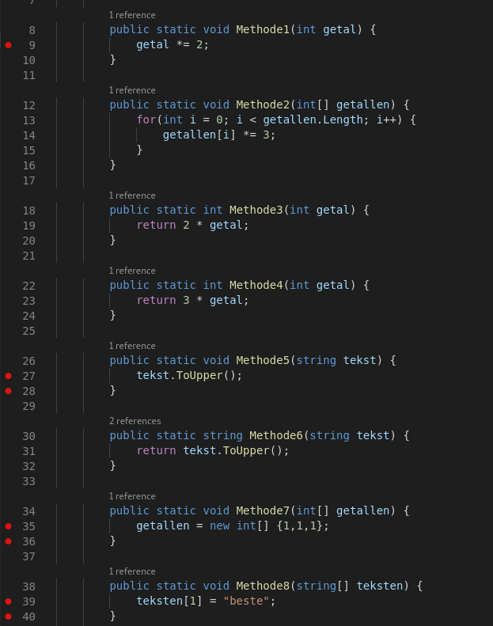

# Oefeningen


Onderstaande oefeningen worden ondergebracht in de klasse `HoostdtukAcht`.


## Oefening: H8-Opwarmers

### Leerdoelen

* arrays

### Functionele analyse

Schrijf in de klasse `HoofdstukAcht` de methode `Opwarmers`.

Onderaan staan enkele opdrachten, voeg ze allemaal toe in de aangemaakte methode.  
Gebruik steeds een loop om de opdrachten uit te lossen.  
Druk voor elke opdracht eerst af wat de opdracht gaat doen. \(Console.WriteLine\)  
Voer vervolgens de opdracht uit.

### Technische analyse

* Maak een array gevuld met de getallen 0 tot 10
* Maak een array gevuld met de getallen van 100 tot 1
* Maak een array gevuld met de letters a tot z
* Maak een array gevuld met willekeurige getallen tussen 1 en 100 \(de array is 20 lang\)
* Maak een array gevuld met afwisselend `true` en `false` \(de array is 30 lang\)

#### UI

console applicatie

#### voorbeeldinteractie\(s\)

```text
Maak een array gevuld met de getallen 0 tot 10
0 1 2 3 4 5 6 7 8 9 10

Maak een array gevuld met de getallen van 100 tot 1
100 99 98 97 96 95 94 93 92 91 90 89 88 87 86 85 84 83 82 81 80 79 78 77 76 75 74 73 72 71 70 69 68 67 66 65 64 63 62 61 60 59 58 57 56 55 54 53 52 51 50 49 48 47 46 45 44 43 42 41 40 39 38 37 36 35 34 33 32 31 30 29 28 27 26 25 24 23 22 21 20 19 18 17 16 15 14 13 12 11 10 9 8 7 6 5 4 3 2 1

Maak een array gevuld met de letters a tot z
a b c d e f g h i j k l m n o p q r s t u v w x y z

Maak een array gevuld met willekeurige getallen tussen 1 en 100 (de array is 20 lang)
76 64 49 8 97 38 24 63 47 70 86 84 21 39 47 83 79 14 20 41

Maak een array gevuld met afwisselend true en false (de array is 30 lang)
True False True False True False True False True False True False True False True False True False True False True False True False True False True False True False
```

## Oefening: H8-ArrayOefener1

### Leerdoelen

* arrays

### Functionele analyse

Schrijf in de klasse `HoofdstukAcht` de methode `ArrayOefener1`.

Maak een programma dat aan de gebruiker vraagt om 10 waarden in te voeren. Vervolgens toont het programma de som, het gemiddelde en het grootste getal van deze 10.

Vervolgens vraagt het programma de gebruiker om een getal in te voeren. Het programma toont dan alle getallen die groter of gelijk zijn aan dit ingevoerde getal zijn die in de array aanwezig zijn. Indien geen getallen groter zijn dan verschijnt een bericht `Niets is groter` op het scherm.

### Technische analyse

De 10 ingevoerde getallen zijn van het type `int` en worden bewaard in een array.

De som en het grootste getal worden m.b.v. een loop berekend. Je doet dit dus niet met ingebouwde methodes. Het gemiddelde wordt buiten deze loop berekend en daarvoor is de som nodig.

#### UI

console applicatie

#### voorbeeldinteractie\(s\)

```text
Voer 10 gehele getallen in
>2
>44
>1
>22
>3
>4
>87
>5
>1
>12
******
Som is 181, Gemiddelde is 18,1, Grootste getal is 87
******
Geef minimum getal in?
>34
De getallen groter dan 34 zijn: 44,87
```

## Oefening: H8-Boodschappenlijst


Deze boodschappenlijst werkt een beetje anders dan die uit de theorieles.


### Leerdoelen

* arrays

### Functionele analyse

Schrijf in de klasse `HoofdstukAcht` de methode `H8-Boodschappenlijst`.

Maak een programma dat de gebruiker een boodschappenlijstje laat samenstellen. 

* Het programma vraagt eerst hoeveel items de boodschappenlijst moet bevatten en laat dan de lijst vullen.
* Vervolgens wordt een gesorteerde lijst van de items getoond.
* Daarna, in de winkel, kan de gebruiker aangeven welke items er gekocht worden. De gebruiker kan dit blijven doen zolang er 'ja' geantwoord wordt op de vraag 'Nog winkelen?'. Als de gebruiker een item intypt dat niet op de lijst staat, wordt er een bericht getoond. 
* Na het winkelen toont het programma welke items van de lijst niet gekocht zijn.

### Technische analyse

De items van het boodschappenlijstje moet je bijhouden in een array.

Om de array te sorteren en om een item in de array te zoeken, maak je gebruik van een methode van een array.

#### UI

console applicatie

#### voorbeeldinteractie\(s\)

```text
We gaan de boodschappenlijst samenstellen. 
Hoeveel items wil je opschrijven?
>3
Wat is item 1 op je lijst?
>kaas
Wat is item 2 op je lijst?
>boter
Wat is item 3 op je lijst?
>melk
Dit is je gesorteerde lijst:
1: boter
2: kaas
3: melk
Op naar de winkel!
Welk item heb je gekocht?
>mellek
Dit item bevindt zich niet op de lijst!
Nog winkelen? (Ja of Nee)
>Ja
Welk item heb je gekocht?
>melk
Nog winkelen? (Ja of Nee)
>ja
Welk item heb je gekocht?
>kaas
Nog winkelen? (Ja of Nee)
>Nee
Naar huis met de boodschappen!
Volgende items van je lijst ben je vergeten te kopen:
boter
```

## Oefening: H8-Kerstinkopen

### Leerdoelen

* arrays

### Functionele analyse

Schrijf in de klasse `HoofdstukAcht` de methode `H8-Kerstinkopen`.

Maak een programma dat kan gebruikt worden om kerstinkopen te doen, rekening houdend met een budget.   
Na de inkopen, wordt het totaal gespendeerd bedrag getoond en het hoogste, laagste en gemiddelde bedrag.

### Technische analyse

De prijzen \(type double\)  van de cadeautjes moet je bijhouden in een array.

Gebruik methodes van een array.

#### UI

console applicatie

#### voorbeeldinteractie\(s\)

```text
Wat is het budget voor je kerstinkopen?
>100
Hoeveel cadeautjes wil je kopen?
>3
Prijs van cadeau 1?
>75,50
Prijs van cadeau 2?
>26,99
Je bent al 2,5 euro over het budget!
Prijs van cadeau 3?
>12
Je bent al 14,5 euro over het budget!
Info over je aankopen:
Totaal bedrag: 114,5 euro.
Duurste cadeau: 75,5 euro.
Goedkoopste cadeau: 12,0 euro.
Gemiddelde prijs: 38,2 euro.
```

## Oefening: H8-ArrayZoeker

### Leerdoelen

* arrays

### Functionele analyse

Schrijf in de klasse `HoofdstukAcht` de methode `H8-ArrayZoeker`.

Maak een programma dat eerst aan de gebruiker 10 willekeurige cijfers toont tussen 1 en 100 die in een array worden bewaard.

Vervolgens vraagt het programma welke waarde verwijderd moet worden. Wanneer de gebruiker hierop antwoordt met een nieuwe waarde dan zal deze nieuw ingevoerde waarde in de array gezocht worden. Indien deze gevonden wordt dan wordt deze waarde uit de array verwijderd en worden alle waarden die erachter komen met een plaatsje naar links opgeschoven, zodat we de laatste plaats in de array een vaste waarde moeten geven.

Hierna worden alle waarden van de array getoond.

### Technische analyse

Indien achteraan de array een lege plek komt krijgt deze laatste de waarde -1.

Indien de te zoeken waarde meer dan 1 keer voorkomt, wordt enkel de eerst gevonden waarde verwijderd.

#### UI

console applicatie

#### voorbeeldinteractie\(s\)

```csharp
63
84
56
11
80
57
90
2
64
7
Welk getal moet verwijderd worden?
90

Resultaat:
63
84
56
11
80
57
2
64
7
-1
```

## Oefening: H8-Koerier

### Leerdoelen

* arrays

### Functionele analyse

Schrijf in de klasse `HoofdstukAcht` de methode `H8-Koerier`.

Maak een array die 10 postcodes bevat \(zelf te kiezen\) van gemeenten waar een koerierbedrijf aan levert. Maak een tweede array die de prijs per kg bevat van iedere respectievelijke gemeente. 

Vraag aan de gebruiker een postcode en het gewicht van het pakket. Vervolgens wordt de prijs opgezocht voor die gemeente en wordt deze berekend gegeven het ingegeven gewicht.

Indien het bedrijf niet levert aan de ingetypte postcode dan wordt een foutmelding weergegeven.

### Technische analyse

Je voorziet twee arrays, één voor de postcodes, de andere voor het gewicht. De indexpositie van de gemeente bepaalt de prijs per kg in de andere array op dezelfde index positie.

Bv.

```csharp
int[] postcodes = { 1000, 2020, 2013, 4500, 2340, 1200, 9999, 6666, 2362, 2340 };
int[] kg = { 12, 214, 3, 15, 56, 900, 13, 5, 111, 43 };
```

#### UI

console applicatie

#### voorbeeldinteractie\(s\)

```text
Geef gewicht pakket
15
Naar welke postcode wenst u dit pakket te versturen?
4500
Dit zal 225 euro kosten.
```

## Oefening: H8-value-reference-begrijpen

Deze oefening werkt wat anders dan de andere oefeningen. Je krijgt voorbeeldcode en een screenshot.





1. Voorspel eerst, zonder de Main methode uit te voeren, wat er precies op je scherm zal verschijnen. Voer hiervoor de code "in je hoofd" uit.
2. Teken de stack en heap op elk van de aangegeven breakpoints. Je kan dit doen op papier of in een simpel tekenprogramma zoals MS Paint. Je hoeft niet alle lokale variabelen in scope van Main te tekenen. Je moet enkel de variabelen van Main tekenen die meespelen in de uitvoering van de methode waarin het breakpoint staat. Het is **niet** nodig dat je cellen op de stack groter of kleiner maakt naargelang hun gegevenstype, zoals dat in de theorie wel gebeurde.

## Oefening: H8-Hamming-distance

De hamming distance is het aantal tekens dat twee reeksen verschillen indien we ieder element vergelijken op dezelfde plaats in de andere reeks.

Maak een programma dat aan de gebruiker vraagt om twee DNA strings in te voeren \(een reeks bestaande uit de letters G, A, C & T\). Beide reeksen moeten even lang zijn.

Bereken de hamming distance tussen beide reeksen.

De hamming distance van volgende twee DNA strings is 7, omdat er 7 elementen in beide strings staan die niet gelijk zijn aan mekaar op dezelfde plek \(aangeduid met `^`\).

Tip: je doet dit best met behulp van de string-methode `ToCharArray`.

Schrijf deze oefening in de klasse Hoofdstuk8 als de methode `Hamming`.

```text
Gelieve twee strings in te typen:
GAGCCTACTAACGGGAT
CATCGTAATGACGGCCT
^ ^ ^  ^ ^    ^^
De Hamming distance is 7.
```

## Oefening: H8-Galgje

### Leerdoelen

* arrays

### Functionele analyse

Schrijf in de klasse `HoofdstukAcht` de methode `Galgje`.

Maak een programma dat galgje kan spelen. Er wordt door het programma een woord gekozen dat door de gebruiker geraden moet worden. Elke keer als de gebruiker een letter ingeeft, dan wordt deze getoond op de plaats waar deze in het woord voorkomt.

Geeft de gebruiker een woord in, dan wordt er gekeken of dit het te zoeken woord is. Klopt dit, dan is de gebruiker gewonnen. Anders blijft hij letters of woorden gokken tot hij het heeft gevonden. Achteraf krijgt de gebruiker ook het aantal pogingen te zien.

### Technische analyse

Zorg ervoor dat je een array hebt met 5 woorden, waaruit 1 woord random wordt gekozen.    
Dit is het woord dat de gebruiker moet zoeken. De niet gevonden letters van het te zoeken woord worden aan de gebruiker getoond met “\*”-jes. 

De gebruiker geeft een letter of een heel woord in.  


de input is een letter wanneer de input een lengte van 1 heeft, het is een woord wannneer dit meer is. 



een woord \(string\) kan je omzetten naar een array van tekens \(char\[\]\) door `.ToCharArray()` uit te voeren. 


Wanneer het een letter is wordt er gekeken of deze letter zich in het te zoeken woord bevindt.    
Zo ja, dan wordt deze letter zichtbaar op de plaats\(en\) waar het zich in het woord bevindt.   
Zo nee, dan mag de gebruiker opnieuw raden. 

Geeft de gebruiker een woord in dan wordt er gekeken of het woord het gezochte woord is.   
Zo ja, dan is de gebruiker gewonnen.   
Zo nee, dan mag de gebruiker opnieuw raden. 

Er wordt ook bijgehouden hoeveel pogingen de gebruiker er over gedaan heeft tot hij het woord gevonden heeft. 

#### UI

console applicatie

#### voorbeeldinteractie\(s\)

```text
****** 
Geef letter in, of typ het volledige woord indien je het denkt te weten: 
>a 

*a**** 
Geef letter in, of typ het volledige woord indien je het denkt te weten: 
>x 

*a**** 
Geef letter in, of typ het volledige woord indien je het denkt te weten: 
>hahaha 
Niet correct! Probeer een letter te geven. 

*a**** 
Geef letter in, of typ het volledige woord indien je het denkt te weten: 
>galgje 
Correct! U heeft het juiste woord gevonden. 

Benodigde poginen: 4 
```

## Oefening: H8-pixels

### Functionele analyse

We willen een simpel tekenprogramma maken in de terminal. De gebruiker kan pixel per pixel een gewenste kleur aangeven.

### Technische analyse

Schrijf in de klasse `HoofdstukAcht` een methode `Pixels`.

Vraag hierin eerst aan de gebruiker welke afmetingen hij wil gebruiken voor zijn afbeelding. Dit bepaalt het aantal rijen en kolommen en dus het aantal pixels. Maak vervolgens een array van `ConsoleColor` waarden aan met deze afmetingen. Vraag tenslotte in een lus wat de gebruiker wil doen:

* een pixel kleuren
  * vraag hierbij de rij-index en kolom-index
  * vraag ten slotte in welke kleur deze moet worden ingevuld
    * je kan sneller een array van alle kleuren krijgen met volgende code: `ConsoleColor[] kleuren = (ConsoleColor[]) Enum.GetValues(typeof(ConsoleColor));`
* de afbeelding zoals ze momenteel is tonen
  * toon hiervoor elke pixel als een spatie met `Console.Write(" ")`

### Voorbeeldinteractie


## Oefening: H8-som-per-rij

### Functionele analyse

We wensen de gegevens in één rij te groeperen door hun som te bepalen, een beetje zoals je dat in een Excel spreadsheet zou kunnen doen.

### Technische analyse

Schrijf in de klasse `HoofdstukAcht` een methode `SomPerRij`. Deze maakt een tweedimensionale array met het gevraagde aantal rijen en het gevraagde aantal kolommen aan. Je mag veronderstellen dat er een geldig aantal wordt ingegeven. Vervolgens vraagt ze, rij per rij en kolom per kolom, een getalwaarde. Wanneer elke positie is ingevuld, toont ze de som per rij van de ingegeven getallen.

### Voorbeeldinteractie

```text
Hoe veel rijen telt je array?
> 3
Hoe veel kolommen telt je array?
> 2
Waarde voor rij 1, kolom 1?
> 4
Waarde voor rij 1, kolom 2?
> 2
Waarde voor rij 2, kolom 1?
> 1
Waarde voor rij 2, kolom 2?
> 1
Waarde voor rij 3, kolom 1?
> 7
Waarde voor rij 3, kolom 2?
> 9
Sommen per rij:
6
2
16
```


## Oefening: H8-som-per-kolom

### Functionele analyse

We wensen de gegevens in één kolom te groeperen door hun som te bepalen, een beetje zoals je dat in een Excel spreadsheet zou kunnen doen.

### Technische analyse

Schrijf in de klasse `HoofdstukAcht` een methode `SomPerKolom`. Deze werkt zoals de vorige oefening, maar maakt de som per kolom.

### Voorbeeldinteractie

```text
Hoe veel rijen telt je array?
> 3
Hoe veel kolommen telt je array?
> 2
Waarde voor rij 1, kolom 1?
> 4
Waarde voor rij 1, kolom 2?
> 2
Waarde voor rij 2, kolom 1?
> 1
Waarde voor rij 2, kolom 2?
> 1
Waarde voor rij 3, kolom 1?
> 7
Waarde voor rij 3, kolom 2?
> 9
Sommen per kolom:
12
12
```

