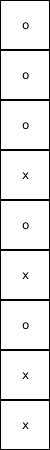

# N-dimensionale arrays

### Organisatievormen van data

Voorlopig hebben we enkel met 1-dimensionale arrays gewerkt. Je kan er echter ook meerdimensionale maken. In plaats van "reeksen" van data kan je deze zien als tabellen of als figuren.

Als we een array tekenen, doen we dat vaak als een lijn met vakjes op. En als we door een volledige array lopen, doen we dat door de index steeds te verhogen. Om deze reden zeggen we dat arrays een "lineaire" gegevensstructuur zijn, dus "lijnvormig". Een andere manier om dit uit te drukken is "ééndimensionaal".

Een array met de getallen 4, 9, 2, 7, 3, 6, 1, 12 en 9 zouden we ons kunnen inbeelden als volgt:

.png>)

Het maakt niet echt uit of je dit ziet van links naar rechts, van boven naar onder,... Wat wel belangrijk is, is dat je dit ziet als een reeks waar je in een richting door loopt. Onderstaande voorstelling kan dus ook:

 (1).png>)

Vaak is het handig om niet met een ééndimensionale voorstelling te werken, maar met een tweedimensionale of driedimensionale voorstelling. Dit kan bijvoorbeeld zijn omdat we data hebben zoals een Excel sheet, een rooster voor het spelletje OXO of vier-op-een-rij, een Sudokupuzzel, een afbeelding (die bestaat uit pixels),...

Een voorbeeld. Kan jij van onderstaande afbeelding in één oogopslag zeggen of er OXO op staat, als de eerste waarde staat voor het vakje linksboven en de laatste voor het vakje rechtsonder?



Niet meteen. Je moet alles eerst "vertalen" in je hoofd naar dit:

Nu kan je veel makkelijker aflezen dat er in de eerste kolom inderdaad OXO staat. Dus de organisatie van je data kan het makkelijker of moeilijker maken bepaalde taken uit te voeren, omdat we visueler kunnen werken.

.png>)

Meerdimensionale arrays leveren hetzelfde voordeel op wanneer je programmeert. Ze staan toe data op te delen in roosters, zodat het makkelijker wordt cellen in een bepaalde richting te doorlopen (rij per rij, kolom per kolom, in de diepte,...). Dit is vaak nuttig om zaken die we "op het zicht" doen te kunnen toepassen op arrays.


Met meerdimensionale arrays kan je technisch niet meer of minder dan met ééndimensionale arrays. Maar afhankelijk van het probleem maken ze het programmeerwerk wel een pak eenvoudiger.


### Syntax

De syntax voor een meerdimensionale array is heel gelijkaardig aan die voor een eendimensionale array, maar per dimensie boven de eerste zet je een komma tussen de rechte haken. Bijvoorbeeld:

```csharp
string[,] oxoRooster = new string[3,3];
```

Hierin passen dus 9 strings, maar de extra structuur zal het makkelijker maken rij per rij of kolom per kolom te werken.

Je kan de array ook als volgt initialiseren.

```csharp
string[,] oxoRooster = {{null,null,null},
                        {null,null,null},
                        {null,null,null}}
```

Of hij mag al ingevuld zijn:

```csharp
string[,] oxoRooster = {{"o","o","o"},
                        {"x","o","x"},
                        {"o","x","x"}}
```

Technisch gesproken bevatten de binnenste accolades groepjes waarden in de tweede dimensie van de array en de buitenste ordenen deze groepjes dan in de eerste dimensie. **Maar het volstaat als je onthoudt dat je hier zaken kan noteren alsof ze in rijen en kolommen stonden.**

Je kan nu elementen opvragen door **per dimensie** een index mee te geven. Indexen blijven nog steeds vanaf 0 tellen. Bijvoorbeeld:

```csharp
// toont het vakje in het midden (tweede rij, tweede kolom)
Console.WriteLine(oxoRooster[1,1]);
// toont het vakje rechtsonder (derde rij, derde kolom)
Console.WriteLine(oxoRooster[2,2]);
// toont het vakje onderaan in het midden (derde rij, tweede kolom)
Console.WriteLine(oxoRooster[2,1]);
```

### Lengte van iedere dimensie in een n-dimensionale matrix

Indien je de lengte opvraagt van een meer-dimensionale array dan krijg je het totaal aantal posities in de array. Onze OXO-array zal bijvoorbeeld dus lengte 9 hebben. Je kan echter de lengte van iedere aparte dimensie te weten komen met de `GetLength()` methode die iedere array heeft. Als parameter geef je de dimensie mee waarvan je de lengte wenst.

```csharp
int arrayRijen = oxoRooster.GetLength(0);
int arrayKolommen = oxoRooster.GetLength(1);
```

Het aantal dimensies van een array wordt trouwens weergegeven door de `Rank` eigenschap die ook iedere array heeft. Bijvoorbeeld:

```csharp
int arrayDimensions = oxoRooster.Rank;
```
