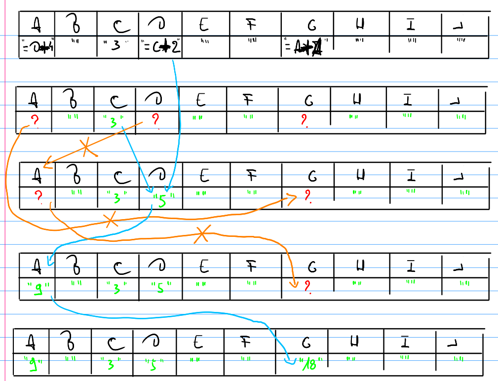

# Intermezzo: TextCell

## Inleiding

Het voelt misschien nog niet zo, maar je kent intussen al redelijk veel programmeerconcepten. Je kent onder meer variabelen van verschillende types, beslissingen, loops, arrays en methoden. Nu is het niet alleen kwestie van die zaken te kennen, maar ook van die zaken te gebruiken. Daarom zullen we deze les een beetje anders aanpakken dan gewoonlijk. We zullen een vereenvoudigde versie van een bestaand programma schrijven. Dit is een uitstekende manier om te leren. Het maakt niet uit dat dat programma al bestaat. Het doel is om bij te leren. Door bestaande software na te bouwen, heb je een duidelijk referentiepunt.

De software die wij hier zullen bouwen is een tekstgebaseerde spreadsheet, zoals Excel of Calc. Onze versie zal meer lijken op de allereerste spreadsheets dan op een moderne spreadsheet, maar de essentie zal er wel zijn. De belangrijkste beperkingen zijn:

* We werken tekstgebaseerd. Anders zouden we tijd moeten spenderen aan het bestuderen van een grafische toolkit. In principe zou je dit later kunnen oplossen door een versie in TypeScript te bouwen die tabellen in de browser gebruikt.
* We werken ééndimensionaal. We hebben dus een spreadsheet van één rij, in plaats van een spreadsheet met rijen _en_ kolommen. We zullen dit op het einde van het semester rechtzetten, maar we hebben nog wat meer ervaring met arrays nodig om dit vlot te laten verlopen.
* We ondersteunen alleen optellingen, geen andere berekeningen. Op zich is het systeem hetzelfde voor bijkomende berekeningen, maar je moet alle gevallen analyseren. In de praktijk wordt zoiets gedaan met een _parser_ en dat gaat wat te ver voor deze demonstratie.

Dat zijn serieuze beperkingen, maar vergeet niet dat spreadsheets als tientallen jaren bestaan en ontwikkeld worden door programmeerteams. Ze kunnen het resultaat zijn van letterlijk duizenden jaren werk door professionele programmeurs.

Tijdens deze les moet je zelf de gedemonstreerde code uitschrijven. Ik zal telkens een stapje uitleggen en dan doen we een uitbreiding van het project. Je zal tijdens de labo's en tijdens het examen een paar uitbreidingen doen aan dit project, dus zorg dat je actief nadenkt over de code en niet gewoonweg overtypt. Als dat betekent dat je moet teruggaan naar een eedere les, doe dat dan. Er is geen snelle manier om goed te leren programmeren, maar dit is de minst trage.

Laat me ook even duidelijke verwachtingen scheppen: Er wordt niet verwacht dat je dit project zelf kan bedenken. Er zal in dit vak nooit een oefening zijn die de omvang van dit project benadert. De concepten die we hier gebruiken zijn bijna allemaal al gekende leerstof, maar om dit project te bedenken heb je naast de concepten ook al redelijk wat ervaring nodig. Het is dus volledig normaal als je tijdens dit project denkt: "Dit had ik zelf nooit bedacht." Het is zelfs de bedoeling. Het punt hier is om je te laten zien dat je niet noodzakelijk erg veel concepten nodig hebt om complexere programma's te schrijven. Je kan best veel met de basics.

## Hoe werkt een spreadsheet?

* Een spreadsheet is in essentie een rooster op basis van rijen en kolommen.
* De combinatie van rij en kolom duidt één "vakje" aan. Zo'n vakje noemen we in technische termen een "cel".
* Een cel bevat data of een berekening:
  * data is heel vaak een getal, een stuk tekst of een datum
  * een berekening begint met `=`
    * een berekening mag ingebouwde methodes gebruiken
    * een berekening mag ook verwijzen naar andere cellen

Merk op: kolommen worden aangeduid met letters en rijen met getallen.

Moderne spreadsheets kunnen natuurlijk veel meer, zoals je ook ziet in de interface van Calc, maar leer stappen voor je leert lopen. Dit is al niet zo makkelijk. Je moet dit eerst goed onder de knie hebben voor je probeert meer te doen.

## Een nieuwe klasse maken

We zullen de spreadsheet maken in hetzelfde project als onze labo-oefeningen. Dat maakt dat er niet te veel gewisseld moet worden tussen projecten wanneer je hier uitbreidingen voor schrijft tijdens de labosessies. We noemen de klasse `TextCell`. Dat is de naam die we verder zullen gebruiken voor onze eigen spreadsheet.

## Algemene structuur

We kijken eerst naar Calc voor wat inspiratie. Wanneer we opstarten, staat er een lege spreadsheet klaar. Het programma wacht eigenlijk gewoon tot we een cel invullen. Wanneer we dat doen, worden alle cellen met daarin een berekening opnieuw berekend. In Calc kan ik bijvoorbeeld cel B1 aanpassen en dan zie je dat cel B2 ook wijzigt, omdat die een berekening op basis van cel B1 bevat. Daarna kunnen we weer aanpassingen doen.

We zullen dit zo goed mogelijk nabootsen. Om te beginnen zetten we een nieuwe, lege spreadsheet klaar. Hoe doen we dit? Een cel lijkt erg op een variabele, want je kan er letterlijke data of het resultaat van een berekening in plaatsen. Anderzijds kunnen we niet voor elke cel een variabele in onze programmacode zetten. Dan zou onze code gigantisch worden en zou er geen manier zijn om systematisch alle cellen te doorlopen. We waren op hetzelfde probleem gebotst toen we arrays introduceerden. Daar konden we geen variabele voorzien voor elk item op een boodschappenlijstje. We zullen onze cellen dan ook voorstellen door middel van een array.

Dit levert drie belangrijke beperkingen op:

Ten eerste, een array hebben we voorgesteld als een rij of een kolom, maar niet als een combinatie van rijen en kolommen. We zullen ons hier tijdelijk bij neerleggen en een een spreadsheet maken waarvan we alleen de eerste rij kunnen invullen. We zullen dit later nog recht zetten.

Ten tweede, de grootte van een array wordt vastgelegd zodra de array wordt aangemaakt. Ook hier leggen we ons voorlopig bij neer. We zullen bij het opstarten van de spreadsheet vragen hoe groot de array moet zijn. Later zullen we zien dat hier ook rond gewerkt kan worden.

Ten derde, een array bevat één type waarden. Dus strings _of_ getallen _of_ booleans of iets anders, maar geen mengeling. Maar merk op dat je in Calc gewoon iets intypt en dat het systeem er dan zelf een interpretatie aan geeft. Bijvoorbeeld: als ik `01/03/1987` intyp, verschijnt dit als `01/03/87`. Dat komt omdat deze tekst er **uitziet** als een datum. Terwijl `Vincent` ongewijzigd blijft. Dus op zich kan je gewoon tekst ingeven en zaken die er **uitzien** als getallen of datums behandelen als getallen of datums wanneer nodig. Met andere woorden, we zullen een `string[]` gebruiken om ons rooster voor te stellen.

Dus we hebben een rooster (i.e. een `string[]`) dat bij opstart wordt aangemaakt. Elke cel bevat op dat moment `""`. Eens dat gebeurd is, tonen we het huidige rooster en wachten we tot de gebruiker een cel aanpast, tot het einde ter tijden, of tot het programma gestopt wordt.

In Flowgorithm ziet dit er zo uit:


Ik vul eerst de lege string in in elke cell, omdat er anders de defaultwaarde `null` staat. Lege cellen gedragen zich echter als cellen waarbij we letter per letter een backspace hebben uitgevoerd, dus als een cel met een lege string. Bovendien zullen we `null` verderop voor iets anders gebruiken.

Voorlopig kan je `BerekenEnToonRooster` en `WijzigCel` met een lege body implementeren. Zo kan je tenminste het programma compileren.

Aan jullie om dit om te zetten naar code in C#. Schrijf de code met de hand. Deze code begint trouwens in `Main`, terwijl het de bedoeling is dat je je spreadsheet kan opstarten van uit je keuzemenu, dus noem je methode `TextCellMain` en zet ze in de klasse `TextCell`.

## Weergave van het rooster

Eigenlijk moeten we dus de twee methodes implementeren die in de lus worden uitgevoerd. We zullen beginnen met de methode `BerekenEnToonRooster`, omdat we dan zo snel mogelijk onze spreadsheet kunnen **zien**. We zullen eerst alleen het "toon"-aspect afhandelen. Met andere woorden, we negeren even berekeningen en doen alsof elke cel gewoon een tekstwaarde bevat.

We willen wel al dat onze cellen naast elkaar getoond worden en dat boven elke cel een identifier staat.

Om de identifiers te tonen en om ze te kunnen vertalen naar getallen, moet je wat wiskunde gebruiken. Dat is hier niet de focus, dus je krijgt hier twee methoden voor in de cursustekst. Deze heten `GetalVoorstellingNaarLetters` en `LetterVoorstellingNaarGetal`. Je moet ze kopiëren uit de tekst en in je klasse zetten. De eerste zet een getal om naar een lettercombinatie (die je boven de cellen kan tonen), de tweede werkt in de omgekeerde richting:

```csharp
public static string GetalVoorstellingNaarLetters(int getal) {
    string alfabet = "ABCDEFGHIJKLMNOPQRSTUVWXYZ";
    int aantalSymbolen = alfabet.Length;
    string resultaat = "";
    int resterend = getal;
    bool laatsteKeer = false;
    while (!laatsteKeer) {
        if (resterend <= aantalSymbolen) {
            laatsteKeer = true;
        }
        int karakterIndex = (resterend - 1) % aantalSymbolen;
        resultaat = alfabet[karakterIndex] + resultaat;
        resterend = (resterend - 1) / aantalSymbolen;
    }
    return resultaat;
}

public static int LetterVoorstellingNaarGetal(string letters) {
    string alfabet = "ABCDEFGHIJKLMNOPQRSTUVWXYZ";
    int aantalSymbolen = alfabet.Length;
    int resultaat = 0;
    for (int i = letters.Length - 1; i >= 0; i--) {
        int exponent = letters.Length - i - 1;
        resultaat += (alfabet.IndexOf(letters[i]) + 1) * (int) Math.Pow(aantalSymbolen, exponent);
    }
    return resultaat;
}
```

Voor de weergave van de cellen starten we hiermee:

```csharp
for(int i = 0; i < rooster.Length; i++) {
  Console.Write("|");
  string tekstVoorstelling = GetalVoorstellingNaarLetters(i+1);
  Console.Write(tekstVoorstelling);
}
Console.WriteLine("|");
for(int i = 0; i < rooster.Length; i++) {
  Console.Write("|");
  Console.Write(rooster[i]);
}
Console.WriteLine("|");
```

Een probleem hier is dat niet elke cel even breed is. Probeer maar eens uit.

Als oplossing zullen we elke cel 10 karakters breed tonen. Inhoud die verder gaat, wordt niet getoond.

```csharp
for(int i = 0; i < rooster.Length; i++) {
    Console.Write("|");
    string tekstVoorstelling = GetalVoorstellingNaarLetters(i+1);
    Console.Write(tekstVoorstelling.PadRight(10).Substring(0,10));
}
Console.WriteLine("|");
for(int i = 0; i < rooster.Length; i++) {
    Console.Write("|");
    Console.Write(rooster[i].PadRight(10).Substring(0,10));
}
Console.WriteLine("|");
```

Met een beetje creativiteit kan je elke cel exact zo breed maken als nodig is voor de content, maar om het project kort te houden, doen we dat voorlopig niet.

## Invullen van waarden

Dit is vrij eenvoudig. We moeten gewoon vragen welke cel we willen invullen, wat we er in willen plaatsen en dan die positie van de array invullen. Er is wel één puntje waar we aandacht aan moeten besteden.

We hebben tijdens de les rond methoden gezien dat methoden werken met een kopie van het meegegeven argument. Het gevolg daarvan was dat je een parameter kon wijzigen in een methode en dat je dit niet meer zag na de oproep van de methode. Ik herhaal even het voorbeeld uit de contactles:

```csharp
public static void VeranderGetal(int getal) {
  getal = getal - 1;
  Console.WriteLine($"Het getal is {getal}");
}

public static void Main() {
  int getal = 4;
  Console.WriteLine($"Het getal is {getal}");
  VeranderGetal(getal);
  Console.WriteLine($"Het getal is {getal}");
}
```

De reden dat op het einde `Het getal is 4` verschijnt, is dat de methode `VeranderGetal` een kopie van de waarde heeft gekregen om mee te werken.

Om technische redenen, die we in het vervolgvak uitgebreider zullen bespreken, lijkt dit op het eerste zicht niet helemaal te kloppen voor arrays. Je kan namelijk een array als argument van een methode meegeven. Als je dan een aanpassing doet op een indexpositie van die array, blijft die zichtbaar na de methode. **Voor dit vak is dit de enige uitzondering op de regel dat methodes argumenten niet kunnen wijzigen.**

Het slechte nieuws is dus dat sommige soorten data complexere regels volgen. Het goede nieuws is dat het heel makkelijk wordt om de methode `WijzigCel` te schrijven.

```csharp
public static void WijzigCel(string[] rooster) {
  Console.WriteLine("Welke cel wil je wijzigen?");
  int celIndex = LetterVoorstellingNaarGetal(Console.ReadLine()) - 1;
  Console.WriteLine("Wat wil je hier invullen?");
  rooster[celIndex] = Console.ReadLine();
}
```

Nu kunnen we waarden invullen en zien we ze verschijnen. Probeer maar eens uit.

## Berekeningen toevoegen

Een spreadsheet is geen spreadsheet als je geen berekeningen hebt. We moeten dit slim aanpakken. Cellen kunnen verwijzen naar andere cellen, of die nu eerder of later komen. Bovendien moeten de berekeningen zelf **blijven staan in de spreadsheet**. We mogen ze dus niet meteen uitrekenen op het moment dat ze worden ingetypt, want dan zouden ze hun resultaten niet updaten.

We zullen volgende aanpak volgen voor een spreadsheet met berekeningen:



We maken dus eerst een kopie van onze spreadsheet, maar we vullen alleen de cellen zonder berekening in. Voor de cellen met een berekening vullen we niets in, zodat er `null` staat, de defaultwaarde van een variabele van het type `string`. Herinner je dat dit **niet** hetzelfde is als `""`. Vanaf dan gaan we op zoek naar cellen waarvoor we nog geen resultaat hebben. Als alle nodige inputs voor die cellen al gekend zijn, vullen we ze in. We herhalen dit tot we voor elke cel een resultaat hebben.

De eerste kopie maken doen we als volgt:

```csharp
string[] berekendRooster = new string[rooster.Length];
KopieerCellenZonderFormule(rooster,berekendRooster);
```

De hulpmethode schrijven we als volgt: (neem over uit modeloplossing). Dit maakt dus een tweede array die er uitziet zoals de eerste, maar zonder de formules (highlight in de tekening). Merk ook op dat de hoofdingen in de tekening wel bestaan, maar in code zijn ze niet aanwezig. Ze stellen gewoon indexposities van een array voor, waarbij A wijst op de eerste cel, B op de tweede,...

In een volgende stap doorlopen we de berekende array en proberen we de "vraagtekens" in te vullen. Hoe vaak dit moet gebeuren, hangt af van hoe veel formules er staan en wat de verbanden tussen cellen zijn. Zolang onze spreadsheet juist is opgesteld, eindigt het proces uiteindelijk wel en wordt alles ingevuld. We vatten dit als volgt samen:

```csharp
while (BevatNullWaarden(berekendRooster)) {
  BerekenOntbrekendeCellenEenKeer(rooster, berekendRooster);
}
```

Voor de hulpmethode `BerekenOntbrekendeWaardenEenKeer`, die één stapje op de tekening voorstelt, doorlopen we alle reeds berekende cellen. Telkens we een nog niet berekende cel tegenkomen, zoeken we de formule op en proberen we die uit te rekenen voor enkel die cel. De implementatie ziet er zo uit:

```csharp
public static void BerekenOntbrekendeWaardenEenKeer(string[] rooster, string[] berekendRooster) {
    for(int cel = 0; cel < rooster.Length; cel++) {
        if (berekendRooster[cel] is null) {
            berekendRooster[cel] = BerekenOntbrekendeCelRechtstreeks(rooster[cel].Substring(1), berekendRooster);
        }
    }
}
```

Om één formule (met andere woorden, een som) uit te rekenen, moeten we eerst bepalen welke onderdelen we moeten optellen. Dat kunnen getallen of andere cellen zijn. We kunnen de tekstvoorstelling van deze onderdelen verkrijgen via de `Split`-methode van een string. Deze breekt een string in stukjes op basis van het meegegeven argument.

Laat ons dit al eens uitproberen met sommen van uitsluitend getallen:

```csharp
public static string BerekenOntbrekendeCelRechtstreeks(string formule, string[] berekendRooster) {
    string[] somOnderdelen = formule.Split('+');
    int som = 0;
    for (int i = 0; i < somOnderdelen.Length; i++) {
        som += Convert.ToInt32(somOnderdelen[i]);
    }
    return som.ToString();
}
```

Dit werkt als je formules alleen getallen optellen. Nu moeten we nog zorgen dat verwijzingen naar andere cellen herkend worden.

Om dit klaar te spelen, moeten we het verschil kunnen zien tussen iets als `A` en `1`. We houden het simpel: we kijken gewoon of het stuk tekst begint met een cijfer. Het kan nauwkeuriger, maar omdat formules alleen getallen of cellen kunnen bevatten, is het voor ons voldoende.:

```csharp
public static bool IsGetal(string voorstelling) {
            return voorstelling.StartsWith("0") ||
                   voorstelling.StartsWith("1") ||
                   voorstelling.StartsWith("2") ||
                   voorstelling.StartsWith("3") ||
                   voorstelling.StartsWith("4") ||
                   voorstelling.StartsWith("5") ||
                   voorstelling.StartsWith("6") ||
                   voorstelling.StartsWith("7") ||
                   voorstelling.StartsWith("8") ||
                   voorstelling.StartsWith("9");
}
```

Nu kunnen we een methode schrijven die namen van cellen vervangt door de reeds uitgerekende waarde, maar getallen met rust laat:

```csharp
public static string WaardeVanCel(string waarde, string[] rooster) {
  if (IsGetal(waarde)) {
    return waarde;
  }
  else {
    return rooster[LetterVoorstellingNaarGetal(waarde) - 1];
  }
}
```

Nu kunnen we zorgen dat sommen ook identifiers van cellen mogen bevatten. We gebruiken de methode die we net geschreven hebben om de waarde van de cel op te zoeken. Als de waarde van de cel nog niet gekend is, kunnen we ook geen waarde voor een formule op basis ervan berekenen. We hebben de basisonderdelen van de som niet echt meer nodig eens we ze hebben opgezocht, dus we mogen ze overschrijven:

```csharp
public static string BerekenOntbrekendeCelRechtstreeks(string formule, string[] berekendRooster) {
  string[] somOnderdelen = formule.Split('+');
  for (int i = 0; i < somOnderdelen.Length; i++) {
    somOnderdelen[i] = WaardeVanCel(somOnderdelen[i], berekendRooster);
    if(somOnderdelen[i] is null) {
      return null;
    }
  }
  int som = 0;
  for (int somOperand = 0; somOperand < somOnderdelen.Length; somOperand++) {
    som += Convert.ToInt32(somOnderdelen[somOperand]);
  }
  return som.ToString();
}
```

Nu nog even uittesten.

```
Hoe veel cellen telt je spreadsheet?
8
|A         |B         |C         |D         |E         |F         |G         |H         |
|          |          |          |          |          |          |          |          |
Welke cel wil je wijzigen?
D
Wat wil je hier invullen?
4
|A         |B         |C         |D         |E         |F         |G         |H         |
|          |          |          |4         |          |          |          |          |
Welke cel wil je wijzigen?
F
Wat wil je hier invullen?
=D+D
|A         |B         |C         |D         |E         |F         |G         |H         |
|          |          |          |4         |          |8         |          |          |
Welke cel wil je wijzigen?
A
Wat wil je hier invullen?
=F+3
|A         |B         |C         |D         |E         |F         |G         |H         |
|11        |          |          |4         |          |8         |          |          |
Welke cel wil je wijzigen?
H
Wat wil je hier invullen?
9
|A         |B         |C         |D         |E         |F         |G         |H         |
|11        |          |          |4         |          |8         |          |9         |
Welke cel wil je wijzigen?
C
Wat wil je hier invullen?
=A+H
|A         |B         |C         |D         |E         |F         |G         |H         |
|11        |          |20        |4         |          |8         |          |9         |
```
