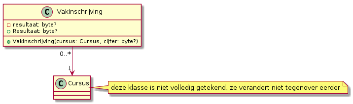

# SchoolAdmin

Onderstaande kennisclips moet je bekijken voor wat de onderdelen betreft die handelen over het SchoolAdmin project en je dient deze mee maken met de filmpjes.


* [Kennisclip 1](https://youtu.be/eT5uhSw9nFo)
* [Kennisclip 2](https://youtu.be/Wuk9G1_JMWc)
* [Kennisclip 3](https://youtu.be/q__6UaGtNGs)


## Oefening: H10-StudentKlasse


Deze oefening veronderstelt dat je de theoriefilmpjes hebt gevolgd en dat je daar de klasse `Student` al hebt aangemaakt in een SchoolAdmin project.


### Leerdoelen

* werken met klassen en objecten
* opstart van het project

### Functionele analyse

Dit programma vraagt om de naam en leeftijd van een student. Vervolgens worden de punten voor 3 vakken gevraagd, waarna het gemiddelde wordt teruggegeven.

### Technische analyse

Breid je klasse Student uit met een tweede array `CursusResultaten`. Voorzie ook een methode `Kwoteer` om een cijfer aan een cursus met een bepaalde index toe te kennen. Signaleer ongeldige waarden met een `Console.WriteLine("Ongeldig cijfer!")`. Je kan ook nooit een cijfer boven 20 behalen.

Voeg aan de klasse een methode `Gemiddelde()` toe. Deze berekent het gemiddelde van de niet-`null` cursussen als `double`.

Voeg ook een methode `ToonOverzicht` toe, die de persoonsgegevens en behaalde cijfers voor elke student toont. Kijk naar de voorbeeldinteractie voor de juist voorstellingswijze.

Test je programma door een statische methode \(in de klasse `Student`\), `DemonstreerStudenten` te voorzien, die twee studenten aanmaakt via variabelen `student1`, `student2`. Elke student is ingeschreven voor minstens drie vakken die je zelf kiest en krijgt een geldig cijfer \(naar keuze\) voor elk vak, een naam en een geldige leeftijd. Vervolgens wordt van elke student de `ToonOverzicht`-methode opgeroepen. In je `Main`-methode voorzie je een \(niet-genest\) keuzemenu dat vraagt wat je wil doen en op dit moment is de enige optie `DemonstreerStudenten` uitvoeren.

Een overzicht van de klasse na al deze wijzigingen:


Voorbeeldcode om de eerste student aan te maken:

```csharp
Student student1= new Student();
student1.Geboortedatum = new DateTime(2001,1,3);
student1.Naam = "Said Aziz";
student1.RegistreerVoorCursus("Communicatie");
student1.CursusResultaten[0] = 12;
student1.RegistreerVoorCursus("Programmeren");
student1.CursusResultaten[1] = 15;
student1.RegistreerVoorCursus("Webtechnologie");
student1.CursusResultaten[2] = 13;
student1.ToonOverzicht();
```

#### Voorbeeldinteractie\(s\)

```text
Wat wil je doen?
1. DemonstreerStudenten uitvoeren
> 1
Said Aziz, 20 jaar

Cijferrapport:
**********
Communicatie:             12
Programmeren:             15
Webtechnologie:           13
Gemiddelde:               13.3

Mieke Vermeulen, 21 jaar

Cijferrapport:
**********
Communicatie:             13
Programmeren:             16
Databanken:               14
Gemiddelde:               14.3
```


Commit je aanpassingen na deze oefening!


## Oefening: H10-Cursus


Deze klasse hoort bij het SchoolAdmin project.


### Leerdoelen

* werken met klassen en objecten
* opstart van het project
* arrays van objecten maken

### Functionele analyse

We zullen studenten groeperen in cursussen. Bij elke cursus horen op dit moment exact twee studenten.

### Technische analyse

Werk verder in het SchoolAdmin project. Maak in dit nieuw project een nieuwe klasse `Cursus` in een file `Cursus.cs`. Deze klasse heeft twee attributen: `Studenten` en `Titel`. `Studenten` is een array van `Student`-objecten. De initiële waarde voor dit attribuut is een array met een capaciteit van 2 studenten. `Titel` is gewoonweg een `string`. `Cursus` heeft ook een methode `ToonOverzicht` die de titel van de cursus toont, gevolgd door de namen van alle studenten die de cursus volgen.

Test je programma door een statische methode \(in de klasse `Cursus`\), `DemonstreerCursussen` te voorzien, die vier cursussen \("Communicatie", "Databanken", "Programmeren" en "Webtechnologie"\) aanmaakt via variabelen `communicatie`, `programmeren`, `webtechnologie` en `databanken`. Maak ook twee studenten aan \(dezelfde als in `DemonstreerStudenten`\) en maak hen lid van de cursussen waarvoor ze een cijfer hebben \(zie voorbeeldinteractie van de vorige oefening\). Toon tenslotte voor elke cursus het overzicht via `ToonOverzicht`. De methode `DemonstreerCursussen` kan ook opgeroepen worden via het keuzemenu in `Main`.

Je klasse `Cursus` ziet er uiteindelijk zo uit:


#### Voorbeeldinteractie\(s\)

```text
Wat wil je doen?
1. DemonstreerStudenten uitvoeren
2. DemonstreerCursussen uitvoeren
> 2
Communicatie
Said Aziz
Mieke Vermeulen

Databanken
Mieke Vermeulen

Programmeren
Said Aziz
Mieke Vermeulen

Webtechnologie
Said Aziz
```


Commit je aanpassingen!


## Oefening: H10-CursusResultaat

### Leerdoelen

* wegwerken gesynchroniseerde arrays
* encapsulatie
* access modifiers

### Functionele analyse

De eerdere oefening H10-StudentKlasse gebruikte gesynchroniseerde arrays. We willen deze wegwerken.

### Technische analyse

Voorzie een klasse CursusResultaat met twee velden: `Naam` en `Resultaat`. Het eerste stelt de naam van de cursus voor, het tweede het behaalde resultaat.

Vervang vervolgens de arrays `cursussen` en `CursusResultaten` door één `private` array van objecten van deze nieuwe klasse met naam `cursusResultaten`. Vervang `RegistreerVoorCursus` door `RegistreerCursusResultaat` om dit mogelijk te maken \(met een parameter voor de naam en een parameter voor het cijfer\). `DemonstreerStudenten` moet identiek dezelfde uitvoer blijven produceren als tevoren.


Deze oefening vraagt om veel aanpassingen, maar ze zijn niet zo groot. Hou vooral je hoofd erbij en denk goed na over hoe je elk fout gemarkeerd stukje code kan herschrijven wanneer je de oude arrays hebt verwijderd.


## Kennisclip


Deze [filmpje](https://youtu.be/f4HwuIax5IM) dien je ook te bekijken voor wat het onderdeel rond SchoolAdmin betreft.


## Uitbreiding CursusResultaat \(SchoolAdmin project\)

### Leerdoelen

* makkelijker objecten aanmaken
* gebruik maken van properties om geldige waarden af te dwingen

### Functionele analyse

Functioneel zal je niet veel verschil zien met eerder. Dit is zuiver een aanpassing die de kwaliteit van je code verhoogt.

### Technische analyse

Pas `CursusResultaat` aan zodat het huidige attribuut `Naam` privaat wordt \(hernoem het dan ook naar `naam`\) en voeg een **read-only** property `Naam` toe om deze informatie toch toegankelijk te houden.

Voor `Resultaat` doe je een gelijkaardige aanpassing, maar de property is niet read-only. Hij kan ingesteld worden, maar enkel op een waarde tussen 0 en 20. Aanpassingen naar een andere waarde worden genegeerd.

Voeg ook een constructor toe met twee parameters. De eerste is voor de naam, de tweede voor het resultaat. Doe ten slotte nodige wijzigingen in andere onderdelen van je code om met deze nieuwe code te werken, zonder iets te veranderen aan het gedrag van je systeem.

## Uitbreiding Cursus \(SchoolAdmin project\)

### Leerdoelen

* informatie op klasseniveau bijhouden
* meer toepassingen van de constructor

### Functionele analyse

We wensen cursussen automatisch te nummeren \(zoals in DigitAP ook elke cursus een nummer heeft\).

### Technische analyse

Voorzie eerst de klasse `Cursus` van een read-only property `Id` van type `int`. Pas ook de klasse `Cursus` aan zodanig dat het volgende beschikbare nummer voor een cursus wordt bijgehouden in een variabele `maxId`. De eerste cursus zal nummer 1 moeten krijgen. Zorg er ten slotte voor dat elke nieuwe cursus automatisch dit eerste beschikbare nummer krijgt en dat nummer stijgt voor elke cursus die wordt aangemaakt.

Neem dit nummer ook op in de methode `ToonOverzicht` van cursus, zodanig dat het cursusnummer tussen haakjes verschijnt, naast de titel van de cursus.

## Verdere uitbreiding Cursus \(SchoolAdmin project\)

### Leerdoelen

* properties en access control
* meer toepassingen van de constructor

### Functionele analyse

We willen het aantal studiepunten per cursus bijhouden. We willen niet dat het veel extra werk is om dit aantal in te geven en we weten dat de meeste cursussen 3 studiepunten tellen.

### Technische analyse

Voorzie eerst de klasse `Cursus` van een property `Studiepunten` van type `byte`. Je hoeft hierbij geen speciale controles te doen en mag gewoon het algemene patroon volgen, maar maak de setter `private`.

Pas de constructor aan, zodat hij ook het aantal studiepunten aanvaardt als \(derde\) parameter. Zorg er met behulp van chaining ook voor dat ook calls met een of twee argumenten geldig blijven, waarbij het aantal studiepunten van vanzelf wordt ingesteld op 3.

Zet ook het aantal studiepunten mee in het overzicht dat je krijgt via `ToonOverzicht`. Zet tussen haakjes naast het nummer voor de cursus, gevolgd door `"stp"`.

Pas ten slotte, in `DemonstreerCursussen`, je code aan zodat het vak webtechnologie wordt aangemaakt met ruimte voor 5 studenten en 6 studiepunten telt, terwijl databanken ruimte krijgt voor 7 studenten en 5 studiepunten telt.

## Student uit tekst lezen

### Leerdoelen

* werken met strings
* werken met arrays

### Functionele analyse

Voor de administratie is het handig snel en efficiënt nieuwe studenten te kunnen registreren. Zorg ervoor dat een gebruiker één regel tekst kan intypen met alle gegevens over een student, zonder veel verdere interactie.

### Technische analyse

Schrijf een methode `StudentUitTekstFormaat(string csvWaarde)` die een object van de klasse `Student` teruggeeft. Deze methode mag veronderstellen dat `csvWaarde` eerst de naam van de student bevat, gevolgd door een puntkomma, gevolgd door de geboortedag, puntkomma, geboortemaand, puntkomma, geboortejaar. Alle elementen van de geboortedatum worden voorgesteld als getallen, volgens de afspraken die je ook toepast om datums te noteren in het Belgische formaat. Het kan zijn dat er ook informatie is om de student meteen te registreren voor een of meerdere cursusresultaten. In dat geval staat er na het geboortejaar nog een puntkomma, dan de naam van de cursus, dan het behaalde cijfer. Per cursus herhaalt deze groep van twee elementen zich.

Schrijf daarna een methode `DemonstreerStudentUitTekstFormaat()`. Deze vraagt om de tekstvoorstelling van één student in te typen, maakt de student aan en toont dan het overzicht voor deze student. Neem deze methode ook op als optie in je keuzemenu voor `SchoolAdmin`.


Deze methode vereist geen bestaande `Student`. Ze heeft wel te maken met de klasse `Student`.



De student hoeft niet opgenomen te worden in de array `Studenten` van een `Cursus`-object. We verbeteren dit later nog.


### Voorbeeldinteractie

```text
Geef de tekstvoorstelling van 1 student in CSV-formaat:
>Bart Van Steen;04;03;1998;Boekhouden;14;Macro-economie;8;Frans, deel 2;18

Bart Van Steen, 22 jaar

Cijferrapport:
**********
Boekhouden:     14
Macro-economie: 8
Frans, deel 2:  18
Gemiddelde      13,3
```

## Kennisclip


Dit [filmpje](https://youtu.be/vzNCIlFjq5g) bevat demonstraties van SchoolAdmin en dien je mee te maken.


## SchoolAdmin project: alle cursussen opvolgen

### Functionele analyse

We willen een lijst bijhouden met alle objecten van de klasse `Cursus`. Zorg dat deze lijst automatisch wordt ingevuld.

### Technische analyse

Voorzie op klasseniveau een array met plaats voor 10 `Cursus` objecten en noem hem `AlleCursussen`. Zorg ervoor dat een cursus bij aanmaak in de eerste vrije positie in deze array wordt geplaatst. Schrijf hiervoor een private hulpmethode `registreerCursus(Cursus cursus)`. Deze kan je uitvoeren zonder bestaand `Cursus` object. Ze gaat op zoek naar de eerste vrije positie in de array en slaat `cursus` op op deze positie.

Je kan `registreerCursus` als volgt implementeren:

* start met een variabele `vrijePositie` van type `int?` met waarde `null`
* controleer één voor één de posities in de array
  * onthoud de eerste positie waarop je `null` tegenkomt
* controleer nadat de array doorlopen is of er nog een vrije positie is
  * zo ja, sla de cursus daar op
  * zo nee, print `"Er zijn geen vrije posities meer"`

## SchoolAdmin project: cursussen opzoeken op Id

### Functionele analyse

We willen cursussen makkelijk kunnen opvragen via Id. Schrijf een methode `ZoekCursusOpId` die dit doet.

### Technische analyse

Deze methode werkt op klasseniveau, want je hebt geen cursus nodig om een andere cursus te vinden. Ze heeft één parameter, `id`. Het return type is `Cursus`, maar het kan zijn dat je geen cursus met het gevraagde Id kan terugvinden.

De methode werkt door `AlleCursussen` element per element te doorlopen en de waarde van het attribuut `Id` van elk element te vergelijken met het meegegeven argument. Als de gevraagde cursus niet bestaat, mag je programma niet crashen, maar krijg je `null` terug.

## SchoolAdmin project: gelinkte objecten

### Functionele analyse

Het is niet handig dat onze klasse `VakInschrijving` een cursus voorstelt als string. Dat maakt dat we de functionaliteit van `Cursus` niet kunnen gebruiken. Pas daarom VakInschrijving aan zodat de klasse echt gelinkt is aan `Cursus`. Dit vereist aanpassingen op een aantal plaatsen.

### Technische analyse

Voor de aanpassing heb je dit:


Erna heb je dit:



Controleer ook dat al je testmethodes nog dezelfde resultaten leveren als eerder.

## SchoolAdmin project: automatisch Id studenten

Momenteel krijgen studenten nog niet vanzelf een studentennummer. Pas je code aan zodat student 1 automatisch het nummer 1 krijgt, enzovoort.

## SchoolAdmin project: Studieprogramma \(stap 1\)

We wensen cursussen te groeperen in studieprogramma's.

### Functionele analyse

Schrijf een klasse `StudieProgramma`. Deze heeft een naam, bevat een aantal cursussen en kan getoond worden op het scherm.

### Technische analyse

Implementeer als volgt:


Gebruik volgende code voor de demonstratiemethode:

```csharp
Cursus communicatie = new Cursus("Communicatie");
Cursus programmeren = new Cursus("Programmeren");
Cursus databanken = new Cursus("Databanken", new Student[7], 5);
Cursus[] cursussen = { communicatie, programmeren, databanken };
StudieProgramma programmerenProgramma = new StudieProgramma("Programmeren");
StudieProgramma snbProgramma = new StudieProgramma("Systeem- en netwerkbeheer");
programmerenProgramma.cursussen = cursussen;
snbProgramma.cursussen = cursussen;
// later wordt Databanken geschrapt uit het programma SNB
snbProgramma.cursussen[2] = null;
programmerenProgramma.ToonOverzicht();
snbProgramma.ToonOverzicht();
```

Hier loopt iets mis. Benoem zelf de oorzaak en corrigeer de fout.

## Schooladmin project: Studieprogramma \(stap 2\)

Zoals boven, maar gebruik nu volgende code voor de demonstratiemethode:

```csharp
Cursus communicatie = new Cursus("Communicatie");
Cursus programmeren = new Cursus("Programmeren");
Cursus databanken = new Cursus("Databanken", new Student[7], 5);
Cursus[] cursussen1 = { communicatie, programmeren, databanken };
Cursus[] cursussen2 = { communicatie, programmeren, databanken };
StudieProgramma programmerenProgramma = new StudieProgramma("Programmeren");
StudieProgramma snbProgramma = new StudieProgramma("Systeem- en netwerkbeheer");
programmerenProgramma.cursussen = cursussen1;
snbProgramma.cursussen = cursussen2;
// later wordt Databanken geschrapt uit het programma SNB
// voor SNB wordt bovendien Programmeren hernoemd naar Scripting
snbProgramma.cursussen[2] = null;
snbProgramma.cursussen[1].Titel = "Scripting";
programmerenProgramma.ToonOverzicht();
snbProgramma.ToonOverzicht();
```

Opnieuw loopt het fout. Benoem zelf de oorzaak en corrigeer de fout.

## SchoolAdmin project

Als je alles eerder mee hebt kunnen volgen, werk dan vanaf je recentste commit.

### `StudieProgramma.ToonOverzicht()` , `Cursus.ToonOverzicht()` en `Student.ToonOverzicht()` met `foreach`

Pas je ToonOverzicht-methodes aan zodat er geen gebruik wordt gemaakt van een klassieke `for`, maar wel van een `foreach`.

### Alle studenten in het systeem bijhouden

Voorzie de klasse Student van een statische read-only property `AlleStudenten`. Deze is van het type `List<Student>` en bevat altijd elke student die in het systeem aanwezig is. Dit gebeurt door bij de constructie van elk `Student`-object de lijst uit te breiden.

### `AlleStudenten` beveiligen

Maak van `AlleStudenten` een `ImmutableList<T>` in plaats van een gewone `List<T>`. Merk op dat je dit niet hoeft te doen voor het achterliggend attribuut.

### Lijsten

Vervang alle properties van `StudieProgramma`, `Cursus` en `Student` van een arraytype naar een `List` type. AlleCursussen maak je immutable.

Vervang hierbij ook `for`-lussen door `foreach`-lussen waar je kan. Je hoeft geen rekening te houden met capaciteiten die eerder zijn vastgelegd voor arrays. Je mag er ook van uitgaan dat er geen `null`waarden in lijsten worden geplaatst als dat niet zinvol is. Dit kan je code wat korter maken.

## SchoolAdmin: overerving

### Personen overerving

Om naast studenten ook andere personen, zoals lectoren en administratief personeel te kunnen beheren in SchoolAdmin, maken we enkele nieuwe klassen aan:

* Persoon: een abstracte klasse, waarvan de andere klassen zijn afgeleid
* Personeel, met twee kindklassen: 
  * AdministratiefPersoneel en Lector
* Student, een klasse die al bestond.


### Persoon

Deze abstracte klassen definieert wat voor alle personen in het systeem hetzelfde is: een id, een naam en een geboortedatum. Voorzie hiervoor dus private attributen met publieke properties. Voorzie voor de properties `Id` en `Geboortedatum` enkel getters, zodat ze read only zijn. Het `Id` wordt automatisch ingesteld bij constructie. Hiervoor wordt een teller `maxId` bijgehouden.

Verder zegt deze klasse ook dat elke klasse die er van erft, ten minste de methoden `GenereerNaamkaartje` en `BepaalWerkbelasting` moet bevatten. Hoe dat naamkaartje er moet uitzien, legt `Persoon` niet vast.

Elke nieuwe persoon die gemaakt wordt, wordt bewaard in een lijst met alle personen. Deze lijst mag door andere klassen niet gewijzigd worden: het beheer van de lijst ligt bij `Persoon`. Deze lijst kan wel opgevraagd worden via een statische property `AllePersonen` die een immutable list produceert.

### Student

Deze klasse wordt een kind van `Persoon`. Zorg er dus voor dat deze klasse de verplichte zaken uit Persoon implementeert, maar dat duplicate functionaliteit \(bv. Studentnummer, Naam, Geboortedatum, StudentenTeller\) vanaf nu aan `Persoon` worden overgelaten: haal deze dus weg uit Student.

Voeg op Student ook een attribuut `dossier` toe. Dit is een collectie waarin opmerkingen genoteerd kunnen worden. De opmerkingen worden geïndexeerd met de datum en het tijdstip waarop ze worden ingegeven. Zorg er voor dat dit dossier niet aangepast kan worden buiten de Student klasse door de getter een immutable dictionary te laten teruggeven.

### Intermezzo: controle

Test nu de eerdere methodes `DemonstreerStudenten` en `DemonstreerStudentUitTekstFormaat` opnieuw uit. Alles zou nog moeten werken.

### Personeel

Een abstracte klasse die erft van `Persoon`. Op deze klasse wordt een lijst bijgehouden van alle personeelsleden die worden aangemaakt. Ze voorziet ook een ancienniteitsteller: hierin wordt bijgehouden hoeveel jaar het personeelslid al in dienst is. De anciënniteit kan nooit hoger gaan dan 50. Hogere waarden worden verlaagd tot 50.

De klasse eist van al haar kindklassen dat zij een methode `BerekenSalaris` bevatten. Hoe het salaris berekend moet worden, wordt overgelaten aan de kindklassen.

De klasse Personeel voorziet ook een lijst van taken die het personeelslid moet uitvoeren. De taken worden opgeslagen als een naam van een taak, met daarbij het aantal uur per week dat het personeelslid aan die taak zal werken. Deze taken kunnen bij constructie worden meegegeven, maar het oorspronkelijke dictionary mag de taken niet meer kunnen aanpassen. Je moet dus de keys en values kopiëren naar het nieuwe dictionary.

Voorzie ook de mogelijkheid om een immutable list van alle personeel op te vragen.

### AdministratiefPersoneel

Deze klasse is een kind van `Personeel` en moet daarom aan alle voorwaarden van `Personeel` én `Persoon` voldoen: er zullen dus enkele methoden verplicht moeten worden geïmplementeerd in deze klasse. Er wordt ook een lijst bijgehouden van alle administratieve personeelsleden die worden aangemaakt.

Het salaris van een administratief personeelslid wordt als volgt berekend: _per 3 jaar, krijgt het personeelslid 75 euro extra bovenop een basisloon van 2000  euro. Dit basisloon wordt vervolgens verrekend met de tewerkstellingsbreuk. De tewerkstellingsbreuk is de werkbelasting van het personeelslid gedeeld door 40 uur \(voltijdse tewerkstelling\)._

Bijvoorbeeld: Ahmed is 4 jaar in dienst. Hij krijgt dus 2000 EUR basisloon, plus 1 keer 75 EUR ancienniteitstoeslag. Hij werkt echter 30 uur per week in plaats van 40, dus krijgt hij 1556,25 EUR. Cijfers na de komma vallen weg omwille van het datatype.

De werkbelasting van een administratief personeelslid wordt bepaald aan de hand van de taken in zijn of haar takenlijst. De duur van alle taken wordt hiertoe opgeteld.

Het naamkaartje van een administratief personeelslid bevat de naam van het personeelslid, met daarachter de vermelding `(ADMINISTRATIE)`. Bv. 

```text
Ahmed Azzaoui (ADMINISTRATIE)
```

Er is ook een lijst van alle administratief personeel. Ook hier kan je alleen de immutable versie krijgen buiten de klasse.

### Intermezzo: controle

Schrijf nu een methode `DemonstreerAdministratiefPersoneel`. Maak hierin een variabele `ahmed` met de gegevens van bovenstaande persoon. Zijn taken bestaan uit 10u roostering, 10u correspondentie en 10u animatie. Hij is geboren 4 februari 1988.

Doorloop vervolgens met een `foreach` de lijst met alle personeel en toon zo alle naamkaartjes van alle personeel. Herhaal dit ook voor de lijst met administratief personeel. Toon dan ook het salaris en de werkbelasting van Ahmed.

### Lector

Deze klasse is een kind van `Personeel` en moet daarom aan alle voorwaarden van `Personeel` én `Persoon` voldoen: er zullen dus enkele methoden verplicht moeten worden geïmplementeerd in deze klasse. Er wordt ook een lijst bijgehouden van alle lectoren die worden aangemaakt. Een`Lector` object bevat dan weer een opsomming van alle Cursussen die deze lector geeft, met voor elke cursus de werkbelasting van deze cursus voor de lector.

Het salaris van een administratief personeelslid wordt als volgt berekend: _per 4 jaar, krijgt het personeelslid 120 euro extra bovenop een basisloon van 2200 euro. Dit basisloon wordt vervolgens verrekend met de tewerkstellingsbreuk. De tewerkstellingsbreuk is de werkbelasting van het personeelslid gedeeld door 40 uur \(voltijdse tewerkstelling\)._

Bijvoorbeeld: Anna is 9 jaar in dienst. Ze krijgt dus 2200 EUR basisloon, plus 2 keer 120 EUR ancienniteitstoeslag. Ze werkt 10 uur per week in plaats van 40, dus krijgt ze 610,00 EUR.

De werkbelasting van een lector wordt bepaald aan de hand van de cursussen die hij of zij geeft. De werkbelasting van elke cursus in de collectie wordt hiertoe opgeteld.

Het naamkaartje van een lector bevat de naam van de lector, met op een nieuwe lijn `Lector voor:` . Vervolgens worden de titels van alle cursussen die deze lector geeft op telkens een nieuwe lijn toegevoegd. Bv. 

```text
Anna Bolzano
Lector voor:
Economie
Statistiek
Analystische Meetkunde
```

### Intermezzo: controle

Schrijf nu een methode `DemonstreerLectoren`. Maak hierin een variabele `anna` met de gegevens van bovenstaande persoon. Maak hierin ook variabelen voor de drie cursussen in het voorbeeld boven. Anna heeft 3u economie, 3u statistiek en 4u analytische meetkunde. Ze is geboren 12 juni 1975. 

Doorloop vervolgens met een `foreach` de lijst met alle personeel en toon zo alle naamkaartjes van alle personeel. Herhaal dit ook voor de lijst met lectoren. Toon dan ook het salaris en de werkbelasting van Anna.

### Visual Studio Klassediagram

Om je hierbij te helpen, kan je dit klassediagram bekijken:


## Uitbreidingen SchoolAdmin

### Vergelijkbare objecten

Voorzie `Persoon` en `Cursus` van een eigen versie van Equals. Hiermee zullen we later nagaan dat een van deze objecten niet dubbel voorkomt in de lijst met geregistreerde objecten.

Een persoon is gelijk aan een andere persoon met hetzelfde ID. Je hoeft hier niet na te gaan dat de objecten van exact hetzelfde type zijn. In plaats daarvan kan je schrijven: `if (obj is Person) { ... }`

Een cursus is gelijk aan een andere cursus met hetzelfde ID.

Voorzie ook overal een hash code volgens de vuistregel in de cursus.

### `ToString`

Voorzie `Persoon` van een `ToString` methode die een resultaat van volgende vorm toont:

```text
Persoon
-------
Naam: Wouter Roelants
Leeftijd: 43
```


Voorzie in één keer een property `Leeftijd` die berekend wordt aan de hand van de huidige datum.


Zorg dat de concrete klassen hier ook het statuut van de persoon aan koppelen, bijvoorbeeld:

```text
Persoon
-------
Naam: Geertrui Willems
Leeftijd: 51
Meerbepaald, administratief personeel
```

Doe dit niet met `GetType`, want dan is de schrijfwijze anders. Doe het met de hand per klasse.

### Eenmaking statische lijsten personen

Je hebt momenteel volgende statische properties voor \(immutable\) lijsten met personen:

* AllePersonen
* AlleLectoren
* AlleStudenten
* AllePersoneel
* AlleAdministratiefPersoneel

Het is niet ideaal om al deze lijsten te hebben. Elke persoon wordt nu op twee of drie plaatsen bijgehouden, dus als je het systeem zou aanpassen om personen te verwijderen, moet je er aan denken dat op twee of drie plaatsen te doen. Als je klassen zoals `Gastlector`, `Uitwisselingsstudent` of `Roosterverantwoordelijke` zou toevoegen, zou je dat zelfs op nog meer plaatsen moeten doen.

Vervang daarom de lijsten voor de subklassen van `Persoon` zodat er geen achterliggend attribuut wordt bijgehouden. In plaats daarvan, moet de lijst met personen "on-the-fly" berekend worden. Met andere woorden, je moet nog steeds een getter `AlleLectoren` enzovoort voorzien, maar deze verzamelt alle lectoren door `AllePersonen` te doorlopen. Gebruik hier opnieuw het woordje `is` dat we bij `Equals` hebben gebruikt.

### Tweerichtingsverkeer voor `VakInschrijving`

In je huidige code heeft de klasse `Student` een lijst `vakInschrijvingen`. Zo wordt een student gelinkt aan de cursussen die hij of zij volgt. Dit is niet ideaal, want in werkelijkheid willen we ook vaak te weten komen welke studenten in een bepaalde cursus zijn ingeschreven. We moeten dus in twee richtingen kunnen gaan.

Een mogelijke oplossing: voorzie de klasse `VakInschrijving` van een \(immutable\) lijst `AlleVakInschrijvingen`. Zo hoef je geen data dubbel bij te houden en kan je toch de functionaliteit verder uitbreiden. Schrap de huidige lijst met vakinschrijvingen in de klasse `Student`. Voorzie ter vervanging daarvan een property student in de klasse `VakInschrijving` die bijhoudt welke student bij de inschrijving hoort. Voorzie ook, in de klasse `Student`, een property `VakInschrijvingen` die "on-the-fly" berekent welke inschrijvingen bij de student in kwestie horen. Voorzie ook een property `Cursussen`. Voorzie bovendien in de klasse Cursus een property `VakInschrijvingen` en een property `Studenten`. Al deze properties zijn onveranderlijke lijsten.

Je zal ten slotte de lijst met studenten uit de klasse `Cursus` moeten verwijderen. Dit vraagt een aantal logische aanpassingen. In de methode `DemonstreerCursussen` mag je code om studenten te associëren met een cursus verwijderen.

### Cursussen in semesters

Momenteel bestaat een studieprogramma gewoon uit een vlakke lijst cursussen. Dat stemt niet goed overeen met de werkelijkheid. In werkelijkheid wordt een cursus in een bepaald semester ingepland. Eén manier om dit voor te stellen: vervang de vlakke lijst met cursussen door een `Dictionary` met cursussen als keys en getalwaarden \(semesters\) als values. Doe deze aanpassing in je code. Je zal hiervoor je demonstratiecode moeten aanpassen. Zorg dat communicatie bij de opleiding programmeren in het eerste semester staat, maar bij de opleiding systeem- en netwerkbeheer in het tweede semester. Alle andere vakken staan overal in het eerste semester.

### Manueel data invoeren

De demonstratiemethodes hebben bijna overal objecten aangemaakt door ze te "hard coden". Dat wil zeggen dat de instructies C\# code zijn en niet gewijzigd kunnen worden eens je programma gecompileerd is. In een echte systeem voor schoolbeheer zou het administratief personeel voortdurend nieuwe entiteiten kunnen toevoegen aan het systeem.

Voorzie daarom vier nieuwe mogelijkheden in je keuzemenu: "student toevoegen", "cursus toevoegen", "vakinschrijving toevoegen" en "inschrijvingsgegevens tonen". De eerste drie vragen om de nodige gegevens om een object van een van deze klassen aan te maken. De laatste toont eerst alle studenten in het systeem, dan alle cursussen, dan alle inschrijvingen. Zorg ook dat je menu opties presenteert in een oneindige lus, zodat je je methodes samen kan testen.

Onderstaande screenshot toont een voorbeeldinteractie \(enkel de nieuwe opties zijn getoond om plaats te sparen\):


## Schooladmin project: geen dubbele data

Maak in je SchoolAdmin project een klasse `DuplicateDataException`. Deze heeft twee properties, `Waarde1` en `Waarde2`, beide van type `System.Object`. Ze heeft ook een constructor die een message en de twee waarden als parameter heeft.

## Schooladmin project: geen dubbele cursusnamen

Wanneer je een nieuwe cursus aanmaakt, wordt deze vanzelf geregistreerd in het systeem. Pas je code aan zodat geen twee cursussen met dezelfde naam kan registreren. Meerbepaald: zorg dat een poging om een cursus aan te maken afgebroken wordt door middel van een `DuplicateDataException` vooraleer de teller van alle cursussen wordt verhoogd. De boodschap die je meegeeft is: "Nieuwe cursus heeft dezelfde naam als een bestaande cursus." Voor de eerste waarde geef je de nieuwe cursus, voor de tweede geef je de bestaande cursus.

Zorg er ook voor dat je keuzemenu niet crasht wanneer deze fout zich voordoet, maar de boodschap van de exception toont en het ID van de bestaande cursus waarmee de nieuwe cursus zou overlappen. Dit kan je doen door `Waarde2` te casten.

## Schooladmin project: geen lege waarden voor VakInschrijving

Het is niet logisch een inschrijving te hebben zonder student of zonder vak. Zorg ervoor dat een VakInschrijving niet kan aangemaakt worden zonder een \(of beide\) van deze elementen. Gebruik hiervoor een `ArgumentException`. Breid bij wijze van demonstratie je keuzemenu om een student of een vak toe te voegen uit met een optie met nummer 0 om de waarde `null` te gebruiken. \(Dit zou je in het echt niet toevoegen aan je systeem zelf, maar je zou aparte testcode schrijven die dit doet.\) Zorg ook dat het niet toegelaten is een student twee keer in te schrijven voor hetzelfde vak. Ook dat levert een `ArgumentException`. Zorg dat het keuzemenu niet crasht wanneer je deze optie kiest, maar gewoon de boodschap van de exception toont.

## Schooladmin project: beperkt aantal inschrijvingen per vak

Er mogen niet meer dan 20 lopende inschrijvingen per cursus zijn. Zorg ervoor dat er een `CapaciteitOverschredenException` \(met enkel de message als parameter\) optreedt wanneer je iemand probeert in te schrijven voor een cursus waarvoor al 20 inschrijvingen \(zonder toegekend resultaat\) bestaan. Zorg ervoor dat je keuzemenu hierop voorzien is en de message toont, zonder te crashen.

## h16-gedeeltelijke-afhandeling

### Functionele analyse

We schrijven flexibele formuliercode, die we ook zullen gebruiken om de duidelijkheid van onze formulieren te verbeteren. Een formulier logt ongeldige antwoorden op vragen vooraleer het de fout signaleert aan een hoger niveau.


Dit is een uitdagende, maar leerrijke en realistische oefening.


### Technische analyse

We vertrekken vanaf dit klassendiagram:


Je krijgt ook volgende demonstratiecode om in het submenu van je klasse `ExceptionHandling` te plaatsen:

```csharp
private static void DemonstreerFormulieren() {
    var vraag1 = new FormulierGetalVraag("Hoe oud ben je?", 18, 130);
    var vraag2 = new FormulierVrijeTekstVraag("Hoe ziet jouw ideale dag eruit?");
    var vraag3 = new FormulierGetalVraag("Hoe veel personen heb je ten laste?", 0, 10);
    var vraag4 = new FormulierVrijeTekstVraag("Wie is je idool?");
    Formulier f1 = new Formulier(new List<FormulierVraag>{ vraag1, vraag2 });
    Formulier f2 = new Formulier(new List<FormulierVraag>{ vraag3, vraag4 });
    try {
        f1.VulIn();
        f1.Toon();
    }
    catch (Exception) {
        System.Console.WriteLine("We zullen dit formulier weggooien.");
        f1 = null;
    }
    try {
        f2.VulIn();
        f2.Toon();
    }
    catch (Exception) {
        System.Console.WriteLine("We zullen dit formulier weggooien.");
        f2 = null;
    }
}
```

De werking van elke klasse is als volgt:

* FormulierVraag:
  * Dit stelt één vraag op één formulier voor, inclusief het antwoord dat eventueel al is gegeven op deze vraag.
  * De tekst is de vraag waarop een antwoord verwacht wordt. Deze mag nooit leeg of null zijn.
  * Het antwoord is het antwoord dat de invuller gegeven heeft op deze vraag, in tekstformaat. Dit moet initieel null zijn maar mag later nooit meer naar null gewijzigd worden.
  * Het presenteren van een vraag en het inlezen van een antwoord hangt af van het vraagtype, omdat elk vraagtype eigen instructies heeft \(bv. antwoorden in tekst of met een reeks cijfers,...\)
* FormulierGetalVraag:
  * Dit stelt een vraag voor waarbij een getal wordt verwacht.
  * De ondergrens is het kleinste getal dat mag worden ingegeven, de bovengrens is het grootste getal dat mag worden ingegeven.
  * Als een vraag van dit type wordt aangemaakt met een ondergrens die groter is dan de bovengrens, krijgen we een `ArgumentException`.
  * Bij het inlezen van een antwoord wordt de ingetypte tekst geconverteerd naar een getal. Als dit getal tussen de ondergrens en bovengrens ligt, wordt het antwoord \(het getal, voorgesteld als string\) opgeslagen. Anders wordt gesignaleerd dat het antwoord tussen deze twee getallen moet liggen en wordt er opnieuw tekst ingelezen, tot er een antwoord verkregen is \(of er een exception optreedt\).
  * Tonen van een vraag gaat als volgt:
    * Eerst wordt de vraagtekst geprint.
    * Daaronder wordt toegevoegd: "Dit is een getal tussen ... en ..." \(met daar de grenzen ingevuld\)
* FormulierVrijeTekstVraag:
  * Alle tekst is geldig als antwoord
  * Tonen van een vraag: de vraagtekst wordt getoond. Daaronder wordt getoond: "Sluit af met ENTER."
* Formulier:
  * Bij constructie wordt er een lijst met FormulierVraag-objecten meegegeven.
  * Deze vragen worden opgeslagen en na aanmaak van het formulier kan de lijst met vragen niet meer gewijzigd worden.
  * Een formulier invullen betekent dat we één voor één elke vraag in het formulier tonen en het antwoord inlezen.
    * Dit kan fout lopen. Als er iets fout loopt \(wat dan ook\), tonen we een bericht "Onverwachte fout wordt naar schijf weggeschreven." en staan we vervolgens toe dat de fout naar een hoger niveau van de programmacode gaat.
  * Een formulier tonen betekent dat we voor elke vraag in het formulier de tekst van de vraag en het opgeslagen antwoord tonen.

### Voorbeeldinteractie


