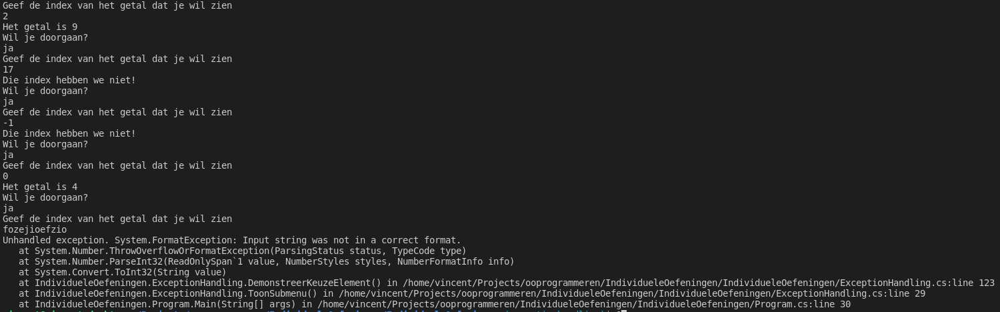

# Labo

## h16-weekdagen-zonder-exception-handling

### Functionele analyse

Je krijgt code die een exception oplevert, maar je kan deze deze oplossen zonder exception handling.

### Technische analyse

Maak eerst een klasse ExceptionHandling met een methode ToonSubmenu zodat je je oefeningen rond exception handling kan demonstreren. Voeg dan volgende methode toe:

```csharp
private static void DemonstreerFoutafhandelingWeekdagenZonderException()
{
    string[] arr = new string[5];
    arr[0] = "Zondag";
    arr[1] = "Maandag";
    arr[2] = "Dinsdag";
    arr[3] = "Woensdag";
    arr[4] = "Donderdag";

    for (int i = 0; i <= 5; i++)
    {
        Console.WriteLine(arr[i].ToString());
    }
}
```

Verbeter zelf de fout.

### Voorbeeldinteractie \(na fix\)

```aspnet
Zondag
Maandag
Dinsdag
Woensdag
Donderdag
```

## h16-weekdagen-met-exception-handling

Start terug vanaf de code van eerder. Noem ze ditmaal `DemonstreerFoutafhandelingWeekdagenMetException`. Los nu het probleem op, enkel en alleen door exception handling toe te voegen op de juiste plaats. De voorbeeldinteractie blijft identiek dezelfde.

## h16-overflow-zonder-exception-handling

### Functionele analyse

Je krijgt opnieuw code die een exception oplevert, maar je kan deze deze oplossen zonder exception handling.

### Technische analyse

Start vanaf volgende code:

```csharp
private static void DemonstreerFoutafhandelingOverflowZonderException()
{
    int num1, num2;
    byte resultaat;
    num1 = 30;
    num2 = 60;
    resultaat = Convert.ToByte(num1 * num2);
    Console.WriteLine("{0} x {1} = {2}", num1, num2, resultaat);
}
```

Spoor zelf de fout op en pas de code aan zodat ze hetzelfde doet, zonder gebruik te maken van exception handling. Gebruik eventueel de debugger.

### Voorbeeldinteractie

```text
3 x 60 = 1800
```

## h16-overflow-met-exception-handling

Start terug vanaf de code van eerder. Los nu het probleem op door te vermelden wat er is misgelopen met behulp van exception handling. Noem je methode nu `DemonstreerFoutAfhandelingOverflowMetException`.

### Voorbeeldinteractie

```text
Het getal is te groot om te converteren naar het gewenste formaat.
```

## h16-juiste-index

### Functionele analyse

Schrijf een programma dat een array maakt met drie willekeurige gehele getallen in en de gebruiker toestaat om een getal naar keuze te tonen, tot hij klaar is.

### Technische analyse

Eerst maak je de array aan. Daarna start je een bepaald soort lus op. Kijk hiervoor in de voorbeeldinteractie welke stappen zich steeds herhalen. Als je programma werkt wanneer de gebruiker zich netjes aan de regels houdt, voeg je exception handling toe om rekening te houden met verkeerde indexwaarden. Op andere soorten exceptions wordt niet voorzien. Noem de methode hiervoor `DemonstreerKeuzeElement`.


Omdat dit een oefening op het basisgebruik is, wijken we hier af van [onze richtlijnen over wanneer je exceptions moet gebruiken](waar-exceptions-plaatsen.md).


### Voorbeeldinteractie



## h16-juiste-index-extra-voorzichtig

### Functionele analyse

Bij de vorige oefening zijn er nog randsituaties mogelijk. Handel de meest waarschijnlijke op een specifieke manier af en voorzie een algemeen vangnet.

### Technische analyse

Test voorgaande code uit met tekst in plaats van een getal. Test voorgaande code uit met een enorm groot getal. Test voorgaande code uit met een kommagetal. Test voorgaande code uit door meteen op enter te duwen. Test voorgaande code uit met een dollarteken in plaats van een getal. Onthoud de soorten exceptions.

Voorzie vervolgens exception handling om uit te leggen wat er is misgelopen zonder het programma te laten crashen, zoals je in de vorige oefening ook hebt aangegeven dat een bepaalde index niet geldig was.

Voorzie ook code om om het even welk type exception af te handelen.

## h16-leeftijd-kat

### Functionele analyse

Schrijf een klasse `Kat`. Deze klasse encapsuleert onze domeinkennis over katten en zorgt ervoor dat we geen onrealistische katten kunnen voorstellen in een softwaresysteem.

### Technische analyse

Maak de klasse. Deze beschikt over een property `Leeftijd`, met een publieke getter, maar geen publieke setter. De leeftijd wordt meegegeven bij constructie en wordt ingesteld, maar als hij hoger is dan 25, moet de code die het `Kat`-object heeft proberen aanmaken een `ArgumentException` afhandelen, met de boodschap: "Deze kat is te oud!".

Pas ook onderstaande code \(die je in een methode `DemonstreerLeeftijdKat` van `ExceptionHandling` mag plaatsen\) aan zodat deze boodschap wordt geprint, maar je programma niet crasht:

```csharp
Kat kat = new Kat(27);
```

### Voorbeeldinteractie

```text
Deze kat is te oud!
```

## h16-leeftijd-katten

### Functionele analyse

Schrijf code die op willekeurige wijze een lijst met katten aanmaakt. Dit kan mis lopen. Hoe dan ook moet je code netjes achter zich opkuisen door in alle gevallen deze lijst terug leeg te maken wanneer het werk gedaan is.


Dit is een nogal vreemd voorbeeld, maar we hebben in deze cursus niet gezien hoe je met databaseconnecties, streams, e.d. werkt en dat zijn het soort zaken die je typisch opkuist in alle mogelijke scenario's.


### Technische analyse

* Maak een methode `DemonstreerLeeftijdKatMetResourceCleanup`
* Maak in deze methode een lijst met katten
* Voeg twintig katten met een willekeurige leeftijd van 0 tot 30 toe aan deze lijst
* Als dit zonder problemen verloopt, toon je: "De volledige lijst met katten is aangemaakt!"
* Als er ergens een probleem optreedt omwille van een ongeldige leeftijd, toon je: "Het is niet gelukt :-\("
* In beide gevallen zorg je dat de methode eindigt door te lijst terug leeg te maken met de methode `Clear`
  * Doe dit op zo'n manier dat dit **altijd** gebeurt, ook als er een andere exception dan de `ArgumentException` optreedt en deze exception op een hoger niveau wordt opgevangen

### Voorbeeldinteractie

```text
De volledige lijst met katten is aangemaakt!
```

**OF**

```text
Het is niet gelukt :-(
```

## h16-filehelper

### Functionele analyse

We willen een _utility_ methode schrijven om makkelijk files te lezen.

### Technische analyse

Schrijf een methode `FileHelper`. Deze vraagt eerst om een pad naar een file en probeert deze file te lezen. Als dit lukt, geeft ze heel de inhoud van de file terug als string. Als de file niet bestaat, geeft ze nog altijd een string terug \(geen exception!\) met de waarde: "File kon niet gevonden worden." In het geval van andere problemen met input/output, geeft ze ook een string terug, met waarde: "File bestaat, maar kon niet gelezen worden. Mogelijk heb je geen toegangsrechten." In nog algemenere problemen geeft ze een string terug met waarde: "Er is iets misgelopen. Neem een screenshot van wat je aan het doen was en contacteer de helpdesk."

```text
Welke file wil je lezen?
> C:\Users\vincent\TODO.txt
naar de winkel gaan
met de hond wandelen
backups maken
```

**OF**

```text
Welke file wil je lezen?
> C:\Users\vincent\FILEDIENIETBESTAAT.txt
File kon niet gevonden worden
```

**OF**

```text
Welke file wil je lezen?
> C:\Windows\beschermdefile.txt
File bestaat, maar kon niet gelezen worden. Mogelijk heb je geen toegangsrechten.
```


