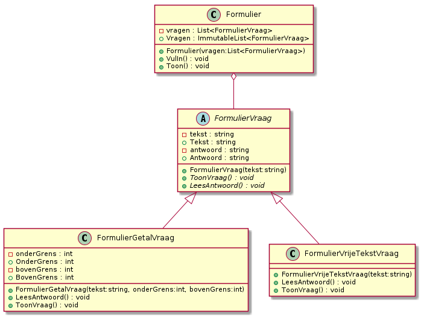
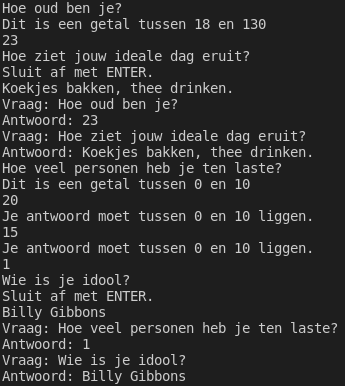

# Labo

## h16-weekdagen-zonder-exception-handling

### Functionele analyse

Je krijgt code die een exception oplevert, maar je kan deze deze oplossen zonder exception handling.

### Technische analyse

Maak eerst een klasse ExceptionHandling met een methode ToonSubmenu zodat je je oefeningen rond exception handling kan demonstreren. Voeg dan volgende methode toe:

```csharp
private static void DemonstreerFoutafhandelingWeekdagenZonderException()
{
    string[] arr = new string[5];
    arr[0] = "Vrijdag";
    arr[1] = "Maandag";
    arr[2] = "Dinsdag";
    arr[3] = "Woensdag";
    arr[4] = "Donderdag";

    for (int i = 0; i <= 5; i++)
    {
        Console.WriteLine(arr[i].ToString());
    }
}
```

Verbeter zelf de fout.

### Voorbeeldinteractie \(na fix\)

```aspnet
Vrijdag
Maandag
Dinsdag
Woensdag
Donderdag
```

## h16-weekdagen-met-exception-handling

Start terug vanaf de code van eerder. Noem ze ditmaal `DemonstreerFoutafhandelingWeekdagenMetException`. Los nu het probleem op, enkel en alleen door exception handling toe te voegen op de juiste plaats. De voorbeeldinteractie blijft identiek dezelfde.

## h16-overflow-zonder-exception-handling

### Functionele analyse

Je krijgt opnieuw code die een exception oplevert, maar je kan deze deze oplossen zonder exception handling.

### Technische analyse

Start vanaf volgende code:

```csharp
private static void DemonstreerFoutafhandelingOverflowZonderException()
{
    int num1, num2;
    byte resultaat;
    num1 = 30;
    num2 = 60;
    resultaat = Convert.ToByte(num1 * num2);
    Console.WriteLine("{0} x {1} = {2}", num1, num2, resultaat);
}
```

Spoor zelf de fout op en pas de code aan zodat ze hetzelfde doet, zonder gebruik te maken van exception handling. Gebruik eventueel de debugger.

### Voorbeeldinteractie

```text
3 x 60 = 1800
```

## h16-overflow-met-exception-handling

Start terug vanaf de code van eerder. Los nu het probleem op door te vermelden wat er is misgelopen met behulp van exception handling. Noem je methode nu `DemonstreerFoutAfhandelingOverflowMetException`.

### Voorbeeldinteractie

```text
Het getal is te groot om te converteren naar het gewenste formaat.
```

## h16-juiste-index

### Functionele analyse

Schrijf een programma dat een array maakt met drie willekeurige gehele getallen in en de gebruiker toestaat om een getal naar keuze te tonen, tot hij klaar is.

### Technische analyse

Eerst maak je de array aan. Daarna start je een bepaald soort lus op. Kijk hiervoor in de voorbeeldinteractie welke stappen zich steeds herhalen. Als je programma werkt wanneer de gebruiker zich netjes aan de regels houdt, voeg je exception handling toe om rekening te houden met verkeerde indexwaarden. Op andere soorten exceptions wordt niet voorzien. Noem de methode hiervoor `DemonstreerKeuzeElement`.


Omdat dit een oefening op het basisgebruik is, wijken we hier af van [onze richtlijnen over wanneer je exceptions moet gebruiken](waar-exceptions-plaatsen.md).


### Voorbeeldinteractie


## h16-juiste-index-extra-voorzichtig

### Functionele analyse

Bij de vorige oefening zijn er nog randsituaties mogelijk. Handel de meest waarschijnlijke op een specifieke manier af en voorzie een algemeen vangnet.

### Technische analyse

Test voorgaande code uit met tekst in plaats van een getal. Test voorgaande code uit met een enorm groot getal. Test voorgaande code uit met een kommagetal. Test voorgaande code uit door meteen op enter te duwen. Test voorgaande code uit met een dollarteken in plaats van een getal. Onthoud de soorten exceptions.

Voorzie vervolgens exception handling om uit te leggen wat er is misgelopen zonder het programma te laten crashen, zoals je in de vorige oefening ook hebt aangegeven dat een bepaalde index niet geldig was.

Voorzie ook code om om het even welk type exception af te handelen.

## h16-leeftijd-kat

### Functionele analyse

Schrijf een klasse `Kat`. Deze klasse encapsuleert onze domeinkennis over katten en zorgt ervoor dat we geen onrealistische katten kunnen voorstellen in een softwaresysteem.

### Technische analyse

Maak de klasse. Deze beschikt over een property `Leeftijd`, met een publieke getter, maar geen publieke setter. De leeftijd wordt meegegeven bij constructie en wordt ingesteld, maar als hij hoger is dan 25, moet de code die het `Kat`-object heeft proberen aanmaken een `ArgumentException` afhandelen, met de boodschap: "Deze kat is te oud!".

Pas ook onderstaande code \(die je in een methode `DemonstreerLeeftijdKat` van `ExceptionHandling` mag plaatsen\) aan zodat deze boodschap wordt geprint, maar je programma niet crasht:

```csharp
Kat kat = new Kat(27);
```

### Voorbeeldinteractie

```text
Deze kat is te oud!
```

## h16-leeftijd-katten

### Functionele analyse

Schrijf code die op willekeurige wijze een lijst met katten aanmaakt. Dit kan mis lopen. Hoe dan ook moet je code netjes achter zich opkuisen door in alle gevallen deze lijst terug leeg te maken wanneer het werk gedaan is.


Dit is een nogal vreemd voorbeeld, maar we hebben in deze cursus niet gezien hoe je met databaseconnecties, streams, e.d. werkt en dat zijn het soort zaken die je typisch opkuist in alle mogelijke scenario's.


### Technische analyse

* Maak een methode `DemonstreerLeeftijdKatMetResourceCleanup`
* Maak in deze methode een lijst met katten
* Voeg twintig katten met een willekeurige leeftijd van 0 tot 30 toe aan deze lijst
* Als dit zonder problemen verloopt, toon je: "De volledige lijst met katten is aangemaakt!"
* Als er ergens een probleem optreedt omwille van een ongeldige leeftijd, toon je: "Het is niet gelukt :-\("
* In beide gevallen zorg je dat de methode eindigt door te lijst terug leeg te maken met de methode `Clear`
  * Doe dit op zo'n manier dat dit **altijd** gebeurt, ook als er een andere exception dan de `ArgumentException` optreedt en deze exception op een hoger niveau wordt opgevangen

### Voorbeeldinteractie

```text
De volledige lijst met katten is aangemaakt!
```

**OF**

```text
Het is niet gelukt :-(
```

## h16-filehelper

### Functionele analyse

We willen een _utility_ methode schrijven om makkelijk files te lezen.

### Technische analyse

Schrijf een methode `FileHelper`. Deze vraagt eerst om een pad naar een file en probeert deze file te lezen. Als dit lukt, geeft ze heel de inhoud van de file terug als string. Als de file niet bestaat, geeft ze nog altijd een string terug \(geen exception!\) met de waarde: "File kon niet gevonden worden." In het geval van andere problemen met input/output, geeft ze ook een string terug, met waarde: "File bestaat, maar kon niet gelezen worden. Mogelijk heb je geen toegangsrechten." In nog algemenere problemen geeft ze een string terug met waarde: "Er is iets misgelopen. Neem een screenshot van wat je aan het doen was en contacteer de helpdesk."

```text
Welke file wil je lezen?
> C:\Users\vincent\TODO.txt
naar de winkel gaan
met de hond wandelen
backups maken
```

**OF**

```text
Welke file wil je lezen?
> C:\Users\vincent\FILEDIENIETBESTAAT.txt
File kon niet gevonden worden
```

**OF**

```text
Welke file wil je lezen?
> C:\Windows\beschermdefile.txt
File bestaat, maar kon niet gelezen worden. Mogelijk heb je geen toegangsrechten.
```


## h16-leeftijd-kat-custom

### Functionele analyse

We doen een uitbreiding op h16-leeftijd-kat. We zouden graag makkelijk in detail kunnen uitleggen aan de gebruiker waarom het is misgelopen. We doen dit hier in de eerste plaats door een custom exception type te voorzien.

### Technische analyse

* Maak een kopie van je klasse `Kat`. Noem deze `KatMetCustomException`.
* Maak een klasse `KatLeeftijdException`. Deze erft van `ArgumentException`.
  * Ze heeft drie read-only properties, waarvan je zelf het juiste type zou moeten kunnen bepalen:
    * `MeegegevenWaarde`
    * `LaagstMogelijkeWaarde`
    * `HoogstMogelijkeWaarde`
  * Ze heeft een constructor die \(enkel\) waarden voor deze drie properties als parameters heeft.
  * Wanneer de leeftijd van een `KatMetCustomException` wordt ingesteld, wordt een exception van dit type in plaats van een `ArgumentException` gegooid. Hierbij vul je de argumenten in op basis van de rest van je code.
* Maak ook een variatie op je eerdere demonstratiemethode. Noem deze `DemonstreerLeeftijdKatMetCustomException`.

### Voorbeeldinteractie

Als dit in je code staat:

```csharp
KatMetCustomException kat = new KatMetCustomException(37);
```

```text
37 is geen geldige leeftijd. De laagst mogelijke leeftijd is 0 jaar, de hoogst mogelijke leeftijd is 25 jaar.
```

Dit bericht mag niet "hardgecodeerd zijn". Elk getal moet uit de exception gehaald worden.

## Schooladmin project: geen dubbele data

Maak in je SchoolAdmin project een klasse `DuplicateDataException`. Deze heeft twee properties, `Waarde1` en `Waarde2`, beide van type `System.Object`. Ze heeft ook een constructor die een message en de twee waarden als parameter heeft.

## Schooladmin project: geen dubbele cursusnamen

Wanneer je een nieuwe cursus aanmaakt, wordt deze vanzelf geregistreerd in het systeem. Pas je code aan zodat geen twee cursussen met dezelfde naam kan registreren. Meerbepaald: zorg dat een poging om een cursus aan te maken afgebroken wordt door middel van een `DuplicateDataException` vooraleer de teller van alle cursussen wordt verhoogd. De boodschap die je meegeeft is: "Nieuwe cursus heeft dezelfde naam als een bestaande cursus." Voor de eerste waarde geef je de nieuwe cursus, voor de tweede geef je de bestaande cursus.

Zorg er ook voor dat je keuzemenu niet crasht wanneer deze fout zich voordoet, maar de boodschap van de exception toont en het ID van de bestaande cursus waarmee de nieuwe cursus zou overlappen. Dit kan je doen door `Waarde2` te casten.

## Schooladmin project: geen lege waarden voor VakInschrijving

Het is niet logisch een inschrijving te hebben zonder student of zonder vak. Zorg ervoor dat een VakInschrijving niet kan aangemaakt worden zonder een \(of beide\) van deze elementen. Gebruik hiervoor een `ArgumentException`. Breid bij wijze van demonstratie je keuzemenu om een student of een vak toe te voegen uit met een optie met nummer 0 om de waarde `null` te gebruiken. \(Dit zou je in het echt niet toevoegen aan je systeem zelf, maar je zou aparte testcode schrijven die dit doet.\) Zorg ook dat het niet toegelaten is een student twee keer in te schrijven voor hetzelfde vak. Ook dat levert een `ArgumentException`. Zorg dat het keuzemenu niet crasht wanneer je deze optie kiest, maar gewoon de boodschap van de exception toont.

## Schooladmin project: beperkt aantal inschrijvingen per vak

Er mogen niet meer dan 20 lopende inschrijvingen per cursus zijn. Zorg ervoor dat er een `CapaciteitOverschredenException` \(met enkel de message als parameter\) optreedt wanneer je iemand probeert in te schrijven voor een cursus waarvoor al 20 inschrijvingen \(zonder toegekend resultaat\) bestaan. Zorg ervoor dat je keuzemenu hierop voorzien is en de message toont, zonder te crashen.

## h16-gedeeltelijke-afhandeling

### Functionele analyse

We schrijven flexibele formuliercode, die we ook zullen gebruiken om de duidelijkheid van onze formulieren te verbeteren. Een formulier logt ongeldige antwoorden op vragen vooraleer het de fout signaleert aan een hoger niveau.


Dit is een uitdagende, maar leerrijke en realistische oefening.


### Technische analyse

We vertrekken vanaf dit klassendiagram:



Je krijgt ook volgende demonstratiecode om in het submenu van je klasse `ExceptionHandling` te plaatsen:

```csharp
private static void DemonstreerFormulieren() {
    var vraag1 = new FormulierGetalVraag("Hoe oud ben je?", 18, 130);
    var vraag2 = new FormulierVrijeTekstVraag("Hoe ziet jouw ideale dag eruit?");
    var vraag3 = new FormulierGetalVraag("Hoe veel personen heb je ten laste?", 0, 10);
    var vraag4 = new FormulierVrijeTekstVraag("Wie is je idool?");
    Formulier f1 = new Formulier(new List<FormulierVraag>{ vraag1, vraag2 });
    Formulier f2 = new Formulier(new List<FormulierVraag>{ vraag3, vraag4 });
    try {
        f1.VulIn();
        f1.Toon();
    }
    catch (Exception) {
        System.Console.WriteLine("We zullen dit formulier weggooien.");
        f1 = null;
    }
    try {
        f2.VulIn();
        f2.Toon();
    }
    catch (Exception) {
        System.Console.WriteLine("We zullen dit formulier weggooien.");
        f2 = null;
    }
}
```

De werking van elke klasse is als volgt:

* FormulierVraag:
  * Dit stelt één vraag op één formulier voor, inclusief het antwoord dat eventueel al is gegeven op deze vraag.
  * De tekst is de vraag waarop een antwoord verwacht wordt. Deze mag nooit leeg of null zijn.
  * Het antwoord is het antwoord dat de invuller gegeven heeft op deze vraag, in tekstformaat. Dit moet initieel null zijn maar mag later nooit meer naar null gewijzigd worden.
  * Het presenteren van een vraag en het inlezen van een antwoord hangt af van het vraagtype, omdat elk vraagtype eigen instructies heeft \(bv. antwoorden in tekst of met een reeks cijfers,...\)
* FormulierGetalVraag:
  * Dit stelt een vraag voor waarbij een getal wordt verwacht.
  * De ondergrens is het kleinste getal dat mag worden ingegeven, de bovengrens is het grootste getal dat mag worden ingegeven.
  * Als een vraag van dit type wordt aangemaakt met een ondergrens die groter is dan de bovengrens, krijgen we een `ArgumentException`.
  * Bij het inlezen van een antwoord wordt de ingetypte tekst geconverteerd naar een getal. Als dit getal tussen de ondergrens en bovengrens ligt, wordt het antwoord \(het getal, voorgesteld als string\) opgeslagen. Anders wordt gesignaleerd dat het antwoord tussen deze twee getallen moet liggen en wordt er opnieuw tekst ingelezen, tot er een antwoord verkregen is \(of er een exception optreedt\).
  * Tonen van een vraag gaat als volgt:
    * Eerst wordt de vraagtekst geprint.
    * Daaronder wordt toegevoegd: "Dit is een getal tussen ... en ..." \(met daar de grenzen ingevuld\)
* FormulierVrijeTekstVraag:
  * Alle tekst is geldig als antwoord
  * Tonen van een vraag: de vraagtekst wordt getoond. Daaronder wordt getoond: "Sluit af met ENTER."
* Formulier:
  * Bij constructie wordt er een lijst met FormulierVraag-objecten meegegeven.
  * Deze vragen worden opgeslagen en na aanmaak van het formulier kan de lijst met vragen niet meer gewijzigd worden.
  * Een formulier invullen betekent dat we één voor één elke vraag in het formulier tonen en het antwoord inlezen.
    * Dit kan fout lopen. Als er iets fout loopt \(wat dan ook\), tonen we een bericht "Onverwachte fout wordt naar schijf weggeschreven." en staan we vervolgens toe dat de fout naar een hoger niveau van de programmacode gaat.
  * Een formulier tonen betekent dat we voor elke vraag in het formulier de tekst van de vraag en het opgeslagen antwoord tonen.

### Voorbeeldinteractie



