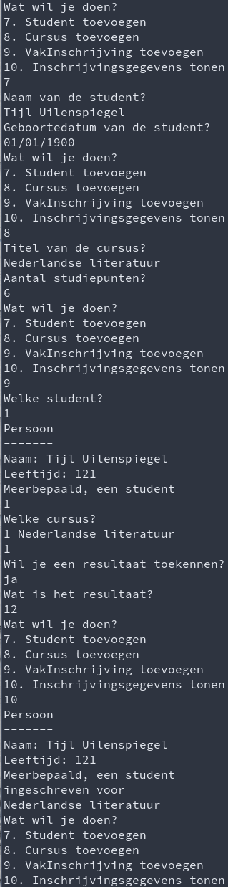

# Labo

## h15-bugfix

### Functionele analyse

We schrijven een bestelsysteem. We kunnen gewone bestellingen en internationale bestellingen plaatsen. Voor geïmporteerde producten wordt een extra toelage van 10% aangerekend, maar is er wel korting voor grote bestellingen. We willen de prijzen van onze producten niet publiek zichtbaar maken, want dat verhindert prijsafspraken.

### Technische analyse

Schrijf een klasse Bestelling met een `uint` property `Aantal` en een `double` privé-attribuut `basisPrijs`. Voorzie ook een overschrijfbare property `TotaalPrijs`, namelijk het aantal maal de basisprijs. Schrijf een subklasse `InternationaleBestelling` die de totaalprijs bepaalt door de basisprijs met 10% te verhogen, maar vanaf 100 stuks een vlakke korting van 1000 euro toepast. **Dit zal niet meteen werken!** Doe een zo klein mogelijke aanpassing om het toch te doen werken.

Schrijf een methode `DemonstreerBestellingen` in de klasse `EigenObjectOefeningen`. Hierin vraag je of de gebruiker een gewone of internationale bestelling wil plaatsen, vraag je om het aantal en de basisprijs en toon je dan de totaalprijs.

### Voorbeeldinteractie

```text
Aantal stuks?
> 4
Basisprijs?
> 5
Gewone bestelling (1) of internationale bestelling (2)?
> 1
Totaalprijs: 20
```

## h15-pizza

### Functionele analyse

We schrijven software om bestellingen van pizza's op te volgen. Deze software spreekt met andere software, bijvoorbeeld van Deliveroo of Uber Eats. We willen niet dat die diensten iets kunnen aanpassen aan de ingrediënten van onze pizza's, maar we willen wel zelf wel allerlei pizza's kunnen samenstellen.

### Technische analyse

Je krijgt volgende klasse `Pizza`:

```csharp
abstract class Pizza {
    private List<string> ingredienten;
    
    public Pizza(string[] extraToppings) {
        this.ingredienten = new List<string> { "deeg", "tomatensaus", "kaas" };
        foreach(var topping in extraToppings) {
            this.ingredienten.Add(topping);
        }
    }
    
    public abstract double BasisPrijs {
        get;
    }
    
    public double Prijs {
        get {
            return this.BasisPrijs + (this.ingredienten.Count * 0.5);
        }
    }
    
    public void ToonIngredienten() {
        foreach(var ingredient in ingredienten) {
            Console.WriteLine(ingredient);
        }
    }
    
    
}
```

Schrijf nu twee klassen `Margarita` en `Veggie` die overerven van `Pizza`, met basisprijs 5 en 6. Bij constructie krijgt een Margarita sowieso "mozzarella" toegevoegd aan de lijst met ingrediënten en krijgt een Veggie sowieso "tofu" en "spinazie", maar geen "kaas". Je moet hierbij een aanpassing doen aan `Pizza`, maar hou ze zo klein mogelijk. Schrijf een demonstratiemethode `DemonstreerPizzas` in de klasse `EigenObjectOefeningen`.

### Voorbeeldinteractie

```text
Een margarita zonder extra's kost: (hier het resultaat)
De ingredienten zijn: 
(hieronder het effect van ToonIngredienten)
Een veggie zonder extra's kost:
De ingredienten zijn: 
(hieronder het effect van ToonIngredienten)
```

## h15-menukaart

### Functionele analyse

We willen een digitale menukaart tonen in een online restaurant. Op deze kaart verschijnen gerechten in een standaardformaat. Kindergerechten volgen hetzelfde formaat, maar verschijnen in kleur.

### Technische analyse

* Schrijf een klasse `Gerecht` met properties `Naam` en `Prijs` \(deze laatste van type `double`\)
  * De methode `ToonOpMenu` print de naam, gevolgd door 3 tabs, gevolgd door de prijs
* Schrijf een kindklasse `KinderGerecht`
  * Dit werkt hetzelfde als een gewoon gerecht, maar de weergave op het menu gebruikt een willekeurige kleur. Als we bijvoorbeeld het aantal tabs aanpassen naar 5, moet KinderGerecht zonder aanpassingen mee volgen.
    * Je kan een willekeurige kleur krijgen door een willekeurig getal tussen 1 en 15 te bepalen en dat dan te casten naar een waarde van de enum `ConsoleColor`.
* Maak een methode `DemonstreerGerechten`. Hierin maak je een lijst met minstens 4 gerechten \(waarvan minstens 2 kindergerechten\) naar keuze en doorloop je de lijst zodat elk gerecht getoond wordt op het menu.

### Voorbeeldinteractie

```text
Paling in 't groen            22.00
Vol-au-vent             11.00(deze regel verschijnt in een willekeurige kleur)
Waterzooi            22.00
Kabouterschnitzel             12.00(deze regel verschijnt in een willekeurige kleur)
```


Tabs zijn eigenlijk niet ideaal. Zoek, als je sneller klaar bent, uit hoe je stringformattering kan gebruiken om de naam van elk gerecht met exact 35 tekens weer te geven.


## H15-figuren


Kopieer eerst je code van [h14-figuren](../h12-overerving/oefeningen.md#oefening-h-14-figuren) naar een nieuwe klasse `VergelijkbareFiguur` met kindklassen `VergelijkbareCirkel` enzovoort. 


### Functionele analyse

We willen wat basisfunctionaliteit toevoegen aan onze figuren.

### Technische analyse

Voorzie de niet-abstracte subklassen van `VergelijkbareFiguur` van een `Equals` methode. Twee figuren zijn gelijk als ze van hetzelfde type zijn \(bijvoorbeeld beide cirkels, beide rechthoeken,...\) en dezelfde afmetingen hebben.

Hierna moet je ook de hash code aanpassen. Dit zie je als waarschuwing bovenaan de klasse in Visual Studio. Maak de setters voor de afmetingen `private` \(of `protected` waar je ze in de kindklassen gebruikt\) en zorg dat de afmetingen alleen bij constructie worden vastgelegd. Gebruik daarna de som van de hash codes van alle afmetingen als hash code voor de figuur.


De reden dat je de setters afschermt is dat een object niet van hash code mag veranderen wanneer het al in gebruik is.


Voorzie ten slotte een aantal implementaties van `ToString`:

* voor cirkels toon je: `"Dit is een object van klasse VergelijkbareCirkel met straal <straal>"`  \(je vult &lt;straal&gt; correct in en de code moet juist blijven ook als je de klasse van naam verandert\)
* voor driehoeken toon je: `"Dit is een object van klasse VergelijkbareDriehoek met basis <basis> en hoogte <hoogte>"`  \(je vult de afmetingen correct in en de code moet juist blijven ook als je de klasse van naam verandert\)
* voor parallellogram zoals bij de vorige twee
* voor een rechthoek \(en dus vanzelf ook voor een vierkant\) genereer je een tekening bestaande uit puntjes. Je doet dit door de breedte en lengte naar boven af te ronden en daaruit het aantal rijen en kolommen in je tekening af te leiden.

Bijvoorbeeld, voor een rechthoek met breedte exact 31 en hoogte 4.5:

```text
...............................
...............................
...............................
...............................
...............................
```

### Voorbeeldinteractie

Schrijf een methode `DemonstreerVergelijkbareFiguren` die de werking van Equals test door figuren met dezelfde afmetingen met elkaar te vergelijken, figuren van verschillende types met elkaar te vergelijken, figuren met verschillende afmetingen met elkaar te vergelijken. Gebruik elk type figuur. Toon dan ook voor elke figuur de voorstelling als string.

## Uitbreidingen SchoolAdmin

### Vergelijkbare objecten

Voorzie `Persoon` en `Cursus` van een eigen versie van Equals. Hiermee zullen we later nagaan dat een van deze objecten niet dubbel voorkomt in de lijst met geregistreerde objecten.

Een persoon is gelijk aan een andere persoon met hetzelfde ID. Je hoeft hier niet na te gaan dat de objecten van exact hetzelfde type zijn. In plaats daarvan kan je schrijven: `if (obj is Person) { ... }`

Een cursus is gelijk aan een andere cursus met hetzelfde ID.

Voorzie ook overal een hash code volgens de vuistregel in de cursus.

### `ToString`

Voorzie `Persoon` van een `ToString` methode die een resultaat van volgende vorm toont:

```text
Persoon
-------
Naam: Wouter Roelants
Leeftijd: 43
```


Voorzie in één keer een property `Leeftijd` die berekend wordt aan de hand van de huidige datum.


Zorg dat de concrete klassen hier ook het statuut van de persoon aan koppelen, bijvoorbeeld:

```text
Persoon
-------
Naam: Geertrui Willems
Leeftijd: 51
Meerbepaald, administratief personeel
```

Doe dit niet met `GetType`, want dan is de schrijfwijze anders. Doe het met de hand per klasse.

### Eenmaking statische lijsten personen

Je hebt momenteel volgende statische properties voor \(immutable\) lijsten met personen:

* AllePersonen
* AlleLectoren
* AlleStudenten
* AllePersoneel
* AlleAdministratiefPersoneel

Het is niet ideaal om al deze lijsten te hebben. Elke persoon wordt nu op twee of drie plaatsen bijgehouden, dus als je het systeem zou aanpassen om personen te verwijderen, moet je er aan denken dat op twee of drie plaatsen te doen. Als je klassen zoals `Gastlector`, `Uitwisselingsstudent` of `Roosterverantwoordelijke` zou toevoegen, zou je dat zelfs op nog meer plaatsen moeten doen.

Vervang daarom de lijsten voor de subklassen van `Persoon` zodat er geen achterliggend attribuut wordt bijgehouden. In plaats daarvan, moet de lijst met personen "on-the-fly" berekend worden. Met andere woorden, je moet nog steeds een getter `AlleLectoren` enzovoort voorzien, maar deze verzamelt alle lectoren door `AllePersonen` te doorlopen. Gebruik hier opnieuw het woordje `is` dat we bij `Equals` hebben gebruikt.

### Tweerichtingsverkeer voor `VakInschrijving`

In je huidige code heeft de klasse `Student` een lijst `vakInschrijvingen`. Zo wordt een student gelinkt aan de cursussen die hij of zij volgt. Dit is niet ideaal, want in werkelijkheid willen we ook vaak te weten komen welke studenten in een bepaalde cursus zijn ingeschreven. We moeten dus in twee richtingen kunnen gaan.

Een mogelijke oplossing: voorzie de klasse `VakInschrijving` van een \(immutable\) lijst `AlleVakInschrijvingen`. Zo hoef je geen data dubbel bij te houden en kan je toch de functionaliteit verder uitbreiden. Schrap de huidige lijst met vakinschrijvingen in de klasse `Student`. Voorzie ter vervanging daarvan een property student in de klasse `VakInschrijving` die bijhoudt welke student bij de inschrijving hoort. Voorzie ook, in de klasse `Student`, een property `VakInschrijvingen` die "on-the-fly" berekent welke inschrijvingen bij de student in kwestie horen. Voorzie ook een property `Cursussen`. Voorzie bovendien in de klasse Cursus een property `VakInschrijvingen` en een property `Studenten`. Al deze properties zijn onveranderlijke lijsten.

Je zal ten slotte de lijst met studenten uit de klasse `Cursus` moeten verwijderen. Dit vraagt een aantal logische aanpassingen. In de methode `DemonstreerCursussen` mag je code om studenten te associëren met een cursus verwijderen.

### Cursussen in semesters

Momenteel bestaat een studieprogramma gewoon uit een vlakke lijst cursussen. Dat stemt niet goed overeen met de werkelijkheid. In werkelijkheid wordt een cursus in een bepaald semester ingepland. Eén manier om dit voor te stellen: vervang de vlakke lijst met cursussen door een `Dictionary` met cursussen als keys en getalwaarden \(semesters\) als values. Doe deze aanpassing in je code. Je zal hiervoor je demonstratiecode moeten aanpassen. Zorg dat communicatie bij de opleiding programmeren in het eerste semester staat, maar bij de opleiding systeem- en netwerkbeheer in het tweede semester. Alle andere vakken staan overal in het eerste semester.

### Manueel data invoeren

De demonstratiemethodes hebben bijna overal objecten aangemaakt door ze te "hard coden". Dat wil zeggen dat de instructies C\# code zijn en niet gewijzigd kunnen worden eens je programma gecompileerd is. In een echte systeem voor schoolbeheer zou het administratief personeel voortdurend nieuwe entiteiten kunnen toevoegen aan het systeem.

Voorzie daarom vier nieuwe mogelijkheden in je keuzemenu: "student toevoegen", "cursus toevoegen", "vakinschrijving toevoegen" en "inschrijvingsgegevens tonen". De eerste drie vragen om de nodige gegevens om een object van een van deze klassen aan te maken. De laatste toont eerst alle studenten in het systeem, dan alle cursussen, dan alle inschrijvingen. Zorg ook dat je menu opties presenteert in een oneindige lus, zodat je je methodes samen kan testen.

Onderstaande screenshot toont een voorbeeldinteractie \(enkel de nieuwe opties zijn getoond om plaats te sparen\):




