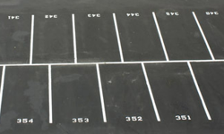

# Arrays van objecten

## Object arrays

We vallen in herhaling: ook arrays van objecten zijn mogelijk, net zoals je arrays van valuetypes al kon maken. Ook hier is de werking grotendeels dezelfde. Maar ook hier moet je er rekening mee houden dat de individuele objecten in je array **reference** values hebben en dus mogelijk `null` zijn.

### Array van objecten aanmaken

Een array van objecten gebeurt als volgt:

```csharp
Student[] mijnKlas = new Student[20];
```

**Maar: er staan nog géén objecten in deze array. Alle elementen in deze array zijn nu nog `null`.** Je zou kunnen zeggen dat we enkel nog maar de parkeerlijnen hebben aangemaakt.



Willen we nu elementen in deze array plaatsen dan moeten dit ook expliciet doen:

```csharp
mijnKlas[0]= new Student();
mijnKlas[7]= new Student();
```

Uiteraard kan dit ook in een loop indien relevant voor de opgave.

Probeer je objecten te benaderen die nog niet bestaan dan zal je uiteraard een `NullReferenceException` krijgen.

#### Array initializer syntax

Je kan ook een variant op de object initializer syntax gebruiken waarbij de objecten reeds van bij de start in de array worden aangemaakt. Als extra'tje zorgt dit er ook voor dat we geen lengte moeten meegeven, de compiler zal deze zelf bepalen. Volgende voorbeeld maakt een nieuwe array aan die bestaat uit 2 nieuwe studenten, alsook 1 bestaande \(`jos`\):

```csharp
Student jos=new Student();
Student[] mijnKlas = new Student[]
    {
        new Student(),
        new Student(),
        jos,
        new Student()
    };
```

Let op de kommapunt helemaal achteraan. Die wordt als eens vergeten.

### Individueel object benaderen

Van zodra een object in de array staat kan je deze vanuit de array aanspreken d.m.v. de index :

```csharp
mijnKlas[3].Name= "Vincent Lagasse";
```

#### Null check met ?

Ook hier kan je met `?` een null check schrijven:

```csharp
mijnKlas?[3]?.Name= "Romeo Montague ";
```

Merk op dat het eerste vraagteken controleer of de array niet `null`is. Het tweede vraagteken, na de index, is om te controleren of het element op die index niet `null` is.

## Arrays als parameters en return

Ook arrays mag je als parameters en returntype gebruiken in methoden. De werking hiervan is identiek aan die van value-types.

## CSV uitlezen naar klasse

We herbekijken het voorbeeld van de csv-parser uit het [vorige hoofdstuk over strings splitsen en csv-bestanden](https://github.com/v-nys/cursusprogrammeren/tree/ce87699fd44fead2f6daa6a8169054bda247ac27/h10-advanced-klassen-en-objecten/strings.md)

We maken nu een klasse Speler:

```csharp
class Speler
{
    public string Voornaam { get;set;}
    public string Achternaam { get;set;}
    public int GebJaar { get;set;}
}
```

We herschrijven dan het parsen naar:

```csharp
string[] lines = File.ReadAllLines(@"c:\soccerstars.csv");
Speler[] spelers= new Speler[lines.Length];

for (int i = 0; i < lines.Length; i++)
{
    string[] splitted = lines[i].Split(';');

    Speler temp=new Speler();
    temp.Voornaam= splitted[1];
    temp.Achternaam= splitted[0];
    temp.GebJaar= splitted[2]:

    spelers[i]= temp;
}
```

### \(PRO\) CSVHelper

De opensource bibliotheek `csvhelper` is een nuttige toevoeging om vorige zaken een deel te automatiseren. Je kan deze eenvoudig als een `nuget` installeren. Alle uitleg en werking vind je op de website: [https://joshclose.github.io/CsvHelper/](https://joshclose.github.io/CsvHelper/).

