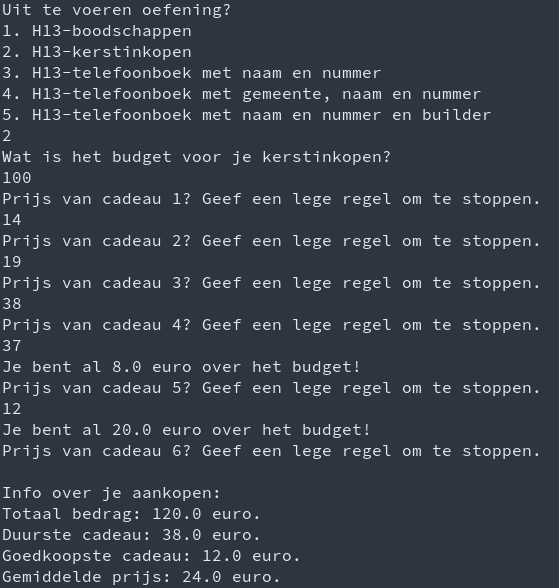

# Labo

## Oefening: som-per-rij

### Functionele analyse

We wensen de gegevens in één rij te groeperen door hun som te bepalen, een beetje zoals je dat in een Excel spreadsheet zou kunnen doen.

### Technische analyse

Schrijf in de klasse `DataStructuren` een methode `SomPerRij`. Deze maakt een tweedimensionale array met het gevraagde aantal rijen en het gevraagde aantal kolommen aan. Je mag veronderstellen dat er een geldig aantal wordt ingegeven. Vervolgens vraagt ze, rij per rij en kolom per kolom, een getalwaarde. Wanneer elke positie is ingevuld, toont ze de som per rij van de ingegeven getallen.

### Voorbeeldinteractie

```text
Hoe veel rijen telt je array?
> 3
Hoe veel kolommen telt je array?
> 2
Waarde voor rij 1, kolom 1?
> 4
Waarde voor rij 1, kolom 2?
> 2
Waarde voor rij 2, kolom 1?
> 1
Waarde voor rij 2, kolom 2?
> 1
Waarde voor rij 3, kolom 1?
> 7
Waarde voor rij 3, kolom 2?
> 9
Sommen per rij:
6
2
16
```

## Oefening: som-per-kolom

### Functionele analyse

We wensen de gegevens in één kolom te groeperen door hun som te bepalen, een beetje zoals je dat in een Excel spreadsheet zou kunnen doen.

### Technische analyse

Schrijf in de klasse `DataStructuren` een methode `SomPerKolom`. Deze werkt zoals de vorige oefening, maar maakt de som per kolom.

### Voorbeeldinteractie

```text
Hoe veel rijen telt je array?
> 3
Hoe veel kolommen telt je array?
> 2
Waarde voor rij 1, kolom 1?
> 4
Waarde voor rij 1, kolom 2?
> 2
Waarde voor rij 2, kolom 1?
> 1
Waarde voor rij 2, kolom 2?
> 1
Waarde voor rij 3, kolom 1?
> 7
Waarde voor rij 3, kolom 2?
> 9
Sommen per kolom:
12
12
```

## Oefening: Pixels

### Functionele analyse

We willen een simpel tekenprogramma maken in de terminal. De gebruiker kan pixel per pixel een gewenste kleur aangeven.

### Technische analyse

Schrijf in \(nieuwe klasse met `ToonSubmenu`\)  `DataStructuren` een methode `Pixels`.

Vraag hierin eerst aan de gebruiker welke afmetingen hij wil gebruiken voor zijn afbeelding. Dit bepaalt het aantal rijen en kolommen en dus het aantal pixels. Maak vervolgens een array van `ConsoleColor` waarden aan met deze afmetingen. Vraag tenslotte in een lus wat de gebruiker wil doen:

* een pixel kleuren
  * vraag hierbij de rij-index en kolom-index
  * vraag ten slotte in welke kleur deze moet worden ingevuld
    * je kan sneller een array van alle kleuren krijgen met volgende code: `ConsoleColor[] kleuren = (ConsoleColor[]) Enum.GetValues(typeof(ConsoleColor));`
    * je hoeft deze instructie niet volledig te begrijpen: ze doet hetzelfde als `ConsoleColor[] kleuren = {ConsoleColor.Back, ConsoleColor.DarkBlue, ...}` maar vraagt gewoon minder typwerk
* de afbeelding zoals ze momenteel is tonen
  * toon hiervoor elke pixel als een spatie met `Console.Write(" ")`

### Voorbeeldinteractie


## H13-boodschappenlijstje

Pas je [boodschappenlijstje uit hoofdstuk 8](../../semester-1-programming-principles/h7-arrays/oefeningen.md#oefening-h-8-boodschappenlijst) aan zodat het gebruik maakt van een lijst. Op deze manier hoef je niet op voorhand te vragen hoe veel items gekocht zullen worden. Maak deze versie deel van de klasse `Datastructuren`.

Zorg hierbij dat het programma pas stopt als er een lege regel wordt ingegeven als "item" op het boodschappenlijstje.

**Tip**: voor lijsten is `Sort` een instantiemethode

### Voorbeeldinteractie


## H13-kerstinkopen

Pas je [programma voor kerstinkopen](../../semester-1-programming-principles/h7-arrays/oefeningen.md#oefening-h-8-kerstinkopen) van eerder aan zodat het gebruik maakt van een lijst. Hierdoor hoef je niet op voorhand aan te geven hoe veel cadeautjes je wil kopen.

### Voorbeeldinteractie



## H13-telefoonboek \(naam en nummer\)

### Functionele analyse

We wensen een simpel telefoonboek bij te houden, waarin je namen en nummers plaatst.

### Technische analyse

* maak eerst een blanco Dictionary van string naar string aan
* vraag in een lus telkens of de gebruiker nog wil doorgaan en, zo ja, vraag om een naam en een nummer
* hou de koppeling van de naam en dat nummer bij
  * dit mag geen fout leveren als de naam al in het woordenboek staat - overschrijf in dat geval de waarde
    * je kan controleren met de instantiemethode `ContainsKey`
* toon tenslotte de inhoud van heel je telefoonboek
* noem je methode `TelefoonboekNaamNummer`

### Voorbeeldinteractie


## H13-telefoonboek \(gemeente, naam en nummer\)

### Functionele analyse

Zie boven, maar we willen nu telefoonnummers ook groeperen per gemeente

### Technische analyse

* per gemeente heb je een Dictionary dat werkt zoals in de vorige oefening
  * om aan het Dictionary van een gemeente te komen, gebruik je een "groter" Dictionary met de naam van de gemeente als opzoekingssleutel
* achteraf print je de gegevens per gemeente, zoals dat ook in een fysiek telefoonboek ongeveer het geval is
* noem je methode TelefoonboekGemeenteNaamNummer

### Voorbeeldinteractie


## H13-telefoonboek-met-builder

### Functionele analyse

We willen graag dat ons Dictionary \(zonder gemeente\) veilig doorgegeven kan worden aan methodes enz. Daarom zullen we er een ImmutableDictionary van maken.

### Technische analyse

* start met aanmaak van een builder voor een ImmutableDictionary
* vraag de gegevens zoals in de eerdere oefening
* plaats deze stap voor stap in de builder \(ook hier kan je ContainsKey gebruiken\)
* zet, voor je alle gegevens print, om naar een ImmutableDictionary en pas daar een foreach lus op toe

### Voorbeeldinteractie

In de interactie zie je geen verschil [met de eerdere oefening](labo-datastructuren.md#h-13-telefoonboek-naam-en-nummer).

## SchoolAdmin project

Als je alles eerder mee hebt kunnen volgen, werk dan vanaf je recentste commit.

### `StudieProgramma.ToonOverzicht()` , `Cursus.ToonOverzicht()` en `Student.ToonOverzicht()` met `foreach`

Pas je ToonOverzicht-methodes aan zodat er geen gebruik wordt gemaakt van een klassieke `for`, maar wel van een `foreach`.

### Alle studenten in het systeem bijhouden

Voorzie de klasse Student van een statische read-only property `AlleStudenten`. Deze is van het type `List<Student>` en bevat altijd elke student die in het systeem aanwezig is. Dit gebeurt door bij de constructie van elk `Student`-object de lijst uit te breiden.

### `AlleStudenten` beveiligen

Maak van `AlleStudenten` een `ImmutableList<T>` in plaats van een gewone `List<T>`. Merk op dat je dit niet hoeft te doen voor het achterliggend attribuut.

### Lijsten

Vervang alle properties van `StudieProgramma`, `Cursus` en `Student` van een arraytype naar een `List` type. AlleCursussen maak je immutable.

Vervang hierbij ook `for`-lussen door `foreach`-lussen waar je kan. Je hoeft geen rekening te houden met capaciteiten die eerder zijn vastgelegd voor arrays. Je mag er ook van uitgaan dat er geen `null`waarden in lijsten worden geplaatst als dat niet zinvol is. Dit kan je code wat korter maken.


