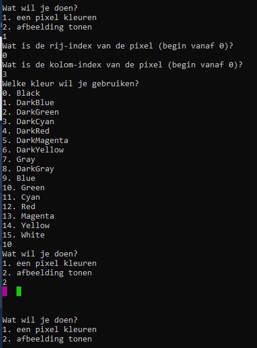

# Labo

## Oefening: som-per-rij

### Functionele analyse

We wensen de gegevens in één rij te groeperen door hun som te bepalen, een beetje zoals je dat in een Excel spreadsheet zou kunnen doen.

### Technische analyse

Schrijf in de klasse `DataStructuren` een methode `SomPerRij`. Deze maakt een tweedimensionale array met het gevraagde aantal rijen en het gevraagde aantal kolommen aan. Je mag veronderstellen dat er een geldig aantal wordt ingegeven. Vervolgens vraagt ze, rij per rij en kolom per kolom, een getalwaarde. Wanneer elke positie is ingevuld, toont ze de som per rij van de ingegeven getallen.

### Voorbeeldinteractie

```text
Hoe veel rijen telt je array?
> 3
Hoe veel kolommen telt je array?
> 2
Waarde voor rij 1, kolom 1?
> 4
Waarde voor rij 1, kolom 2?
> 2
Waarde voor rij 2, kolom 1?
> 1
Waarde voor rij 2, kolom 2?
> 1
Waarde voor rij 3, kolom 1?
> 7
Waarde voor rij 3, kolom 2?
> 9
Sommen per rij:
6
2
16
```

## Oefening: som-per-kolom

### Functionele analyse

We wensen de gegevens in één kolom te groeperen door hun som te bepalen, een beetje zoals je dat in een Excel spreadsheet zou kunnen doen.

### Technische analyse

Schrijf in de klasse `DataStructuren` een methode `SomPerKolom`. Deze werkt zoals de vorige oefening, maar maakt de som per kolom.

### Voorbeeldinteractie

```text
Hoe veel rijen telt je array?
> 3
Hoe veel kolommen telt je array?
> 2
Waarde voor rij 1, kolom 1?
> 4
Waarde voor rij 1, kolom 2?
> 2
Waarde voor rij 2, kolom 1?
> 1
Waarde voor rij 2, kolom 2?
> 1
Waarde voor rij 3, kolom 1?
> 7
Waarde voor rij 3, kolom 2?
> 9
Sommen per kolom:
12
12
```

## Oefening: Pixels

### Functionele analyse

We willen een simpel tekenprogramma maken in de terminal. De gebruiker kan pixel per pixel een gewenste kleur aangeven.

### Technische analyse

Schrijf in \(nieuwe klasse met `ToonSubmenu`\)  `DataStructuren` een methode `Pixels`.

Vraag hierin eerst aan de gebruiker welke afmetingen hij wil gebruiken voor zijn afbeelding. Dit bepaalt het aantal rijen en kolommen en dus het aantal pixels. Maak vervolgens een array van `ConsoleColor` waarden aan met deze afmetingen. Vraag tenslotte in een lus wat de gebruiker wil doen:

* een pixel kleuren
  * vraag hierbij de rij-index en kolom-index
  * vraag ten slotte in welke kleur deze moet worden ingevuld
    * je kan sneller een array van alle kleuren krijgen met volgende code: `ConsoleColor[] kleuren = (ConsoleColor[]) Enum.GetValues(typeof(ConsoleColor));`
    * je hoeft deze instructie niet volledig te begrijpen: ze doet hetzelfde als `ConsoleColor[] kleuren = {ConsoleColor.Back, ConsoleColor.DarkBlue, ...}` maar vraagt gewoon minder typwerk
* de afbeelding zoals ze momenteel is tonen
  * toon hiervoor elke pixel als een spatie met `Console.Write(" ")`

### Voorbeeldinteractie



## SchoolAdmin project

Als je alles eerder mee hebt kunnen volgen, werk dan vanaf je recentste commit. Anders is er een modeloplossing voorzien waarvan je kan verder werken.

### `StudieProgramma.ToonOverzicht()` , `Cursus.ToonOverzicht()` en `Student.ToonOverzicht()` met `foreach`

Pas je ShowOverview methodes aan zodat er geen gebruik wordt gemaakt van een klassieke `for`, maar wel van een `foreach`. Om het gebruik van een index te vermijden, zal je de array van `string` ook moeten vervangen door een `List<string>`.

### Alle studenten in het systeem bijhouden

Voorzie de klasse Student van een statische property `AlleStudenten`. Deze is van het type `List<Student>` en bevat altijd elke student die in het systeem aanwezig is. Dit gebeurt door bij de constructie van elk `Student`-object de lijst uit te breiden.

### Lijsten

Vervang alle properties van `StudieProgramma`, `Cursus` en `Student` van een arraytype naar een `List` type.


