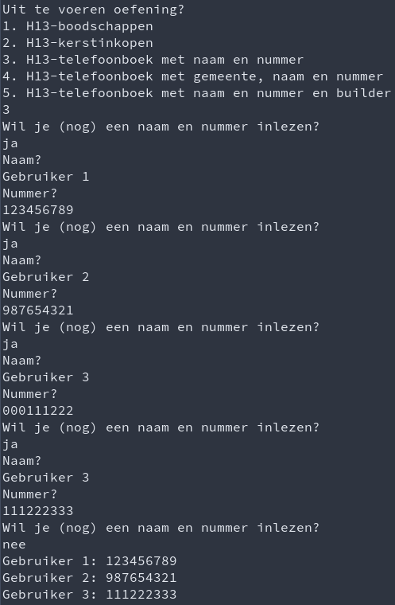
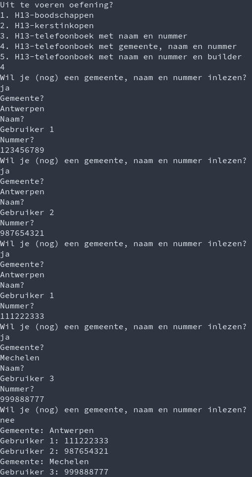

# Labo

## H13-boodschappenlijstje

### Functionele analyse

Schrijf een programma om een boodschappenlijstje samen te stellen en af te werken aan de hand van `List<string>`. Maak deze versie deel van de klasse `Datastructuren`.

### Technische analyse

* Vraag eerst om items toe te voegen, totdat er een lege regel wordt ingegeven. Toon telkens om het hoeveelste item het gaat, zoals in de voorbeeldinteractie.
* Sorteer vervolgens de lijst.
* Vraag dan, zo lang er nog items op de lijst staan en zo lang de gebruiker nog wenst te winkelen, welk item gekocht is. Wanneer er een item wordt ingegeven dat op het lijstje staat, verwijder je dat van het lijstje.
* Als er op het einde nog niet-gekochte items over zijn, laat je zien welke items de gebruiker is vergeten te kopen.

**Tip**: voor lijsten is `Sort` een instantiemethode

### Voorbeeldinteractie

.png>)

## H13-telefoonboek (naam en nummer)

### Functionele analyse

We wensen een simpel telefoonboek bij te houden, waarin je namen en nummers plaatst.

### Technische analyse

* maak eerst een blanco Dictionary van string naar string aan
* vraag in een lus telkens of de gebruiker nog wil doorgaan en, zo ja, vraag om een naam en een nummer
* hou de koppeling van de naam en dat nummer bij
  * dit mag geen fout leveren als de naam al in het woordenboek staat - overschrijf in dat geval de waarde
    * je kan controleren met de instantiemethode `ContainsKey`
* toon tenslotte de inhoud van heel je telefoonboek
* noem je methode `TelefoonboekNaamNummer`

### Voorbeeldinteractie

## H13-telefoonboek (gemeente, naam en nummer)

### Functionele analyse

Zie boven, maar we willen nu telefoonnummers ook groeperen per gemeente

### Technische analyse

* per gemeente heb je een Dictionary dat werkt zoals in de vorige oefening
  * om aan het Dictionary van een gemeente te komen, gebruik je een "groter" Dictionary met de naam van de gemeente als opzoekingssleutel
* achteraf print je de gegevens per gemeente, zoals dat ook in een fysiek telefoonboek ongeveer het geval is
* noem je methode TelefoonboekGemeenteNaamNummer

### Voorbeeldinteractie

## H13-telefoonboek-met-builder

### Functionele analyse

We willen graag dat ons Dictionary (zonder gemeente) veilig doorgegeven kan worden aan methodes enz. Daarom zullen we er een ImmutableDictionary van maken.

### Technische analyse

* start met aanmaak van een builder voor een ImmutableDictionary
* vraag de gegevens zoals in de eerdere oefening
* plaats deze stap voor stap in de builder (ook hier kan je ContainsKey gebruiken)
* zet, voor je alle gegevens print, om naar een ImmutableDictionary en pas daar een foreach lus op toe

### Voorbeeldinteractie

In de interactie zie je geen verschil [met de eerdere oefening](labo-datastructuren.md#h-13-telefoonboek-naam-en-nummer).

## SchoolAdmin project

Als je alles eerder mee hebt kunnen volgen, werk dan vanaf je recentste commit.

### `StudieProgramma.ToonOverzicht()` , `Cursus.ToonOverzicht()` en `Student.ToonOverzicht()` met `foreach`

Pas je ToonOverzicht-methodes aan zodat er geen gebruik wordt gemaakt van een klassieke `for`, maar wel van een `foreach`.

### Alle studenten in het systeem bijhouden

Voorzie de klasse Student van een statische read-only property `AlleStudenten`. Deze is van het type `List<Student>` en bevat altijd elke student die in het systeem aanwezig is. Dit gebeurt door bij de constructie van elk `Student`-object de lijst uit te breiden.

### `AlleStudenten` beveiligen

Maak van `AlleStudenten` een `ImmutableList<T>` in plaats van een gewone `List<T>`. Merk op dat je dit niet hoeft te doen voor het achterliggend attribuut.

### Lijsten

Vervang alle properties van `StudieProgramma`, `Cursus` en `Student` van een arraytype naar een `List` type. AlleCursussen maak je immutable.

Vervang hierbij ook `for`-lussen door `foreach`-lussen waar je kan. Je hoeft geen rekening te houden met capaciteiten die eerder zijn vastgelegd voor arrays. Je mag er ook van uitgaan dat er geen `null`waarden in lijsten worden geplaatst als dat niet zinvol is. Dit kan je code wat korter maken.

