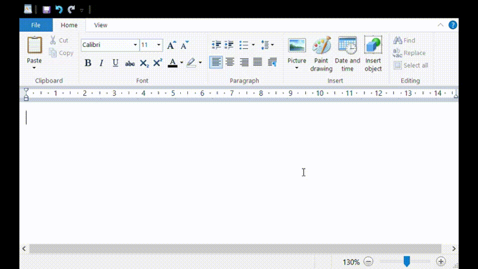

# Verdere datastructuren

## HashSet en ImmutableHashSet

In sommige situaties wil je dat een element geen twee keer in een datastructuur terecht kan komen. Je wil bijvoorbeeld dat de lijst met cursussen die deel uitmaakt van een studieprogramma geen tweemaal dezelfde cursus kan bevatten.

In dit geval gebruik je geen `List<T>`, maar een `HashSet<T>`. Elementen toevoegen doe je met de methode `Add` en elementen verwijderen doe je met `Remove`. Ook hier beperken we ons voorlopig tot voorgedefinieerde soorten objecten. Wanneer we `System.Object` hebben bestudeerd, kunnen we ook `HashSet`s van onze eigen types maken.

De immutable variant is ImmutableHashSet.

## Queue

Een Queue is een collectie van elementen die in een welbepaalde volgorde behandeld moeten worden: van voor naar achter. Vergelijk met een wachtrij bij de bakker: de klant die eerst in de rij staat wordt eerst geholpen, dan steeds de volgende klant tot we aankomen bij de klant die het laatst in de rij is aangesloten. We noemen dit soort van collectie ook wel een _First In, First Out_ oftewel _FIFO_-collectie: het item dat eerst in de rij is gezet, is ook het eerste dat behandeld wordt.

Een Queue is dus een speciaal soort lijst, waarbij het toevoegen en verwijderen van elementen op de lijst niet op gelijk welke plaats mag gebeuren. Een queue biedt daarom geen Add\(\) of RemoveAt\(\) methode aan. In plaats daarvan gebruik je:

* `Enqueue(T item)` om een item aan de rij toe te voegen
* `Dequeue()` om een item uit de rij te halen. Deze methode geeft als returnwaarde het weggehaalde item terug, zodat je er iets mee kan doen.
* `Peek()` geeft je het eerstvolgende item terug, maar verwijdert het nog niet uit de rij.

### Voorbeeld

```csharp
public static void Bakker()
{
    Queue<string> klanten = new Queue<string>();

    klanten.Enqueue("Roos");
    klanten.Enqueue("Piet");
    klanten.Enqueue("Ellen");
    klanten.Enqueue("Frank");
    klanten.Enqueue("Oswald");

    Console.Write("De huidige wachtrij is: ");
    foreach (string klant in klanten)
    {
        Console.Write($"{klant} ");
    }
    Console.WriteLine('\n');

    Console.WriteLine($"We bedienen nu klant {klanten.Dequeue()}");
    klanten.Enqueue("Redouan"); //Nieuwe klant komt in de rij staan
    Console.WriteLine($"De volgende klant is {klanten.Peek()}\n");

    Console.Write("De huidige wachtrij is: ");
    foreach (string klant in klanten)
    {
        Console.Write($"{klant} ");
    }
    Console.WriteLine('\n');

    Console.WriteLine($"We bedienen nu klant {klanten.Dequeue()}\n");

    Console.Write("De huidige wachtrij is: ");
    foreach (string klant in klanten)
    {
        Console.Write($"{klant} ");
    }
    Console.WriteLine('\n');
}
```


Op lijn 18 wordt de volgende klant uit de rij gehaald. Deze klant gebruiken we nog snel om zijn naam te tonen aan de gebruiker, maar na lijn 29 zal deze klant verdwijnen. Wil je deze klant in meer dan één statement gebruiken, zal je hem dus moeten opslaan in een lokale variabele:


```csharp
//...
string volgendeKlant = klanten.Dequeue(); //sla de klant op in een lokale variabele
Console.WriteLine($"We bedienen nu klant {volgendeKlant}");
this.StuurFactuur(volgendeKlant); //klant "Roos" wordt nu ook in deze methodeoproep gebruikt.
//...
```


Op lijn 20 wordt er eerst 'gespiekt' wie de volgende klant is: Piet. Met `Peek()` wordt hij echter nog niet uit de rij gehaald, zoals je in onderstaande output kan zien.


```text
De huidige wachtrij is: Roos Piet Ellen Frank Oswald

We bedienen nu klant Roos
De volgende klant is Piet

De huidige wachtrij is: Piet Ellen Frank Oswald Redouan

We bedienen nu klant Piet

De huidige wachtrij is: Ellen Frank Oswald Redouan
```

### ImmutableQueue

De immutablevariant van Queue is ImmutableQueue.

## Stack

Het omgekeerde van een Queue is een Stack. Dit is een lijst van items waarbij je steeds het laatst toegevoegde item eerst wilt behandelen. Vergelijk dit met een stapel borden aan de afwas: het eerstvolgende bord dat je afwast, is het bovenste bord op de stapel, dus het laatst toegevoegde. Of met een rij wagens in een lange, smalle garage met maar één toegangspoort: de eerste wagen die kan buitenrijden, is degene die laatst is binnengereden.

Dit noemen we een _LIFO_-collectie, oftewel _Last In, First Out_. Waar Queue `Enqueue(T item)` en `Dequeue()` gebruikte om items toe te voegen en uit de rij te halen, gebruikt Stack

* `Push(T item)` om een item op de stapel te leggen.
* `Pop()` om een item van de stapel te nemen.
* `Peek()` om het bovenste item op de stapel te bekijken, zonder het er af te nemen.

### Voorbeeld

Dit voorbeeld demonstreert de werking van de 'Maak ongedaan' functionaliteit die je hebt in de meeste programma's op je computer. Als je op 'Maak ongedaan' \(Engels: undo, commando: Ctrl+Z\) klikt, wordt enkel dat wat je als laatste gedaan hebt, teruggedraaid.

Volgend filmpje demonstreert de acties die de gebruiker uitvoert in een tekstbewerkingsprogramma:



De gebruiker neemt volgende stappen, vertrekkende vanaf een wit blad:

1. Voeg paragraaf toe
2. Zet tekst in vet
3. Haal stuk tekst weg
4. _Maak laatste actie ongedaan_
5. Maak tekst groter.
6. _Maak laatste actie ongedaan_
7. Maak tekst kleiner.
8. Voeg tekst toe.

De code om deze acties bij te houden in een actiehistoriek zou kunnen zijn:

```csharp
public static void UndoDemo()
{
    Stack<string> acties = new Stack<string>();

    acties.Push("Voeg paragraaf toe.");
    acties.Push("Zet tekst in vet.");
    acties.Push("Haal stuk tekst weg.");

    Console.WriteLine("De actiehistoriek is: ");
    foreach (string actie in acties)
    {
        Console.WriteLine($"\t{actie} ");
    }
    Console.WriteLine('\n');

    Console.WriteLine($"Maak ongedaan: {acties.Pop()}\n");
    acties.Push("Maak tekst groter.");
    Console.WriteLine($"Maak ongedaan: {acties.Pop()}\n");

    acties.Push("Maak tekst kleiner.");

    Console.WriteLine($"De meest recente actie was: {acties.Peek()}\n");

    acties.Push("Voeg tekst toe.");

    Console.WriteLine("De actiehistoriek is: ");
    foreach (string actie in acties)
    {
        Console.WriteLine($"\t{actie} ");
    }
    Console.WriteLine('\n');
}
```

Dit geeft volgende output:

```text
De actiehistoriek is:
        Haal stuk tekst weg.
        Zet tekst in vet.
        Voeg paragraaf toe.

Maak ongedaan: Haal stuk tekst weg.

Maak ongedaan: Maak tekst groter.

De meest recente actie was: Maak tekst kleiner.

De actiehistoriek is:
        Voeg tekst toe.
        Maak tekst kleiner.
        Zet tekst in vet.
        Voeg paragraaf toe.
```

### ImmutableStack

De immutablevariant van Stack is ImmutableStack.

