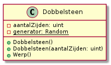

# Oefeningen

## Oefening: H11-Figuren

### Leerdoelen

* werken met klassen en objecten
* gebruik maken van properties om geldige waarden af te dwingen
* gebruik van een constructor

### Functionele analyse

Functioneel is dit programma hetzelfde als H10-figuren.

### Technische analyse

Voorzie je eerdere figuren \(`Rechthoek` en `Driehoek`\) van een constructor met twee parameters, waarvan de tweede telkens de hoogte voorstelt en de eerste de andere afmeting. Zorg dat deze constructor gebruik maakt van de properties, zodat je makkelijker objecten met de juiste afmetingen kan maken en toch dezelfde foutmeldingen krijgt als eerder.

Je zal een extra, parameterloze, constructor moeten toevoegen omdat `DemonstreerFiguren` van eerder moet blijven werken. Schrijf een nieuwe methode `DemonstreerFigurenMetConstructor` om te tonen dat je hetzelfde kan bereiken met de constructor met twee parameters. Deze moet ook opgeroepen kunnen worden van uit je keuzemenu.

#### Voorbeeldinteractie\(s\)

Schrijf `DemonstreerFigurenMetConstructor` zodanig dat je exact onderstaande interactie krijgt:

```text
Het is verboden een breedte van -1 in te stellen!
Het is verboden een hoogte van 0 in te stellen!
Een rechthoek met een breedte van 2,2m en een hoogte van 1,5m heeft een oppervlakte van 3,3m².
Een rechthoek met een breedte van 3m en een hoogte van 1m heeft een oppervlakte van 3,0m².
Een driehoek met een basis van 3m en een hoogte van 1m heeft een oppervlakte van 1,5m².
Een driehoek met een basis van 2m en een hoogte van 2m heeft een oppervlakte van 2,0m².
```

## Uitbreiding CursusResultaat \(SchoolAdmin project\)

### Leerdoelen

* makkelijker objecten aanmaken
* gebruik maken van properties om geldige waarden af te dwingen

### Functionele analyse

Functioneel zal je niet veel verschil zien met eerder. Dit is zuiver een aanpassing die de kwaliteit van je code verhoogt.

### Technische analyse

Pas `CursusResultaat` aan zodat het huidige attribuut `Naam` privaat wordt \(hernoem het dan ook naar `naam`\) en voeg een **read-only** property `Naam` toe om deze informatie toch toegankelijk te houden.

Voor `Resultaat` doe je een gelijkaardige aanpassing, maar de property is niet read-only. Hij kan ingesteld worden, maar enkel op een waarde tussen 0 en 20. Aanpassingen naar een andere waarde worden genegeerd.

Voeg ook een constructor toe met twee parameters. De eerste is voor de naam, de tweede voor het resultaat. Doe ten slotte nodige wijzigingen in andere onderdelen van je code om met deze nieuwe code te werken, zonder iets te veranderen aan het gedrag van je systeem.

## Uitbreiding Cursus \(SchoolAdmin project\)

### Leerdoelen

* informatie op klasseniveau bijhouden
* meer toepassingen van de constructor

### Functionele analyse

We wensen cursussen automatisch te nummeren \(zoals in DigitAP ook elke cursus een nummer heeft\).

### Technische analyse

Voorzie eerst de klasse `Cursus` van een read-only property `Id` van type `int`. Pas ook de klasse `Cursus` aan zodanig dat het volgende beschikbare nummer voor een cursus wordt bijgehouden in een variabele `maxId`. De eerste cursus zal nummer 1 moeten krijgen. Zorg er ten slotte voor dat elke nieuwe cursus automatisch dit eerste beschikbare nummer krijgt en dat nummer stijgt voor elke cursus die wordt aangemaakt.

Neem dit nummer ook op in de methode `ToonOverzicht` van cursus, zodanig dat het cursusnummer tussen haakjes verschijnt, naast de titel van de cursus.

## Verdere uitbreiding Cursus \(SchoolAdmin project\)

### Leerdoelen

* properties en access control
* meer toepassingen van de constructor

### Functionele analyse

We willen het aantal studiepunten per cursus bijhouden. We willen niet dat het veel extra werk is om dit aantal in te geven en we weten dat de meeste cursussen 3 studiepunten tellen.

### Technische analyse

Voorzie eerst de klasse `Cursus` van een property `Studiepunten` van type `byte`. Je hoeft hierbij geen speciale controles te doen en mag gewoon het algemene patroon volgen, maar maak de setter `private`.

Pas de constructor aan, zodat hij ook het aantal studiepunten aanvaardt als \(derde\) parameter. Zorg er met behulp van chaining ook voor dat ook calls met een of twee argumenten geldig blijven, waarbij het aantal studiepunten van vanzelf wordt ingesteld op 3.

Zet ook het aantal studiepunten mee in het overzicht dat je krijgt via `ToonOverzicht`. Zet tussen haakjes naast het nummer voor de cursus, gevolgd door `"stp"`.

Pas ten slotte, in `DemonstreerCursussen`, je code aan zodat het vak webtechnologie wordt aangemaakt met ruimte voor 5 studenten en 6 studiepunten telt, terwijl databanken ruimte krijgt voor 7 studenten en 5 studiepunten telt.

## Student uit tekst lezen

### Leerdoelen

* werken met strings
* werken met arrays

### Functionele analyse

Voor de administratie is het handig snel en efficiënt nieuwe studenten te kunnen registreren. Zorg ervoor dat een gebruiker één regel tekst kan intypen met alle gegevens over een student, zonder veel verdere interactie.

### Technische analyse

Schrijf een methode `StudentUitTekstFormaat(string csvWaarde)` die een object van de klasse `Student` teruggeeft. Deze methode mag veronderstellen dat `csvWaarde` eerst de naam van de student bevat, gevolgd door een puntkomma, gevolgd door de geboortedag, puntkomma, geboortemaand, puntkomma, geboortejaar. Alle elementen van de geboortedatum worden voorgesteld als getallen, volgens de afspraken die je ook toepast om datums te noteren in het Belgische formaat. Het kan zijn dat er ook informatie is om de student meteen te registreren voor een of meerdere cursusresultaten. In dat geval staat er na het geboortejaar nog een puntkomma, dan de naam van de cursus, dan het behaalde cijfer. Per cursus herhaalt deze groep van twee elementen zich.

Schrijf daarna een methode `DemonstreerStudentUitTekstFormaat()`. Deze vraagt om de tekstvoorstelling van één student in te typen, maakt de student aan en toont dan het overzicht voor deze student. Neem deze methode ook op als optie in je keuzemenu voor `SchoolAdmin`.


Deze methode vereist geen bestaande `Student`. Ze heeft wel te maken met de klasse `Student`.



De student hoeft niet opgenomen te worden in de array `Studenten` van een `Cursus`-object. We verbeteren dit later nog.


### Voorbeeldinteractie

```text
Geef de tekstvoorstelling van 1 student in CSV-formaat:
>Bart Van Steen;04;03;1998;Boekhouden;14;Macro-economie;8;Frans, deel 2;18

Bart Van Steen, 22 jaar

Cijferrapport:
**********
Boekhouden:     14
Macro-economie: 8
Frans, deel 2:  18
Gemiddelde      13,3
```

## Dobbelsteen \(h11-dobbelsteen\)

### Leerdoelen

* denken in objecten
* properties
* methodes

### Functionele analyse

We willen een herbruikbare, gebruiksvriendelijke oplossing voor willekeurige getallen in een videospelletje. `Random` is te gedetailleerd en niet erg intuïtief, dus we schrijven een klasse `Dobbelsteen` die achter de schermen gebruik maakt van `Random` \(encapsulatie!\).

### Technische analyse

Schrijf in je project IndividueleOefeningen een nieuwe klasse `Dobbelsteen`. De UML-voorstelling van deze klasse ziet er als volgt uit:



Als je de constructor zonder parameter gebruikt, wordt je dobbelsteen sowieso aangemaakt met 6 zijden. Gebruik hiervoor constructor chaining.

Alle dobbelstenen gebruiken achter de scherm dezelfde generator voor willekeurige getallen. De methode `Werp` toont een resultaat op het scherm.


Je hoeft geen rekening te houden met een dobbelsteen met 0 zijden.


Je kan deze code gebruiken om te demonstreren. Zet in een methode `DemonstreerDobbelsteen`:

```text
Dobbelsteen d1 = new Dobbelsteen();
Dobbelsteen d2 = new Dobbelsteen(20);
d1.Werp();
d1.Werp();
d1.Werp();
d2.Werp();
d2.Werp();
d2.Werp();
```

### Voorbeeldinteractie


Jouw resultaten zullen niet identiek zijn.


```text
6
1
3
14
17
20
```

## Klasse `Opdracht`\(h11-opdrachtklasse\)

### Functionele analyse

Schrijf in het project `IndividueleOefeningen` een klasse `Opdracht` waarmee een klusjesman opdrachten kan bijhouden.

### Technische analyse

Je krijgt ditmaal geen diagram, alleen de vereisten:

* Op het niveau van de klasse moet het huidige BTW-tarief voor klusjes bijgehouden worden met waarde `21.0`. Gebruik hiervoor een read-only property met naam `BTWTarief`.
* Op het niveau van elke `Opdracht` moet bijgehouden worden hoe veel BTW voor die Opdracht wordt aangerekend. Gebruik hiervoor een read-only property met naam `ToegepasteBTW`. Dit drukt het toegepaste BTW-percentage uit.
* Elke opdracht heeft een omschrijving \(in tekst\). Stel voor met een read-only property `Omschrijving`.
* Er zijn twee manieren om een `Opdracht` aan te maken:
  * met omschrijving **en** toegepast BTW-tarief
  * met alleen een omschrijving
    * dit moet altijd \(ook bij latere wijzigingen\) identiek werken aan constructie op de andere manier, maar dan met het algemene BTW-tarief als toegepast BTW-tarief
* Er is een methode `GeefWeer` die op de console info over de opdracht laat zien.
* Er is een methode `DemonstreerOpdrachten` om te laten zien dat alles werkt. Deze doet het volgende:
  * ze maakt een opdracht "lek in de gootsteen" aan met de constructor met één parameter
  * ze maakt een opdracht "dakpannen vervangen" aan waarvoor de toegepaste BTW 6% bedraagt
  * ze geeft beide opdrachten weer met `GeefWeer`

### Voorbeeldinteractie

```text
lek in de gootsteen: 21% BTW
dakpannen vervangen: 6% BTW
```


