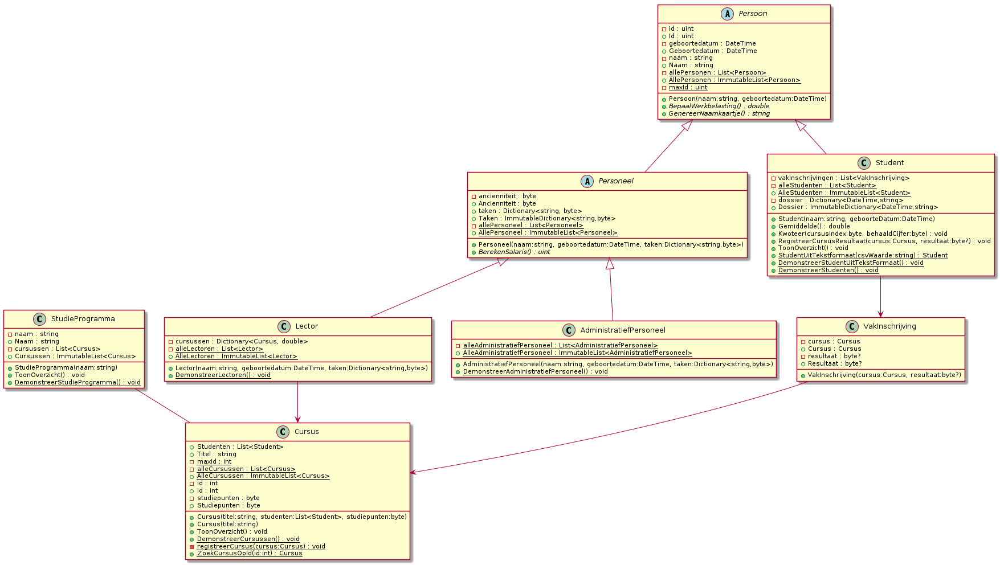

# Oefeningen

## Oefening H14-Figuren

### Leerdoelen

* Overerving gebruiken
* Abstracte klasse gebruiken

### Functionele analyse

Dit programma demonstreert het gebruik van enkele klassen die van elkaar overerven, binnen het domein van de meetkunde.

Van meetkundige figuren kunnen we steeds hun oppervlakte bepalen. Indien deze figuren bovendien _regelmatig_ zijn - m.a.w. ze voldoen aan bepaalde criteria - kunnen we hun oppervlakte berekenen met gekende formules. Zo zijn er formules om de oppervlakte van verschillende soorten regelmatige vierhoeken te berekenen, maar ook voor driehoeken en cirkels bestaan deze formules. 

Het programma onderscheidt volgende regelmatige figuren:

* Parallellogram: vierhoekige figuur, waarvan de zijden 2-aan-2 evenwijdig zijn. \
  De formule om de oppervlakte te berekenen is: basis x hoogte.
  * Rechthoek: parallellogram, waarvan de hoeken 90° meten.\
    Oppervlakte rechthoek: lengte x breedte.
    * Vierkant: rechthoek, waarvan alle zijden even lang zijn.\
      Oppervlakte vierkant: zijde²
  * Ruit: parallellogram, waarvan de diagonalen elkaar loodrecht in het midden snijden.\
    Oppervlakte ruit: lange diagonaal x korte diagonaal / 2
* Driehoek: driehoekige figuur\
  Oppervlakte driehoek: basis x hoogte. (hoogte: de afstand tussen het overstaande hoekpunt en de basis)
* Cirkel: figuur zonder hoeken, waarvan alle punten op de omtrek zich even ver van een middelpunt bevinden.\
  Oppervlakte cirkel: straal² x π

Het programma maakt elk van deze figuren aan, geeft ze de nodige afmetingen en toont vervolgens hun oppervlakten.

```
De oppervlakte van het parallellogram met basis 6 en hoogte 2 is 12.
De oppervlakte van de rechthoek met lengte 5 en breedte 6 is 30.
De oppervlakte van het vierkant met zijde 3 is 9.
De oppervlakte van de ruit met diagonalen 4 en 5 is 10.
De oppervlakte van de cirkel is 113.10.
De oppervlakte van de driehoek is 16.5.
```

### Technische analyse

Je schrijft dit programma als een methode `DemonstreerFigurenOvererving` van de klasse `EigenObjectOefeningen` in het project **IndividueleOefeningen**:

```csharp
public static void DemonstreerFigurenOvererving()
{
    Parallellogram parallellogram = new Parallellogram(6, 2);
    parallellogram.Kleur = ConsoleColor.Cyan;
    Console.WriteLine($"De oppervlakte van het parallellogram met basis {parallellogram.Basis} en hoogte {parallellogram.Hoogte} is {parallellogram.Oppervlakte}.");

    Rechthoek rechthoek = new Rechthoek(6, 3);
    rechthoek.Lengte = 5;
    Console.WriteLine($"De oppervlakte van de rechthoek met lengte {rechthoek.Basis} en breedte {rechthoek.Hoogte} is {rechthoek.Oppervlakte}.");

    Vierkant vierkant1 = new Vierkant(5);
    vierkant1.Zijde = 3;
    Console.WriteLine($"De oppervlakte van het vierkant met zijde {vierkant1.Breedte} is {vierkant1.Oppervlakte}.");

    Ruit ruit = new Ruit(4, 5);
    Console.WriteLine($"De oppervlakte van de ruit met diagonalen {ruit.Diagonaal1} en {ruit.Diagonaal2} is {ruit.Oppervlakte}.");

    Figuur cirkel = new Cirkel(6);
    Console.WriteLine($"De oppervlakte van de cirkel is {cirkel.Oppervlakte:F2}.");

    Figuur driehoek = new Driehoek(3, 11);
    Console.WriteLine($"De oppervlakte van de driehoek is {driehoek.Oppervlakte}.");

}
```

Zorg er voor dat je deze methode kan opstarten via de methode `ToonSubmenu` in dezelfde klasse.

Bouw vervolgens de klassen, volgens volgend klassediagram. Merk op dat `Oppervlakte` cursief gedrukt staat, omdat het een abstracte methode is:

.png>)

Begin bij `Figuur` en werk het diagram tak per tak af.

Het kan zijn dat de klassen `Driehoek` en `Rechthoek` bij jou al bestaan en afwijken van het diagram. Refactor de klassen zodanig dat ze overeenkomen met het diagram.


Gezien vierkanten en rechthoeken allemaal van parallellogrammen zijn, implementeren we in de subklassen `Vierkant` en `Rechthoek`_niet_ de readonly property `Oppervlakte`, maar laten we dit afhandelen door de klasse `Parallellogram`.

We willen echter wél de correcte benamingen voor de afmetingen kunnen gebruiken:

* `Vierkant.Zijde`
* `Rechthoek.Breedte` en `Rechthoek.Lengte`

in plaats van `Basis` in `Hoogte`. Je zal in resp. `Vierkant` en `Rechthoek` dus iets moeten toevoegen zodat, wanneer iemand de waarde van bijvoorbeeld resp. `Zijde` of `Lengte` aanpast, de onderliggende waarde `Basis` wordt aangepast, net als voor `Zijde` of `Breedte`, die `Hoogte` zullen moeten aanpassen.



Opgelet voor `Ruit`: je kan deze klasse op dezelfde manier laten overerven van `Parallellogram` als `Rechthoek` en dus de property `Oppervlakte` van `Parallellogram` laten gebruiken.

Je zal dan echter code moeten voorzien die de `Basis` en `Hoogte` zal aanpassen elke keer een diagonaal aangepast wordt. De formule hiervoor staat hieronder. Overschrijf dan `Basis` en `Hoogte` zodat de setters niets meer doen.

Als dit te complex blijkt, mag je `Oppervlakte` gewoon overriden in Ruit, met de formule `diagonaal1 * diagonaal2 / 2`. Aan de base constructor van geef je vanuit `Ruit` dan gewoon twee nullen mee.


$$
{basis} =  \sqrt{\left(\frac{diagonaal_1} 2\right)^2+\left(\frac{diagonaal_2} 2\right)^2} \newline \newline
{hoogte} = \frac{diagonaal_1  \cdot diagonaal_2} {2 \cdot basis}
$$

## SchoolAdmin: overerving

### Personen overerving

Om naast studenten ook andere personen, zoals lectoren en administratief personeel te kunnen beheren in SchoolAdmin, maken we enkele nieuwe klassen aan:

* Persoon: een abstracte klasse, waarvan de andere klassen zijn afgeleid
* Personeel, met twee kindklassen: 
  * AdministratiefPersoneel en Lector
* Student, een klasse die al bestond.

.png>)

### Persoon

Deze abstracte klassen definieert wat voor alle personen in het systeem hetzelfde is: een id, een naam en een geboortedatum. Voorzie hiervoor dus private attributen met publieke properties. Voorzie voor de properties `Id` en `Geboortedatum` enkel getters, zodat ze read only zijn. Het `Id` wordt automatisch ingesteld bij constructie. Hiervoor wordt een teller `maxId` bijgehouden.

Verder zegt deze klasse ook dat elke klasse die er van erft, ten minste de methoden `GenereerNaamkaartje` en `BepaalWerkbelasting` moet bevatten. Hoe dat naamkaartje er moet uitzien, legt `Persoon` niet vast.

Elke nieuwe persoon die gemaakt wordt, wordt bewaard in een lijst met alle personen. Deze lijst mag door andere klassen niet gewijzigd worden: het beheer van de lijst ligt bij `Persoon`. Deze lijst kan wel opgevraagd worden via een statische property `AllePersonen` die een immutable list produceert.

### Student

Deze klasse wordt een kind van `Persoon`. Zorg er dus voor dat deze klasse de verplichte zaken uit Persoon implementeert, maar dat duplicate functionaliteit (bv. Studentnummer, Naam, Geboortedatum, StudentenTeller) vanaf nu aan `Persoon` worden overgelaten: haal deze dus weg uit Student.

Voeg op Student ook een attribuut `dossier` toe. Dit is een collectie waarin opmerkingen genoteerd kunnen worden. De opmerkingen worden geïndexeerd met de datum en het tijdstip waarop ze worden ingegeven. Zorg er voor dat dit dossier niet aangepast kan worden buiten de Student klasse door de getter een immutable dictionary te laten teruggeven.

### Intermezzo: controle

Test nu de eerdere methodes `DemonstreerStudenten` en `DemonstreerStudentUitTekstFormaat` opnieuw uit. Alles zou nog moeten werken.

### Personeel

Een abstracte klasse die erft van `Persoon`. Op deze klasse wordt een lijst bijgehouden van alle personeelsleden die worden aangemaakt. Ze voorziet ook een ancienniteitsteller: hierin wordt bijgehouden hoeveel jaar het personeelslid al in dienst is. De anciënniteit kan nooit hoger gaan dan 50. Hogere waarden worden verlaagd tot 50.

De klasse eist van al haar kindklassen dat zij een methode `BerekenSalaris` bevatten. Hoe het salaris berekend moet worden, wordt overgelaten aan de kindklassen.

De klasse Personeel voorziet ook een lijst van taken die het personeelslid moet uitvoeren. De taken worden opgeslagen als een naam van een taak, met daarbij het aantal uur per week dat het personeelslid aan die taak zal werken. Deze taken kunnen bij constructie worden meegegeven, maar het oorspronkelijke dictionary mag de taken niet meer kunnen aanpassen. Je moet dus de keys en values kopiëren naar het nieuwe dictionary.

Voorzie ook de mogelijkheid om een immutable list van alle personeel op te vragen.

### AdministratiefPersoneel

Deze klasse is een kind van `Personeel` en moet daarom aan alle voorwaarden van `Personeel` én `Persoon` voldoen: er zullen dus enkele methoden verplicht moeten worden geïmplementeerd in deze klasse. Er wordt ook een lijst bijgehouden van alle administratieve personeelsleden die worden aangemaakt.

Het salaris van een administratief personeelslid wordt als volgt berekend: _per 3 jaar, krijgt het personeelslid 75 euro extra bovenop een basisloon van 2000  euro. Dit basisloon wordt vervolgens verrekend met de tewerkstellingsbreuk. De tewerkstellingsbreuk is de werkbelasting van het personeelslid gedeeld door 40 uur (voltijdse tewerkstelling)._

Bijvoorbeeld: Ahmed is 4 jaar in dienst. Hij krijgt dus 2000 EUR basisloon, plus 1 keer 75 EUR ancienniteitstoeslag. Hij werkt echter 30 uur per week in plaats van 40, dus krijgt hij 1556,25 EUR. Cijfers na de komma vallen weg omwille van het datatype.

De werkbelasting van een administratief personeelslid wordt bepaald aan de hand van de taken in zijn of haar takenlijst. De duur van alle taken wordt hiertoe opgeteld.

Het naamkaartje van een administratief personeelslid bevat de naam van het personeelslid, met daarachter de vermelding `(ADMINISTRATIE)`. Bv. 

```
Ahmed Azzaoui (ADMINISTRATIE)
```

Er is ook een lijst van alle administratief personeel. Ook hier kan je alleen de immutable versie krijgen buiten de klasse.

### Intermezzo: controle

Schrijf nu een methode `DemonstreerAdministratiefPersoneel`. Maak hierin een variabele `ahmed` met de gegevens van bovenstaande persoon. Zijn taken bestaan uit 10u roostering, 10u correspondentie en 10u animatie. Hij is geboren 4 februari 1988.

Doorloop vervolgens met een `foreach` de lijst met alle personeel en toon zo alle naamkaartjes van alle personeel. Herhaal dit ook voor de lijst met administratief personeel. Toon dan ook het salaris en de werkbelasting van Ahmed.

### Lector

Deze klasse is een kind van `Personeel` en moet daarom aan alle voorwaarden van `Personeel` én `Persoon` voldoen: er zullen dus enkele methoden verplicht moeten worden geïmplementeerd in deze klasse. Er wordt ook een lijst bijgehouden van alle lectoren die worden aangemaakt. Een`Lector` object bevat dan weer een opsomming van alle Cursussen die deze lector geeft, met voor elke cursus de werkbelasting van deze cursus voor de lector.

Het salaris van een administratief personeelslid wordt als volgt berekend: _per 4 jaar, krijgt het personeelslid 120 euro extra bovenop een basisloon van 2200 euro. Dit basisloon wordt vervolgens verrekend met de tewerkstellingsbreuk. De tewerkstellingsbreuk is de werkbelasting van het personeelslid gedeeld door 40 uur (voltijdse tewerkstelling)._

Bijvoorbeeld: Anna is 9 jaar in dienst. Ze krijgt dus 2200 EUR basisloon, plus 2 keer 120 EUR ancienniteitstoeslag. Ze werkt 10 uur per week in plaats van 40, dus krijgt ze 610,00 EUR.

De werkbelasting van een lector wordt bepaald aan de hand van de cursussen die hij of zij geeft. De werkbelasting van elke cursus in de collectie wordt hiertoe opgeteld.

Het naamkaartje van een lector bevat de naam van de lector, met op een nieuwe lijn `Lector voor: `. Vervolgens worden de titels van alle cursussen die deze lector geeft op telkens een nieuwe lijn toegevoegd. Bv. 

```
Anna Bolzano
Lector voor:
Economie
Statistiek
Analystische Meetkunde
```

### Intermezzo: controle

Schrijf nu een methode `DemonstreerLectoren`. Maak hierin een variabele `anna` met de gegevens van bovenstaande persoon. Maak hierin ook variabelen voor de drie cursussen in het voorbeeld boven. Anna heeft 3u economie, 3u statistiek en 4u analytische meetkunde. Ze is geboren 12 juni 1975. 

Doorloop vervolgens met een `foreach` de lijst met alle personeel en toon zo alle naamkaartjes van alle personeel. Herhaal dit ook voor de lijst met lectoren. Toon dan ook het salaris en de werkbelasting van Anna.

### Visual Studio Klassediagram

Om je hierbij te helpen, kan je dit klassediagram bekijken:


