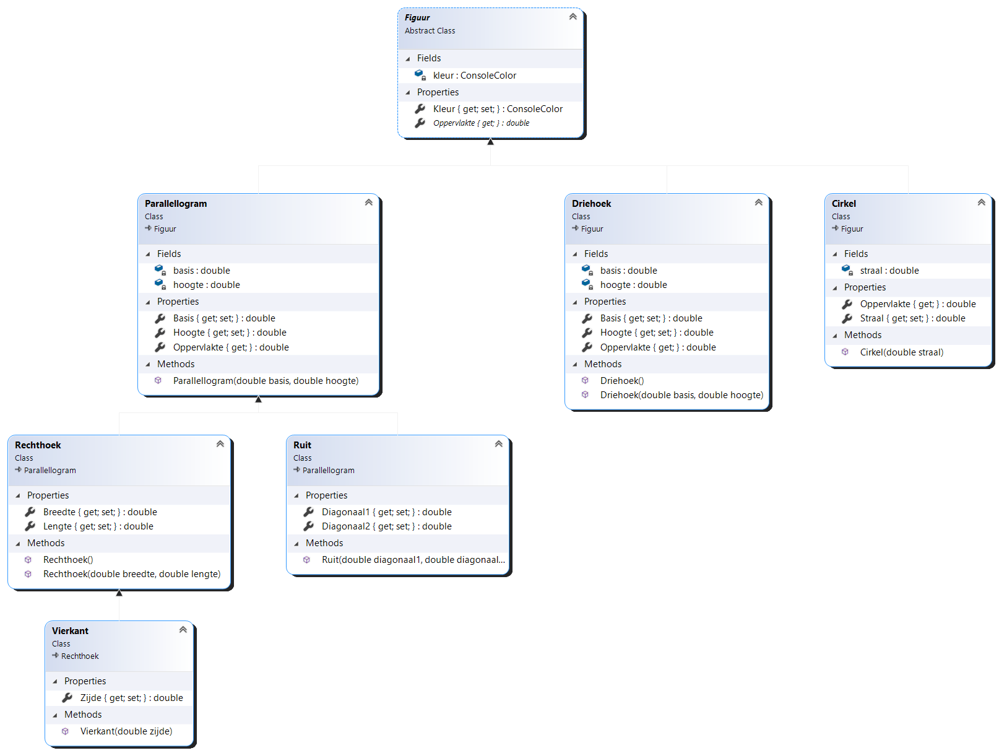

# Oefeningen

## Oefening H14-Figuren

### Leerdoelen

* Overerving gebruiken
* Abstracte klasse gebruiken

### Functionele analyse

Dit programma demonstreert het gebruik van enkele klassen die van elkaar overerven, binnen het domein van de meetkunde.

Van meetkundige figuren kunnen we steeds hun oppervlakte bepalen. Indien deze figuren bovendien _regelmatig_ zijn - m.a.w. ze voldoen aan bepaalde criteria - kunnen we hun oppervlakte berekenen met gekende formules. Zo zijn er formules om de oppervlakte van verschillende soorten regelmatige vierhoeken te berekenen, maar ook voor driehoeken en cirkels bestaan deze formules. 

Het programma onderscheidt volgende regelmatige figuren:

* Parallellogram: vierhoekige figuur, waarvan de zijden 2-aan-2 evenwijdig zijn.  De formule om de oppervlakte te berekenen is: basis x hoogte.
  * Rechthoek: parallellogram, waarvan de hoeken 90° meten. Oppervlakte rechthoek: lengte x breedte.
    * Vierkant: rechthoek, waarvan alle zijden even lang zijn. Oppervlakte vierkant: zijde²
  * Ruit: parallellogram, waarvan de diagonalen elkaar loodrecht snijden. Oppervlakte ruit: lange diagonaal x korte diagonaal
* Driehoek: driehoekige figuur Oppervlakte driehoek: basis x hoogte. \(hoogte: de afstand tussen het overstaande hoekpunt en de basis\)
* Cirkel: figuur zonder hoeken, waarvan alle punten op de omtrek zich even ver van een middelpunt bevinden. Oppervlakte cirkel: straal² x π

Het programma maakt elk van deze figuren aan, geeft ze de nodige afmetingen en toont vervolgens hun oppervlakten.

```text
De oppervlakte van het parallellogram met basis 6 en hoogte 2 is 12.
De oppervlakte van de rechthoek met lengte 5 en breedte 6 is 30.
De oppervlakte van het vierkant met zijde 3 is 9.
De oppervlakte van de ruit met diagonalen 4 en 5 is 20.
De oppervlakte van de cirkel is 113.10.
De oppervlakte van de driehoek is 16.5.
```

### Technische analyse

Je schrijft dit programma als een methode `DemonstreerFigurenOvererving` van de klasse `EigenObjectOefeningen` in het project **IndividueleOefeningen**:

```csharp
public static void DemonstreerFigurenOvererving()
{
    Parallellogram parallellogram = new Parallellogram(6, 2);
    parallellogram.Kleur = ConsoleColor.Cyan;
    Console.WriteLine($"De oppervlakte van het parallellogram met basis {parallellogram.Basis} en hoogte {parallellogram.Hoogte} is {parallellogram.Oppervlakte}.");

    Rechthoek rechthoek = new Rechthoek(6, 3);
    rechthoek.Lengte = 5;
    Console.WriteLine($"De oppervlakte van de rechthoek met lengte {rechthoek.Basis} en breedte {rechthoek.Hoogte} is {rechthoek.Oppervlakte}.");

    Vierkant vierkant1 = new Vierkant(5);
    vierkant1.Zijde = 3;
    Console.WriteLine($"De oppervlakte van het vierkant met zijde {vierkant1.Breedte} is {vierkant1.Oppervlakte}.");

    Ruit ruit = new Ruit(4, 5);
    Console.WriteLine($"De oppervlakte van de ruit met diagonalen {ruit.Diagonaal1} en {ruit.Diagonaal2} is {ruit.Oppervlakte}.");

    Figuur cirkel = new Cirkel(6);
    Console.WriteLine($"De oppervlakte van de cirkel is {cirkel.Oppervlakte:F2}.");

    Figuur driehoek = new Driehoek(3, 11);
    Console.WriteLine($"De oppervlakte van de driehoek is {driehoek.Oppervlakte}.");

}
```

Zorg er voor dat je deze methode kan opstarten via de methode `ToonSubmenu` in dezelfde klasse.

Bouw vervolgens de klassen, volgens volgend klassediagram:



Begin bij `Figuur` en werk het diagram tak per tak af.

Het kan zijn dat de klassen `Driehoek` en `Rechthoek` bij jou al bestaan en afwijken van het diagram. Refactor de klassen zodanig dat ze overeenkomen met het diagram.


Gezien vierkanten, ruiten en rechthoeken allemaal van parallellogrammen zijn, implementeren we in de subklassen `Vierkant`, `Ruit` en `Rechthoek` _niet_ de readonly property `Oppervlakte`, maar laten we dit afhandelen door de klasse `Parallellogram`.

We willen echter wél de correcte benamingen voor de afmetingen kunnen gebruiken:

* `Vierkant.Zijde`
* `Ruit.Diagonaal1` en `Ruit.Diagonaal2`
* `Rechthoek.Breedte` en `Rechthoek.Lengte`

in plaats van `Basis` in `Hoogte`. Je zal in resp. `Vierkant`, `Ruit` en `Rechthoek` dus iets moeten toevoegen zodat, wanneer iemand de waarde van bijvoorbeeld resp. `Zijde`, `Diagonaal1` of `Lengte` aanpast, de onderliggende waarde `Basis` wordt aangepast.


