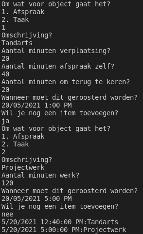

# Labo

## h17-IComparable-implementatie

### Functionele analyse

We willen op een eenvoudige manier objecten van een bepaalde klasse kunnen sorteren.

### Technische analyse

Gegeven volgende klasse `Product`:

```csharp
namespace IndividueleOefeningen {
    public class Product {
        private uint kostprijs;
        public uint Kostprijs
        {
            get { return kostprijs; }
            set { kostprijs = value; }
        }
        
        private string naam;
        public string Naam
        {
            get { return naam; }
            set { naam = value; }
        }
    }
}
```

We moeten producten kunnen sorteren op kostprijs voor we ze aan de gebruiker tonen. We kunnen dit doen door de interface `IComparable<Product>` te implementeren. Door dit te doen, beloven we eigenlijk dat we een object van deze klasse kunnen vergelijken met een product. Anders gezegd: dat we producten met elkaar kunnen vergelijken. Hierdoor kunnen we gebruik maken van algemene methodes om objecten te sorteren.

De interface `IComparable<Product>` vereist dat je `CompareTo(Product p)` implementeert. De afspraak is dat je `-1` teruggeeft als `this` voor `p` moet worden gesorteerd, `0` als ze gelijkwaardig zijn en `1` als `this` na `p` komt.

Implementeer deze interface. Je moet ook rekening houden met de mogelijkheid dat `p` `null` is. `null` moet voor deze oefening helemaal vooraan komen.

Test met volgende code. Sla deze op in `EigenObjectOefeningen.DemonstreerVergelijkbareProducten()`.

```csharp
var p1 = new Product("Fiets", 999);
var p2 = new Product("Playstation 5", 500);
var p3 = new Product("Elektrische gitaar", 750);
var p4 = new Product("Doos ontbijtgranen", 3);
Product p5 = null;
var p6 = new Product("Xbox Series X", 500);
var producten = new List<Product> { p1, p2, p3, p4, p5, p6 };
producten.Sort();
foreach(var p in producten) {
    if (!(p is null)) {
        System.Console.WriteLine($"{p.Naam}, {p.Kostprijs}");
    }
    else {
        System.Console.WriteLine("NULL");
    }
}
```

### Voorbeelduitvoer

```text
NULL
Doos ontbijtgranen, 3
Playstation 5, 500
Xbox Series X, 500
Elektrische gitaar, 750
Fiets, 999
```


Probeer eens zonder de code die aangeeft dat `Product` de gevraagde interface implementeert. Wat gebeurt er?


## h17-zoek-grootste

### Functionele analyse

We willen te weten komen wat het "grootste" element in een lijst is. We willen deze code gebruiken voor allerlei zaken. De hoogste prijs, de oudste persoon, de cirkel met de grootste straal,...

### Technische analyse

Schrijf een statische methode `ZoekGrootste` in de klasse voor dit labo. Deze heeft als parameter een lijst van `IComparable<T>` objecten en geeft een object terug dat minstens even groot is als alle andere objecten. Binnenin deze methode mag je T behandelen alsof het een ingevuld type is, bijvoorbeeld:

```csharp
T variabeleDieIkNodigHeb = lijst[0];
```

Doe dit zonder een sorteermethode te gebruiken.

Implementeer ook `IComparable<Figuur>` in de klasse Figuur \(die je eerder geschreven hebt\) zodat een figuren vergeleken worden op basis van oppervlakte. Implementeer eveneens `IComparable<Pizza>` in de klasse `Pizza`  \(die je eerder geschreven hebt\) zodat pizza's vergeleken worden op basis van hun totaalprijs.

Maak dan een lijst met `Figuur`-objecten en een lijst met `Pizza`-objecten. Ga na dat je methode inderdaad de "grootste" oplevert.

## h17-Rooster-stap1

### Functionele analyse

We schrijven een kalender. Hierop kunnen we verschillende zaken plaatsen: afspraken en taken. Beide werken anders, maar beide nemen wel een zekere hoeveelheid tijd in beslag.

### Technische analyse

* Schrijf twee klassen, `Afspraak`
* Voor een afspraak moet je volgende zaken bijhouden:
  * de tijd om je naar de afspraak te verplaatsen \(een `TimeSpan`\)
  * de tijd om terug te komen \(een `TimeSpan`\)
  * de duur van de afspraak \(een `TimeSpan`\)
  * een omschrijving \(een `string`\)
* Voor een taak moet je volgende zaken bijhouden:
  * de werktijd die je nodig zal hebben \(een `TimeSpan`\)
  * een omschrijving \(een `string`\)

Beide hebben constructoren die de hierboven genoemde parameters in volgorde bevatten.

Zowel afspraken als taken zijn roosterbaar op een kalender. Dit maak je mogelijk door hen allebei te voorzien van de `IRoosterbaar` interface. Deze omvat:

* een read-only property `Tijdsduur` die een `TimeSpan` teruggeeft
  * voor een afspraak is dit de som van de verplaatsingstijd en de duur van de afspraak
  * voor een taak is dit gewoon de duur van de taak
* een read-only property `Omschrijving` die een `string` teruggeeft
  * voor een taak kan je gewoon de bestaande property gebruiken
  * voor een afspraak geef je de bestaande omschrijving, gevolgd door de tekst `(inclusief verplaatsing)`

Test uit met volgende code, die je `DemonstreerIRoosterbaar` noemt.

```csharp
IRoosterbaar blok1 = new Afspraak(new TimeSpan(0,20,0),new TimeSpan(1,0,0),new TimeSpan(0,20,0), "tandarts");
IRoosterbaar blok2 = new Taak(new TimeSpan(2,0,0),"dagelijkse oefeningen OOP");
System.Console.WriteLine($"Totale kalendertijd: {(blok1.Tijdsduur + blok2.Tijdsduur).Hours}u{(blok1.Tijdsduur + blok2.Tijdsduur).Minutes}m");
```

### Voorbeeldinteractie

```text
Totale kalendertijd: 3u40m
```

## h17-Rooster-stap2

### Functionele analyse

We willen onze taken en afspraken nu echt kunnen inplannen op een interactieve kalender.

### Technische analyse

* Schrijf een klasse `Kalender`. Een kalender heeft een naam en koppelt tijdstippen aan roosterbare gebeurtenissen. Enkel de naam wordt meegegeven bij constructie. Voor de koppeling gebruik je een `Dictionary<DateTime,IRoosterbaar>`.
* Een `Kalender` heeft een methode `VoegToe`. Deze vraagt eerst om wat voor gebeurtenis het gaat \(`Taak` of `Afspraak`\) en vraagt dan om alle properties van dit type object. Daarna vraagt ze: "Wanneer moet dit geroosterd worden"? Ten slotte wordt het roosterbare object geassocieerd met dit tijdstip. **Let op:** voor een afspraak vraag je wanneer **de afspraak zelf** geroosterd moet worden, maar rooster je vanaf het moment dat je moet vertrekken naar de afspraak.

### Voorbeelduitvoering

Schrijf zelf een methode DemonstreerKalender1. Deze vraagt maakt een kalender met naam "DemonstratieKalender" en vraagt de gebruiker objecten toe te voegen tot hij niet meer wil doorgaan. Daarna wordt de inhoud van de kalender getoond.



## h17-Rooster-stap3

### Functionele analyse

Onze code is te sterk gekoppeld. Om Kalender te schrijven, hebben we code moeten schrijven om beide soorten objecten in te lezen. Als we nog meer tijdsblokken willen inbouwen \(bijvoorbeeld `QualityTime`\), moeten we `Kalender` verder uitbreiden.

### Technische analyse

Voorzie `Taak` en `Afspraak` van een constructor zonder parameters. Voorzie de interface IRoosterbaar van een methode `Initialiseer` en van een methode `RoosterOm(TimeSpan referentiepunt)`. De methode `Initialiseer` vraagt alle gegevens voor een object van dat type en stelt ze in. De methode `RoosterOm` bepaalt uit het referentiepunt wanneer de kalender moet worden ingeblokt.


We werken met een constructor zonder parameters, gevolgd door initialisatie, omdat we geen statische methoden kunnen toevoegen aan een interface. Er zijn elegantere oplossingen, maar we willen niet te ver afwijken van de koers.


### Voorbeeldinteractie

Deze ziet eruit zoals hierboven, maar de demonstratiecode is nu:

```csharp
public void VoegToeLosgekoppeld() {
    System.Console.WriteLine("Om wat voor object gaat het?");
    System.Console.WriteLine("1. Afspraak");
    System.Console.WriteLine("2. Taak");
    IRoosterbaar item;
    DateTime begin;
    int antwoord = Convert.ToInt32(Console.ReadLine());
    if (antwoord == 1) {
        item = new Afspraak();
    }
    else {
        item = new Taak();
    }
    item.Initialiseer();
    System.Console.WriteLine("Wanneer moet dit geroosterd worden?");
    begin = Convert.ToDateTime(Console.ReadLine(), new CultureInfo("nl-BE"));
    this.Rooster[item.RoosterOm(begin)] = item;
}
```

Merk op dat je maar een heel kleine aanpassing zou moeten doen om `Kalender` uit te breiden met bijvoorbeeld `QualityTime`. Die klasse zou door iemand anders geschreven mogen worden.

