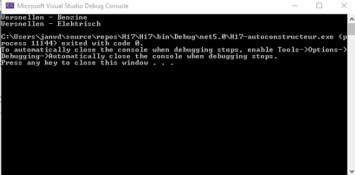
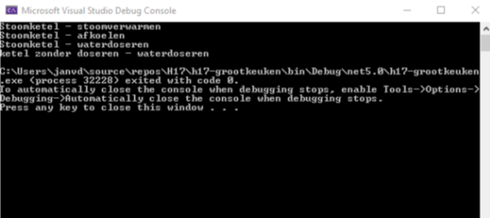
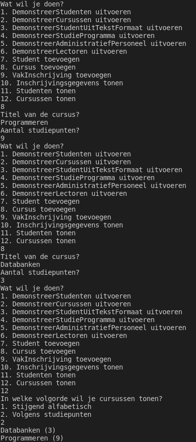
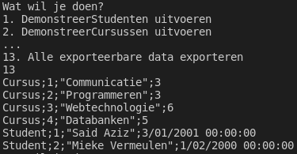

# Labo


Onderstaande oefeningen maak je oproepbaar via een klasse `Polymorfisme` met een methode `ToonSubmenu`.


## h17-autoconstructeur

### Functionele analyse

Omdat we aan de vooravond staan van de transitie van klassieke aandrijvingen naar meer milieubewuste aandrijvingen van auto’s heeft een autoconstructeur beslist om zijn assemblage software te herwerken.

In de huidige software wordt gebruik gemaakt van een superklasse motor met twee subklassen bezinemotor en dieselmotor. Dit wordt nu uitgebreid.

Er zijn verschillende nieuwe motoren op de markt: elektrische, CNG, waterstof,..

Niet alleen de motor is verschillend maar ook de periferie (omgeving) van de motor is erg verschillend. Denk bv. aan de brandstofvoorziening (voor benzine, diesel, elektrisch).

### Technische analyse

Maak een interface IAandrijving die de volgende methoden en properties ondersteunt:

`void EnergieToevoegen(); // Het vroegere tanken`

`void Vertragen(int kmPerUurPerSeconde, int doelsnelheid);`

`void Versnellen(int kmPerUurPerSeconde, int doelsnelheid);`

Maak een klasse voor de volgende types aandrijvingen die de interface IAandrijving implementeren

`AandrijvingElekrisch`

`AandrijvingBezine`

`AandrijvingCNG`

De implementatie van de methodes is steeds

`Console.Writeline(“<Naam van de methode> - <Type aandrijving>”);`

Bijvoorbeeld:

`Console.Writeline(“Versnellen - Benzine”);`

Maak een klasse `Auto` met public property (van het type `string`) `AutoType` en een public property `Aandrijving`. Zorg er voor dat elk type van aandrijving kan toegevoegd worden aan een object van type `Auto`.

Instantieer een auto met benzine aandrijving. Doe dat door de aandrijving als parameter in de constructor mee te geven. De constructor van de auto heeft als signatuur dus `public Auto (string autoType, ? aandrijving)`. Het `?` moet je zelf invullen. Laat de auto versnellen. Bouw die auto nu om naar een elektrische aandrijving. Laat de auto opnieuw versnellen. Doe dit allemaal in een methode `DemonstreerAandrijving`.

### Voorbeeldinteractie



## h17-grootkeuken

### Functionele analyse

Je wordt gevraagd om een grootkeuken van een studentenrestaurant te automatiseren.

In de keuken staan een zestal ketels die bepaalde functies wel of niet hebben. De functies zijn:

* `Verwarmen(int doelTemperatuur)`
* `Afkoelen(int doelTemperatuur)`
* `StoomVerwarmen(int doelTemperatuur)`
* `WaterDoseren(int hoeveelheid)`

Er bestaan 4 types van ketels

1. `Ketel` (dit is een abstracte klasse zonder enige functionaliteit)
2. Stoomketel (met functionaliteit `StoomVerwarmen`, `Afkoelen`, `WaterDoseren`) klasse `StoomKetel`
3. Gewone ketel zonder doseren (met functionaliteit `Verwarmen`) klasse `KetelZonderDoseren`
4. Gewone ketel met dosering (met functionaliteit `Verwarmen`, `WaterDoseren`) klasse `KetelMetDoseren`

### Technische analyse

Creëer 4 interfaces voor de verschillende functies: `IVerwarmen`, `IAfkoelen`, `IStoomVerwarmen`, `IWaterDoseren`). In de interface vinden we steeds de functie als methode terug (met return type `void`).

Creëer de 3 types van ketels. Gebruik overerving om gemeenschappelijke properties (inhoud type `int` en temperatuur type `int`) te implementeren. De constructors van de drie types ketels krijgen de inhoud als parameter mee. De temperatuur blijft op de defaultwaarde staan.

Demonstreer je code door 6 ketels te instantiëren. Zet de code hiervoor in `DemonstreerGrootkeuken`:

Ketel 1 : Stoomketel met capaciteit 300l

Ketel 2 : Stoomketel met capaciteit 300l

Ketel 3 : Ketel zonder doseren met capaciteit 150l

Ketel 4 : Ketel zonder doseren met capaciteit 300l

Ketel 5 : Ketel met doseren met capaciteit 200l

Ketel 6 : Ketel met doseren met capaciteit 150l

Verwarm ketel 1 tot 100 graden Celcius… zie interactie:

### Voorbeeldinteractie



## h17-Rooster-stap1

### Functionele analyse

We schrijven een kalender. Hierop kunnen we verschillende zaken plaatsen: afspraken en taken. Beide werken anders, maar beide nemen wel een zekere hoeveelheid tijd in beslag.

### Technische analyse

* Schrijf twee klassen, `Afspraak` en `Taak`
* Voor een afspraak moet je volgende zaken bijhouden:
  * de tijd om je naar de afspraak te verplaatsen (een `TimeSpan`)
  * de tijd om terug te komen (een `TimeSpan`)
  * de duur van de afspraak (een `TimeSpan`)
  * een omschrijving (een `string`)
* Voor een taak moet je volgende zaken bijhouden:
  * de werktijd die je nodig zal hebben (een `TimeSpan`)
  * een omschrijving (een `string`)

Beide hebben constructoren die de hierboven genoemde parameters in volgorde bevatten.

Zowel afspraken als taken zijn roosterbaar op een kalender. Dit maak je mogelijk door hen allebei te voorzien van de `IRoosterbaar` interface. Deze omvat:

* een read-only property `Tijdsduur` die een `TimeSpan` teruggeeft
  * voor een afspraak is dit de som van de verplaatsingstijd en de duur van de afspraak
  * voor een taak is dit gewoon de duur van de taak
* een read-only property `Omschrijving` die een `string` teruggeeft
  * voor een taak kan je gewoon de bestaande property gebruiken
  * voor een afspraak geef je de bestaande omschrijving, gevolgd door de tekst `(inclusief verplaatsing)`

Test uit met volgende code, die je `DemonstreerIRoosterbaar` noemt (in de klasse voor dit labo).

```csharp
IRoosterbaar blok1 = new Afspraak(new TimeSpan(0,20,0),new TimeSpan(1,0,0),new TimeSpan(0,20,0), "tandarts");
IRoosterbaar blok2 = new Taak(new TimeSpan(2,0,0),"dagelijkse oefeningen OOP");
System.Console.WriteLine($"Totale kalendertijd: {(blok1.Tijdsduur + blok2.Tijdsduur).Hours}u{(blok1.Tijdsduur + blok2.Tijdsduur).Minutes}m");
```

### Voorbeeldinteractie

```
Totale kalendertijd: 3u40m
```

## h17-Rooster-stap2

### Functionele analyse

We willen onze taken en afspraken nu echt kunnen inplannen op een interactieve kalender.

### Technische analyse

* Schrijf een klasse `Kalender`. Een kalender heeft een naam en koppelt tijdstippen aan roosterbare gebeurtenissen. Enkel de naam wordt meegegeven bij constructie. Voor de koppeling gebruik je een `Dictionary<DateTime,IRoosterbaar>`.
* Een `Kalender` heeft een methode `VoegToe`. Deze vraagt eerst om wat voor gebeurtenis het gaat (`Taak` of `Afspraak`) en vraagt dan om alle properties van dit type object. Daarna vraagt ze: "Wanneer moet dit geroosterd worden"? Ten slotte wordt het roosterbare object geassocieerd met dit tijdstip. **Let op:** voor een afspraak vraag je wanneer **de afspraak zelf** geroosterd moet worden, maar rooster je vanaf het moment dat je moet vertrekken naar de afspraak.

### Voorbeelduitvoering

Schrijf zelf een methode `DemonstreerKalender1`. Deze vraagt maakt een kalender met naam "DemonstratieKalender" en vraagt de gebruiker objecten toe te voegen tot hij niet meer wil doorgaan. Daarna wordt de inhoud van de kalender getoond.


## h17-Rooster-stap3

### Functionele analyse

Onze code is te sterk gekoppeld. Om Kalender te schrijven, hebben we code moeten schrijven om beide soorten objecten in te lezen. Als we nog meer tijdsblokken willen inbouwen (bijvoorbeeld `QualityTime`), moeten we `Kalender` verder uitbreiden.

### Technische analyse

Voorzie `Taak` en `Afspraak` van een constructor zonder parameters. Voorzie de interface IRoosterbaar van een methode `Initialiseer` en van een methode `RoosterOm(DateTime referentiepunt)`. De methode `Initialiseer` vraagt alle gegevens voor een object van dat type en stelt ze in. De methode `RoosterOm` bepaalt uit het referentiepunt wanneer de kalender moet worden ingeblokt.


We werken met een constructor zonder parameters, gevolgd door initialisatie, omdat we geen statische methoden kunnen toevoegen aan een interface. Er zijn elegantere oplossingen, maar we willen niet te ver afwijken van de koers.


### Voorbeeldinteractie

Deze ziet eruit zoals hierboven, maar de demonstratiecode is nu:

```csharp
public void VoegToeLosgekoppeld() {
    System.Console.WriteLine("Om wat voor object gaat het?");
    System.Console.WriteLine("1. Afspraak");
    System.Console.WriteLine("2. Taak");
    IRoosterbaar item;
    DateTime begin;
    int antwoord = Convert.ToInt32(Console.ReadLine());
    if (antwoord == 1) {
        item = new Afspraak();
    }
    else {
        item = new Taak();
    }
    item.Initialiseer();
    System.Console.WriteLine("Wanneer moet dit geroosterd worden?");
    begin = Convert.ToDateTime(Console.ReadLine(), new CultureInfo("nl-BE"));
    this.Rooster[item.RoosterOm(begin)] = item;
}
```

Merk op dat je maar een heel kleine aanpassing zou moeten doen om `Kalender` uit te breiden met bijvoorbeeld `QualityTime`. Die klasse zou door iemand anders geschreven mogen worden.

## SchoolAdmin project: sorteren volgens criteria

### Functionele analyse

We willen graag de data in ons systeem gesorteerd weergeven. We willen de gebruiker de keuze geven om te sorteren op verschillende manieren. Dit ben je ongetwijfeld gewoon van op webwinkels waar je kan sorteren volgens prijs, productnaam,...

### Technische analyse

* Om dit klaar te spelen, heb je een klasse nodig die de `IComparer<T>` interface implementeert. Deze interface bestaat al. Je hoeft hem niet te schrijven. Je moet hem alleen implementeren.
* Bijvoorbeeld, om studenten op naam te sorteren, kan je een `StudentenVolgensNaamComparer` schrijven die `IComparer<Student>` implementeert.
* Deze interface bevat één methode `Compare(T,T)`. Deze vergelijkt twee objecten van één type.
  * Als het eerste argument voor het tweede gesorteerd moet worden, geeft de methode een negatief getal terug.
  * Als het eerste argument na het tweede gesorteerd moet worden, geeft de methode een positief getal terug.
  * Als het niet uitmaakt, geeft ze 0 terug.
* Voeg hiermee volgende functionaliteit toe aan je systeem:
  * Een methode `Student.ToonStudenten` die je kan oproepen vanaf het keuzemenu
    * Bij het tonen van studenten, moet de gebruiker kunnen kiezen om ze te tonen in stijgende of dalende alfabetische volgorde.
    * `null` zou niet mogen voorkomen, maar je mag dit altijd vooraan zetten in om het even welke lijst objecten
  * Een methode `Cursus.ToonCursussen` die je kan oproepen vanaf het keuzemenu
    * Bij het tonen van cursussen, moet de gebruiker kunnen kiezen om ze te tonen volgens cursusnaam van A naar Z of volgens oplopend aantal studiepunten.
    * Voorzie een `ToString` die de titel van de cursus toont, gevolgd door het aantal studiepunten tussen haakjes om te controleren of alles werkt
    * `null` zou niet mogen voorkomen, maar je mag dit altijd vooraan zetten in om het even welke lijst objecten

### Voorbeeldinteractie



## SchoolAdmin project: data export naar CSV

### Functionele analyse

We zouden graag alle entiteiten in ons systeem in één beweging kunnen exporteren naar CSV-formaat. Zo kunnen we makkelijk heel ons systeem voorzien van een backup zonder al te veel code. We zullen dit hier doen voor enkele entiteittypes, maar niet allemaal, om ons niet te verliezen in de details.

### Technische analyse

Schrijf een interface `ICSVSerializable`. Deze bevat één objectmethode zonder parameters, namelijk `ToCSV`. Het return type is `string`.

Deze interface wordt geïmplementeerd door `Persoon` en door `Cursus`. Voor elk object tonen we steeds eerst de naam van de klasse waartoe het object behoort, gevolgd door puntkomma, gevolgd door het Id van het object.

Voor een persoon tonen we daarna (met telkens puntkomma's tussen):

* de naam tussen dubbele aanhalingstekens
* de geboortedatum

Voor personeel tonen we verder voor elke taak:

* de omschrijving van die taak tussen dubbele aanhalingstekens
* de hoeveelheid werk die in die taak kruipt

Voor lectoren tonen we ook per cursus:

* het Id van de cursus
* het aantal uren voor die cursus

Voor studenten tonen we ook per entry in het dossier:

* de datum
* de tekst tussen dubbele aanhalingstekens

Voor cursussen tonen we ten slotte ook de titel tussen aanhalingstekens en het aantal studiepunten.

Om zeker te zijn dat een datum op elke machine op dezelfde manier wordt voorgesteld, mag je hem zo omzetten naar een `string`: `Geboortedatum.ToString(new CultureInfo("nl-BE"))`

Dit garandeert dat de Vlaamse voorstellingswijze voor een datum wordt gebruikt.


Tip: gebruik overerving om de gemeenschappelijke aspecten niet telkens opnieuw te schrijven. Je kan dit ofwel doen via `base.ToCSV` ofwel met een hulpmethode die de serialisatie van het gedeelte van de ouderklasse afhandelt. De eerste aanpak levert je minder methodes, de tweede kan voorkomen dat je vergeet de methode af te werken in de kindklassen.


### Voorbeeldinteractie



## h17-grootkeuken-deel2

### Functionele analyse

De ketels moeten ook onderhouden worden. Elke functie vereist zijn eigen vorm van onderhoud en moet door specialisten voor die functie worden onderhouden. We willen een onderhoudslijst per functie. In elke lijst zitten de ketels die de bepaalde functie hebben.

### Technische analyse

Creëer eerst een enumeratietype `KetelFuncties` met daarin vier elementen:

`StoomVerwarmen, Afkoelen, Verwarmen, WaterDoseren`

Maak dan een lijst met alle geïnstantieerde ketels.

Schrijf een statische methode `SelecteerKetels` die twee parameters heeft: `ketels` (van het type `List<Ketel>`) en `ketelfunctie` van het type `KetelFuncties`. Deze methode geeft alle ketels terug die de functie implementeren (tip: gebruik `is` om te checken of de interface wordt geïmplementeerd!).

Creëer vervolgens met behulp van deze nieuwe methode de lijsten `onderhoudWaterDoseren` en `onderhoudVerwarmen` en print deze lijsten af. Deze bevatten alle ketels die kunnen verwarmen en alle ketels die water kunnen doseren, respectievelijk.

## h17-grootkeuken-deel3

### Functionele analyse

Wanneer je nu een recept krijgt (een aantal functies die moeten worden uitgevoerd) moet uitgezocht worden welke ketels er geschikt zijn. Het recept bestaat uit een lijst van `KetelFuncties`.

Voorbeelden:

* Recept1: Verwarmen, WaterDoseren
* Recept2: StoomVerwarmen, Afkoelen, Waterdoseren
* Recept3: Verwarmen
* Recept4: Stoomverwarmen, Afkoelen

Recept1 kan je uitvoeren op een KetelMetDoseren, …

### Technische analyse

Schrijf een statische functie `SelecteerKetelsVoorRecept` die gegeven een lijst van ketels en recept een lijst van geldige ketels teruggeeft. Doe dat door te loopen over het recept, de lijst te laten krimpen tot alle geldige ketels, vervolgens deze lijst weer te laten krimpen voor de volgende functie in het recept.

Vertrekkende van de gegeven lijst van ketels, maak een lijst van ketels die de functie Verwarmen ondersteunen. Genereer hieruit een lijst met ketels die ook de functie WaterDoseren ondersteunen. Dit kan je doen door één recept mee te geven.

Print vervolgens de lijst uit.
