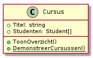

# Oefeningen

## Richtlijnen

### Structuur oefeningen

Vanaf hier veronderstellen we dat je in één groot project werkt dat één klasse `Program` heeft. Deze klasse heeft een `Main` methode die een keuzemenu opstart. Oefeningen rond eenzelfde topic worden \(statische\) methodes van één klasse met een methode `ToonSubmenu`, die je een menu toont van alle oefeningen over dat topic en die je toestaat een oefening naar keuze te testen. Dit wordt uitgelegd in de eerste oefening.

## Oefening: H10-voorbereiding

### Leerdoelen

* een ordelijke menustructuur voor je code voorzien

### Functionele analyse

We willen dat we alle oefeningen die we in dit vak maken op een ordelijke manier kunnen opstarten. We doen dit door een keuzemenu met twee niveaus te voorzien: de gebruiker kan elke reeds geschreven oefening uitvoeren door eerst het algemene onderwerp aan te geven en vervolgens de specifieke oefening.

### Technische analyse

* Laat in je Main methode een lijst van alle topics zien waarover oefeningen gemaakt zijn. In het begin is dit enkel `DateTime`. De gebruiker kan een topic aanduiden door een nummer in te geven, want voor elk topic staat ook een nummer.
* Gebruik een switch op de gebruikersinput om te bepalen van welk topic de `ToonSubmenu` methode moet worden opgeroepen. Deze methode heeft return type `void` en geen parameters.
* Voorzie een eerste klasse, `DateTimeOefeningen`, met deze methode `ToonSubmenu`. Totdat je oefeningen hebt om te demonstreren, toont `ToonSubmenu` gewoonweg de tekst `"Er zijn nog geen oefeningen over dit topic"`.
* Indien er wel oefeningen zijn \(deze oefening moet je dus updaten naarmate je vordert\), wordt elke reeds geprogrammeerde oefening genummerd en getoond en kan de gebruiker kiezen om deze uit te voeren.
* Nadat een oefening getest is, kan je opnieuw een topic en een oefening kiezen. Het programma eindigt nooit.

#### Voorbeeldinteractie


Dit is maar een voorbeeld! De getoonde topics en oefeningen gaan afhangen van wat je al gedaan hebt.


```text
Welkom bij de demo Objectgeoriënteerd Programmeren!
Topic van de uit te voeren oefening?
1. DateTime
2. Properties en access modifiers
> 1
Uit te voeren oefening?
1. H10-dag-van-de-week
2. H10-ticks-sinds-2000
3. H10-schrikkelteller
> 2
Sinds 1 januari 2000 zijn er (...) ticks voorbijgegaan.
Topic van de uit te voeren oefening?
(...)
```

## Oefening: H10-dag-van-de-week

### Leerdoelen

* aanmaken van `DateTime` objecten
* formatteren van `DateTime` objecten

### Functionele analyse

We willen voor een willekeurige datum kunnen bepalen welke dag van de week het is.

### Technische analyse

* je moet eerst de dag, maand en jaar opvragen en een `DateTime` aanmaken
* daarna moet je laten zien over welke dag van de week het gaat
  * gebruik hiervoor formattering van een `DateTime`
  * laat ook de datum zelf zien in een formaat dat leesbaar is voor de gebruiker
  * als je computer niet volledig ingesteld is op Belgisch Nederlands, kan het resultaat er wat anders uitzien.
* maak deze methode toegankelijk via `ToonSubmenu` van de klasse `DateTimeOefeningen`
* noem de methode waarin je dit schrijft `WeekdagProgramma`

### Voorbeeldinteractie

```text
Welke dag?
> 14
Welke maand?
> 2
Welk jaar?
> 2020
14 februari 2020 is een vrijdag.
```

## Oefening: H10-ticks-sinds-2000

### Leerdoelen

* aanmaken van `DateTime` objecten

### Functionele analyse

We willen weten hoe veel fracties van een seconde al verlopen zijn sinds het begin van de jaren 2000.

### Technische analyse

* .NET stelt deze fracties \(1 / 10000 milliseconden\) voor als "ticks"
* We willen weten hoe veel ticks er voorbijgegaan zijn sinds het absolute begin van het jaar 2000
* maak deze methode toegankelijk via `ToonSubmenu` van de klasse `DateTimeOefeningen`
* Noem de methode waarin je dit schrijft `Ticks2000Programma`

### Voorbeeldinteractie

```text
Sinds 1 januari 2000 zijn er (hier wordt het aantal getoond) ticks voorbijgegaan.
```

## Oefening: H10-schrikkelteller

### Leerdoelen

* gebruik van een statische methode

### Functionele analyse

We willen bepalen hoe veel schrikkeljaren er zijn tussen 1799 en 2021.

### Technische analyse

* implementeer zelf geen logica voor schrikkeljaren, maar laat dit over aan de klassen `DateTime`
* maak gebruik van een statische methode van deze klasse
* maak deze methode toegankelijk via `ToonSubmenu` van de klasse `DateTimeOefeningen`
* noem je methode `SchrikkeljaarProgramma`

### Voorbeeldinteractie

```text
Er zijn (hier wordt het aantal getoond) schrikkeljaren tussen 1799 en 2021.
```

## Oefening: H10-simpele-timing

### Leerdoelen

* eenvoudig code leren timen
* gebruiken van `DateTime`
* herhaling arrays

### Functionele analyse

We zijn benieuwd hoe lang het duurt een array van 1 miljoen `int`s te maken en op te vullen met de waarden 1,2,...

### Technische analyse

* Bepaal het tijdstip voor en na aanmaken van de array.
* Vul de array in met een `for`-lus.
* maak deze methode toegankelijk via `ToonSubmenu` van de klasse `DateTimeOefeningen`
* Noem de methode waarin je dit schrijft `ArrayTimerProgramma`

### Voorbeeldinteractie

```text
Het duurt (hier wordt het aantal getoond) milliseconden om een array van een miljoen elementen aan te maken en op te vullen met opeenvolgende waarden.
```

## Oefening: H10-verjaardag-v2

Leerdoelen

* leren werken met objecten
* gebruik maken van properties en methodes

### Functionele analyse

We zullen het programma uit om het aantal dagen tot een verjaardag te bepalen \(uit de theorie\) aanpassen zodat het aantal dagen tot de volgende verjaardag wordt getoond. Dit betekent dat er nooit 0 dagen tot een verjaardag zijn, maar in extreme gevallen duizenden dagen kunnen over gaan \(bijvoorbeeld: van 29 februari 1996 tot 29 februari 2004\).

### Technische analyse

Je moet één geval toevoegen, namelijk het geval waarin het oude programma 0 dagen tot de volgende verjaardag zou geven.

Noem je methode `VerjaardagProgramma`. Maak deze methode toegankelijk via `ToonSubmenu` van de klasse `DateTimeOefeningen`

## Oefening: H10-Getallencombinatie

### Leerdoelen

* werken met klassen en objecten
* instantieattributen
* instantiemethoden

### Functionele analyse

Dit programma geeft op basis van de input van twee getallen de som van beide getallen, het verschil, het product en de deling. In het laatste geval en indien er een deling door nul zou worden uitgevoerd, wordt dit woordelijk weergegeven.

### Technische analyse

Voorzie voor volgende oefening eerst een nieuwe submenuklasse met als naam `EigenObjectOefeningen`.

Maak een eigen klasse `GetallenCombinatie` in een eigen file, `GetallenCombinatie.cs`. Deze klasse bevat 2 getallen \(type `int`\). Er zijn 4 methoden, die allemaal een `double` teruggeven:

* `Som`: geeft som van beide getallen weer
* `Verschil`: geeft verschil van beide getallen weer
* `Product`: geeft product van beide getallen weer
* `Quotient`: geeft deling van beide getallen weer. Print `"Fout"` naar de console indien je zou moeten delen door 0 en voer dan de deling uit. Wat er dan gebeurt, is niet belangrijk.

Gebruik `public` attributen `Getal1` en `Getal2`. Plaats onderstaande code in een publieke statische methode van `EigenObjectOefeningen` met naam `DemonstreerOperaties` met return type `void`:

```csharp
GetallenCombinatie paar1 = new GetallenCombinatie();
paar1.Getal1 = 12;
paar1.Getal2 = 34;
Console.WriteLine("Paar:" + paar1.Getal1 + ", " + paar1.Getal2);
Console.WriteLine("Som = " + paar1.Som());
Console.WriteLine("Verschil = " + paar1.Verschil());
Console.WriteLine("Product = " + paar1.Product());
Console.WriteLine("Quotient = " + paar1.Quotient());
```

Zorg dat je `DemonstreerOperaties` kan oproepen via het submenu van `EigenObjectOefeningen`.

#### Voorbeeldinteractie\(s\)

```text
Paar: 12, 34
Som = 46
Verschil = -22
Product = 408
Quotient = 0,352941176470588
```

## Oefening: H10-StudentKlasse


Deze oefening veronderstelt dat je de theoriefilmpjes hebt gevolgd en dat je daar de klasse `Student` al hebt aangemaakt in een SchoolAdmin project.


### Leerdoelen

* werken met klassen en objecten
* opstart van het project

### Functionele analyse

Dit programma vraagt om de naam en leeftijd van een student. Vervolgens worden de punten voor 3 vakken gevraagd, waarna het gemiddelde wordt teruggegeven.

### Technische analyse

Breid je klasse Student uit met een tweede array `CursusResultaten`. Voorzie ook een methode `Kwoteer` om een cijfer aan een cursus met een bepaalde index toe te kennen. Signaleer ongeldige waarden met een `Console.WriteLine("Ongeldig cijfer!")`. Je kan ook nooit een cijfer boven 20 behalen.

Voeg aan de klasse een methode `Gemiddelde()` toe. Deze berekent het gemiddelde van de niet-`null` cursussen als `double`.

Voeg ook een methode `ToonOverzicht` toe, die de persoonsgegevens en behaalde cijfers voor elke student toont. Kijk naar de voorbeeldinteractie voor de juist voorstellingswijze.

Test je programma door een statische methode \(in de klasse `Student`\), `DemonstreerStudenten` te voorzien, die twee studenten aanmaakt via variabelen `student1`, `student2`. Elke student is ingeschreven voor minstens drie vakken die je zelf kiest en krijgt een geldig cijfer \(naar keuze\) voor elk vak, een naam en een geldige leeftijd. Vervolgens wordt van elke student de `ToonOverzicht`-methode opgeroepen. In je `Main`-methode voorzie je een \(niet-genest\) keuzemenu dat vraagt wat je wil doen en op dit moment is de enige optie `DemonstreerStudenten` uitvoeren.

Een overzicht van de klasse na al deze wijzigingen:


Voorbeeldcode om de eerste student aan te maken:

```csharp
Student student1= new Student();
student1.Geboortedatum = new DateTime(2001,1,3);
student1.Naam = "Said Aziz";
student1.RegistreerVoorCursus("Communicatie");
student1.CursusResultaten[0] = 12;
student1.RegistreerVoorCursus("Programmeren");
student1.CursusResultaten[1] = 15;
student1.RegistreerVoorCursus("Webtechnologie");
student1.CursusResultaten[2] = 13;
student1.ToonOverzicht();
```

#### Voorbeeldinteractie\(s\)

```text
Wat wil je doen?
1. DemonstreerStudenten uitvoeren
> 1
Said Aziz, 20 jaar

Cijferrapport:
**********
Communicatie:             12
Programmeren:             15
Webtechnologie:           13
Gemiddelde:               13.3

Mieke Vermeulen, 21 jaar

Cijferrapport:
**********
Communicatie:             13
Programmeren:             16
Databanken:               14
Gemiddelde:               14.3
```


Commit je aanpassingen na deze oefening!


## Oefening: H10-Cursus


Deze klasse hoort bij het SchoolAdmin project.


### Leerdoelen

* werken met klassen en objecten
* opstart van het project
* arrays van objecten maken

### Functionele analyse

We zullen studenten groeperen in cursussen. Bij elke cursus horen op dit moment exact twee studenten.

### Technische analyse

Werk verder in het SchoolAdmin project. Maak in dit nieuw project een nieuwe klasse `Cursus` in een file `Cursus.cs`. Deze klasse heeft twee attributen: `Studenten` en `Titel`. `Studenten` is een array van `Student`-objecten. De initiële waarde voor dit attribuut is een array met een capaciteit van 2 studenten. `Titel` is gewoonweg een `string`. `Cursus` heeft ook een methode `ToonOverzicht` die de titel van de cursus toont, gevolgd door de namen van alle studenten die de cursus volgen.

Test je programma door een statische methode \(in de klasse `Cursus`\), `DemonstreerCursussen` te voorzien, die vier cursussen \("Communicatie", "Databanken", "Programmeren" en "Webtechnologie"\) aanmaakt via variabelen `communicatie`, `programmeren`, `webtechnologie` en `databanken`. Maak ook twee studenten aan \(dezelfde als in `DemonstreerStudenten`\) en maak hen lid van de cursussen waarvoor ze een cijfer hebben \(zie voorbeeldinteractie van de vorige oefening\). Toon tenslotte voor elke cursus het overzicht via `ToonOverzicht`. De methode `DemonstreerCursussen` kan ook opgeroepen worden via het keuzemenu in `Main`.

Je klasse `Cursus` ziet er uiteindelijk zo uit:



#### Voorbeeldinteractie\(s\)

```text
Wat wil je doen?
1. DemonstreerStudenten uitvoeren
2. DemonstreerCursussen uitvoeren
> 2
Communicatie
Said Aziz
Mieke Vermeulen

Databanken
Mieke Vermeulen

Programmeren
Said Aziz
Mieke Vermeulen

Webtechnologie
Said Aziz
```


Commit je aanpassingen!


## Oefening: H10-CursusResultaat

### Leerdoelen

* wegwerken gesynchroniseerde arrays
* encapsulatie
* access modifiers

### Functionele analyse

De eerdere oefening H10-StudentKlasse gebruikte gesynchroniseerde arrays. We willen deze wegwerken.

### Technische analyse

Voorzie een klasse CursusResultaat met twee velden: `Naam` en `Resultaat`. Het eerste stelt de naam van de cursus voor, het tweede het behaalde resultaat.

Vervang vervolgens de arrays `cursussen` en `CursusResultaten` door één `private` array van objecten van deze nieuwe klasse met naam `cursusResultaten`. Vervang `RegistreerVoorCursus` door `RegistreerCursusResultaat` om dit mogelijk te maken \(met een parameter voor de naam en een parameter voor het cijfer\). `DemonstreerStudenten` moet identiek dezelfde uitvoer blijven produceren als tevoren.


Deze oefening vraagt om veel aanpassingen, maar ze zijn niet zo groot. Hou vooral je hoofd erbij en denk goed na over hoe je elk fout gemarkeerd stukje code kan herschrijven wanneer je de oude arrays hebt verwijderd.



Commit je aanpassingen!


## Oefening: H10-Figuren

### Leerdoelen

* werken met klassen en objecten
* gebruik maken van properties om geldige waarden af te dwingen

### Functionele analyse

Dit programma maakt enkele rechthoeken en driehoeken met gegeven afmetingen \(in meter\) aan, berekent hun oppervlakte en toont deze info aan de gebruiker. De rechthoeken en driehoeken die worden aangemaakt, zijn al gecodeerd in het programma. De gebruiker hoeft dus niets anders te doen dan het programma te starten.

### Technische analyse

Er is een klasse `Rechthoek` met **full properties** `Breedte` en `Hoogte` en een klasse `Driehoek` met `Basis` en `Hoogte`. Je programma maakt de figuren die hierboven beschreven worden aan met beginwaarde `1.0` voor elke afmeting en stelt daarna hun afmetingen in via de setters voor deze properties. De oppervlakte wordt bepaald in een read-only property \(dus met alleen een getter en geen setter\). Deze heet `Oppervlakte` en is van het type `double`.

Indien om het even welk van deze properties wordt ingesteld op `0` of minder, signaleer je dit via de code `Console.WriteLine($"Het is verboden een (afmeting) van (waarde) in te stellen!")` \(zie voorbeeldcode\).


De wiskundige formule voor de oppervlakte van een driehoek is basis \* hoogte / 2.


Schrijf de voorbeelden uit in een `static` methode `DemonstreerFiguren` van de klasse `EigenObjectOefeningen`.

#### Voorbeeldinteractie\(s\)

\(Er worden twee rechthoeken en twee driehoeken aangemaakt. De afmetingen van de eerste rechthoek worden eerst op `-1` en `0` ingesteld. Daarna krijgen ze de waarden die je ziet in het bericht hieronder. Formatteer ook met 1 cijfer na de komma.\)

```text
Het is verboden een breedte van -1 in te stellen!
Het is verboden een breedte van 0 in te stellen!
Een rechthoek met een breedte van 2,2m en een hoogte van 1,5m heeft een oppervlakte van 3,3m².
Een rechthoek met een breedte van 3m en een hoogte van 1m heeft een oppervlakte van 3m².
Een driehoek met een basis van 3m en een hoogte van 1m heeft een oppervlakte van 1,5m².
Een driehoek met een basis van 2m en een hoogte van 2m heeft een oppervlakte van 2m².
```
