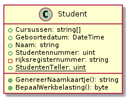

# Access modifiers


[Kennisclip](https://youtu.be/q__6UaGtNGs). Bevat niet-uitgeschreven voorbereiding op het labo.


**Access modifiers** bepalen welke code door welke andere code mag worden uitgevoerd of aangepast. We hebben al een aantal dingen `public` gemaakt bij wijze van demonstratie. Dit is handig om voorbeeldjes te tonen, maar in code van hoge kwaliteit, denk je grondig na voor je dit doet.

## Public en private access modifiers

De **access modifier** geeft aan hoe zichtbaar een bepaald deel van de klasse is **voor code buiten de klasse zelf**. Wanneer je niet wilt dat "van buitenuit" \(bv in `Main`, terwijl je een andere klasse dan `Program` schrijft\) een bepaalde methode kan aangeroepen worden, dan dien je deze als `private` in te stellen. Wil je dit net wel dat moet je er expliciet `public` voor zetten.

Test in de voorgaande klasse `Auto` eens wat gebeurt wanneer je `public` verwijdert voor een van de methodes. Inderdaad, je krijgt een foutmelding. Lees deze. Ze zegt dat de methode die je wil oproepen wel bestaat, maar niet gebruikt mag worden. **Dat komt omdat je testcode in de klasse `Program` staat en je methode deel uitmaakt van een andere klasse \(meerbepaald `Auto`\).**

Als je duidelijk wil maken dat bepaalde code niet van buitenaf aangeroepen kan worden, schrijf dan `private` in plaats van `public`. Er zijn nog tussenliggende niveaus waar we later op ingaan en als je geen van beide modifiers schrijft, kan het zijn dat je code op zo'n tussenliggend niveau terecht komt. Als beginnende programmeur maak je er best een gewoonte van duidelijk te kiezen voor `public` of `private`.

## Reden van private

Waarom zou je bepaalde zaken `private` maken? Het antwoord is opnieuw encapsulatie.

Neem als voorbeeld de kilometerstand. Het is wettelijk verboden een kilometerstand zomaar aan te passen. Hij mag alleen veranderen doordat er met een auto gereden wordt. Dan is het logisch dat dit ook alleen maar op deze manier kan voor onze auto-objecten. We kunnen dit realiseren door `kilometers` van `public` naar `private` te wijzigen. Dan kunnen we de kilometerstand nog wijzigen, maar enkel door de \(publieke\) methode `Rijden` te gebruiken. Als we hem dan nog willen kunnen bekijken \(maar niet rechtstreeks wijzigen\), kunnen we een extra \(publieke!\) methode `ToonKilometerstand` voorzien.


Volgens de conventie maken we dan van de grote "K" in `kilometers` een kleine "k", omdat publieke members met Pascal case genoteerd worden en private members met camel case.



De richtlijnen rond naamgeving van Microsoft met betrekking tot attributen, methoden,... vind je [hier](https://docs.microsoft.com/en-us/dotnet/standard/design-guidelines/capitalization-conventions) terug.


We kunnen ook methoden `private` maken. Dit gebeurt niet zo vaak als bij attributen, maar het kan wel. Dit doen we bijvoorbeeld als het gaat om een hulpmethode die binnen de klasse nuttig is, maar buiten de klasse fout gebruikt zou kunnen worden. Een typisch voorbeeld: een stukje code dat letterlijk herhaald wordt in twee of meer verschillende publieke methoden. In plaats van deze code te kopiëren, zonderen we ze af in een hulpmethode. Zo hoeven we eventuele bugfixes,... geen twee keer te doen.


Een studente vroeg in een van de afgelopen jaren: "Kunnen we niet gewoon afspreken dat we van sommige zaken afblijven?" In principe wel. Python doet het min of meer zo. Langs de andere kant: als wij meedelen dat de examenvragen op een publieke website staan en dat je er niet naartoe mag surfen, zou niemand dat dan doen? Private velden aanpassen kan soms een goed idee lijken op korte termijn, maar een project saboteren op langere termijn.


## Voorstelling

In de diagrammen die wij in deze cursus gebruiken, stellen we publieke attributen voor met een bolletje en private attributen \(als we die al tekenen, wat niet altijd gedaan wordt\) met een vierkantje. Deze zaken zijn leeg voor attributen en opgevuld voor methodes. Zie hieronder voor een voorbeeld \(je hoeft het rijksregisternummer niet te implementeren in `Student`, volg alleen wat in de kennisclip gebeurt\):


Andere software stelt dit ook anders voor. Ken de afspraken voor jouw diagrammen!


