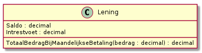

# Klassen en objecten weergeven deel 1


[Kennisclip](https://youtu.be/IS8jpkYF-X0)


## Klassen voorstellen

De data en functionaliteit van een klasse, en ook haar relatie tot andere klassen, wordt vaak voorgesteld in een **UML-klassendiagram**. Hoe je verschillende klassen met elkaar verbindt, houden we voor iets verderop. Ook enkele andere details volgen later. Wat we wel al kunnen vertellen:

* elke klasse wordt voorgesteld als een rechthoek, met bovenaan in die rechthoek de naam van de klasse
* in een tweede vakje worden dan de eigenschappen gegeven, gewoonlijk met hun datatype
* in een derde vakje worden dan de methoden gegeven, met hun parameters en hun returntype


Het (return) type kan voor de naam van een attribuut of methode staan (zoals in C#), of het kan helemaal achteraan staan, voorafgegaan door een dubbele punt (zoals in TypeScript).


### Voorbeeld 1: Lening

Dit vertelt ons dat een object van klasse `Lening` beschikt over een saldo en een intrestvoet en het vertelt ons ook welke datatypes we gebruiken om deze voor te stellen. Bovendien kan een `Lening` zelf bepalen hoe veel we in totaal zullen moeten betalen als we elke maand een vast bedrag aflossen.  Dit is functionaliteit van het object, die we zullen implementeren met een instantiemethode.

### Voorbeeld 2: Auto

Dit vertelt ons dat elke `Auto` een eigen kilometerstand, bouwjaar en huidige snelheid heeft. Het is mogelijk de `Auto` te laten starten en om hem te laten versnellen met een geven aantal kilometer per uur.

## Objecten voorstellen

Een UML-klassendiagram dient voor... klassen. Als je wil kijken naar objecten, gebruik je een **sequentiediagram**. We gaan hier nog niet erg diep op in, maar we maken alvast duidelijk dat je **op een klassendiagram geen objecten** ziet.

Een voorbeeld van een sequentiediagram voor een programma dat twee leningen aanmaakt (bijvoorbeeld een programma in een bank om een simulatie te maken voor een klant):

Het figuurtje met als naam `ExterneCode` stelt iets voor dat ons eigenlijk niet interesseert. Wat de pijlen en de berichten daarop technisch betekenen, maakt voorlopig ook niet zo uit. Het belangrijkste hier is dat er twee objecten van de klasse `Lening` zijn. Dit wordt extra in de verf gezet omdat ze twee verschillende namen hebben (`lening1` en `lening2`), maar allebei hetzelfde type na de dubbele punt (`Lening`). Op een klassediagram ga je nooit twee keer een box voor dezelfde klasse zien.
