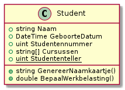

# Methoden


[Kennisclip](https://youtu.be/Wuk9G1\_JMWc)


**Instantiemethoden**, ook **objectmethoden** genoemd, weerspiegelen staan toe om functionaliteit toe te voegen aan objecten van een bepaalde klasse. Soms wordt ook gezegd dat ze "**gedrag**" van de objecten voorzien. Ze verschillen van statische methoden omdat ze niet alleen gebruik kunnen maken van statische onderdelen van klassen, maar ook van het object waar ze zelf bij horen.


Methoden behoren tot een algemenere categorie onderdelen van objecten genaamd **members**.


## Basisvoorbeelden

We gaan verder met de klasse `Auto`. We willen bijvoorbeeld een applicatie voor de opvolging van deelauto's (Cambio, Poppy, etc.) schrijven. Er zijn verschillende soorten functionaliteit die je kan koppelen aan één auto:

* voltanken
* rijden
* op onderhoud gaan
* verkoopsprijs bepalen


Is het de auto die deze zaken doet, of is het een persoon? In werkelijkheid is het natuurlijk dat laatste. Maar de functionaliteit is wel veel sterker gelinkt aan auto's dan aan personen en misschien interesseert de persoon die de handeling uitvoert ons niet eens.


Je doet dit met objectmethoden. Deze lijken erg op `static` methoden, maar ze hebben toegang tot het object waarop ze zijn toegepast.

Een simpele implementatie van dit gedrag zie je hier:

```csharp
class Auto {

    // objectvariabelen van eerder zijn er nog

    public void Voltanken()
    {
        Benzine = 50.0; // we veronderstellen even dat dat het maximum is
    }

    public void Rijden(int aantalKilometers)
    {
        Kilometers += aantalKilometers;
        Benzine -= 5.0 * (aantalKilometers/100.0);
    }

    public void Onderhouden()
    {
        LaatsteOnderhoud = DateTime.Now;
    }

    public double VerkoopsprijsBepalen()
    {
        return Math.Max(10000 * (1 - Kilometers / 200000.0),1000);
    }
}
```


Bovenstaande code is kort om didactische redenen. Er wordt niet gecontroleerd dat je benzinepeil altijd minstens 0l is, er wordt verondersteld dat de capaciteit van je tank 50l is,...



Voor de duidelijkheid kan je het woordje `this` toevoegen om het huidige object expliciet voor te stellen. Het wordt sterk aangeraden dat je dit doet. Je code wordt er beter leesbaar door.


## Gebruik

Om een objectmethode te gebruiken, hebben we een object nodig. We schrijven dan de naam van het object, gevolgd door een punt en een methodeoproep.

```csharp
// in Program.cs
public static void DemonstreerAttributen() {
    Auto auto1 = new Auto();
    Auto auto2 = new Auto();
    auto1.Voltanken();
    auto1.Rijden(5);
    auto1.Rijden(10);
    auto1.Rijden(20);
    Console.WriteLine(auto1.Kilometers);
    Console.WriteLine(auto2.Kilometers);
}
```

Het gedrag van een object kan afhangen van de waarde van de instantievariabelen. Zo zal de verkoopswaarde van `auto1` iets lager liggen dan die van `auto2`. Dat komt omdat `this.Kilometers` deel uitmaakt van de berekening van de verkoopsprijs. Ook dit valt onder het principe van **encapsulatie**: er vindt een berekening plaats "onder de motorkap". We hoeven niet te weten hoe de prijs berekend wordt, elk object weet van zichzelf hoe het de prijs berekent.

## `static` methodes

Een statische methode is een methode die wel bij de klasse hoort, maar niet te maken heeft met een specifiek object van die klasse. We gebruiken terug de euronorm als voorbeeld:

```csharp
enum MilieuNormen {
    Euro1, Euro2, Euro3
}

class Auto {
    public static MilieuNormen HuidigeNorm;
    // rest van de code voor Auto
    public static void VerklaarNorm(MilieuNormen norm) {
        int jaartal;
        double CO;
        switch (norm) {
            case MilieuNormen.Euro1:
                jaartal = 1992;
                CO = 1.0;
                break;
            case MilieuNormen.Euro2:
                jaartal = 1996;
                CO = 1.0;
                break;
            case MilieuNormen.Euro3:
                jaartal = 2000;
                CO = 0.64;
                break;
            default:
                jaartal = -1;
                CO = -1;
                break;
        }
        Console.WriteLine($"Geïntroduceerd in {jaartal}");
        Console.WriteLine($"{CO} gram CO per km");
    }
}
```

## SchoolAdmin project

We breiden onze klasse `Student` uit zodat ze overeenstemt met volgend diagram:



### Toevoegen naamkaartje

Het naamkaartje is een stuk tekst, bestaande uit de naam van de student, gevolgd door `(STUDENT)`.

### Toevoegen werkbelasting

Dit is 10u per week per cursus.

Push je vooruitgang naar Gitlab!
