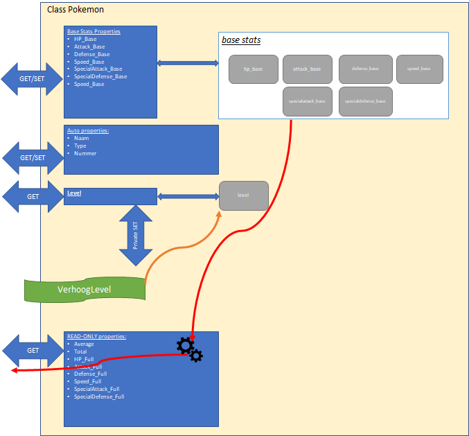

# Oefeningen

We gaan een programma schrijven dat ons toelaat enkele basis-eigenschappen van specifieke Pokémon te berekenen terwijl ze levellen. Nadruk van deze oefening is het juist gebruiken van properties. Bekijk de cheat sheet bij twijfel.

> Disclaimer: de informatie in deze tekst is een vereenvoudigde versie van de echte Pokémon-stats in de mate dat ik het allemaal een beetje kon begrijpen en juist interpreteren.

## Hoe Pokémon werken

Korte uitleg over Pokémon en hun interne werking: Iedere Pokémon wordt uniek gemaakt door z’n base-stats, deze zijn voor iedere Pokémon anders. Deze base-stats \(punt 3\) zijn onveranderlijk en blijven dus doorheen het hele leven van een Pokémon dezelfde. Je kan de base-stats als het dna van een Pokémon beschouwen.

De full-stats \(punt 9\) zijn echter de stats die de effectieve ‘krachten’ van een Pokémon bepalen in een gevecht. Deze stats worden berekend gebaseerd op de vaste base-stats en het huidige level van de Pokémon. Hoe hoger het level van de Pokémon, hoe hoger dus zijn full-stats.



## De Pokémonopdracht

Maak een consoleapplicatie met daarin een klasse Pokémon die de werking zoals hierboven beschreven heeft:

### Base-stats

De base-stats worden als ints bewaard. Maak voor al deze basis-eigenschappen full properties, namelijk:

* HP\_Base
* Attack\_Base
* Defense\_Base
* SpecialAttack\_Base
* SpecialDefense\_Base
* Speed\_Base

### Extra stats

Voorts wordt een Pokémon ook gedefinieerd door z’n naam \(string\) ,type \(string, bv "grass & poison"\) en nummer \(int\), maak hiervoor auto properties aan.

### Level

Voeg een fullproperty Level toe\(type int\). Deze heeft een public get, maar een private setter.

Voeg een publieke methode "VerhoogLevel" toe. Deze methode zal , via de private setter van Level \(zie vorig punt\), de level van de Pokémon met 1 verhogen. Deze methode heeft géén parameters nodig en return niets.

### Statistieken

Voeg 2 read-only properties toe \(enkel get, géén set\) genaamd "Average" en "Total":

* De Average-property geeft het gemiddelde van de 6 base-stats terug , dus `(HP_Base + Attack_Base + Defense_Base + SpAttack_Base + SpDefense_Base +Speed_Base)/6`.
* De Total-property geeft de som terug van de 6 basestats. Daar de base stats niet evolueren met het level veranderen dus `Average` en `Total` ook niet van zodra de base-stats werden ingesteld, toch mag je beide statistieken steeds herberekenen in de get.

### Level-gebaseerde stats

De eigenschappen van de Pokémon die mee evolueren met het leven gaan we steeds als read-only property implementeren:

* Voeg een read-only HP\_Full property \(int\) toe om de maximum health voor te stellen. Deze wordt berekend als volgt: `(( (HP_Base + 50 ) * Level ) / 50 ) + 10` \(noot: dit is een benadering van hoe het bij "echte" Pokémon is \).
* Voeg voor iedere base-stat een full-stat toe \(int\). Dus Defense\_Full, Speed\_Full, etc. Ook deze properties zijn readonly. Deze stats worden berekend als volgt: `( (stat_Base*Level) / 50 ) + 5`. Attack\_Full bijvoorbeeld wordt dus berekend als: `((Attack_Base*Level)/50)+5`

### Maak enkele Pokémon

Kies enkele Pokémon uit [deze lijst](https://bulbapedia.bulbagarden.net/wiki/List_of_Pok%C3%A9mon_by_base_stats) en maak in je Main enkele Pokémon-objecten aan met de juiste eigenschappen.

Opgelet: **Je dient dus enkel de base stats in te stellen. Alle andere zaken zijn op deze stats en het huidige level van de Pokémon gebaseerd**.

Toon aan dat de Average, Total , HP en andere stats correct berekend worden \(controleer in de tabel op de voorgaande url\).

#### Level-up tester

Maak een kleine loop die je toelaat om per loop een bepaalde Pokémon z’n level met 1 te verhogen en vervolgens toon je dan z’n nieuwe stats.

1Test eens hoe de stats na bv 100 levels evolueren. Je zal zien dat bepaalde stats pas na een paar keer levelen ook effectief beginnen stijgen.

**Voeg extra functionaliteit naar keuze toe**

## Deel 2: De Pokémontester

> vergelijk je oplossing uit het vorige deel [met volgende oplossing](https://github.com/v-nys/cursusprogrammeren/tree/13ea122a2e92d805feb8b618811589d4f57a8b23/assets/6_klassen/Pokemon.cs).

Het is een heel gedoe om telkens manueel de informatie van een Pokémon op het scherm te outputen. Voeg een methode `public void ShowInfo()` toe aan je Pokemon klasse. Deze methode zal alle relevante informatie \(alle properties!\) in een mooie vorm op het scherm tonen, bv:

```text
Pikachu (level 5)
Base stats:
    * Health = 56
    * Speed = 30
    etc
Full stats:
    * Health = 100
    etc.
```

Maak nu een nieuwe console-applicatie genaamd "Pokémon Tester":

1. Voeg je Pokemon-klasse-bestand toe aan dit project. Verander de "namespace" van dit bestand naar de namespace van je nieuwe console-applicatie  \(zie "Aanpassen van klasse" in [volgende uitleg](https://codevan1001nacht.wordpress.com/2013/11/06/werken-met-klassen-in-visual-studio/)\)
2. Maak enkele Pokémon objecten aan en stel hun base stats in.
3. Schrijf een applicatie die aan de gebruiker eerst de 6 base-stats vraagt. Vervolgens wordt de Pokémon aangemaakt met die stats en worden de full-stats aan de gebruiker getoond
4. Vraag nu aan de gebruiker tot welke level de Pokémon moet gelevelled worden. Roep zoveel keer de LevelUp-methode aan van de Pokémon. \(of kan je dit via een parameter doorgeven aan LevelUp?!\)
5. Toon terug de full-stats van de nu ge-levelde Pokémon

## Deel 3: Pokémon-battler

### Pokémon generator

Maak een methode met volgende signatuur: `static Pokemon GeneratorPokemon()`. Plaats deze methode niét in je Pokémon-klasse, maar in Program.cs.

Deze methode zal telkens een Pokémon aanmaken met willekeurige base-stats. Bepaal zelf hoe je dit gaat doen.

### Battle tester

Voeg een methode met volgende signatuur toe aan je hoofdprogramma \(dus ook weer in Program.cs\): `static int Battle(Pokemon poke1, Pokemon poke2)`.

De methode zal een getal teruggeven dat aangeeft welke van de twee Pokémons een gevecht zou winnen. 1= poke1, 2 = poke2, 0 = gelijke stand.

Controleer steeds of 1 of beide van de meegegeven Pokémons niet `null` zijn. Indien er 1 `null` is dan wint uiteraard de andere. Indien allebei `null` wint niemand \(dus return je 0\). Test of dit werkt!

Bepaal zelf hoe Pokémons vechten \(bv degene met de hoogste average van full-stats\). Werk niet enkel met de base-stats, daar deze constant zijn. Het is leuker dat het level ook een invloed heeft \(maar ga niet gewoon het level vergelijken\)

### Alles samen

Genereer 2 willekeurige Pokémons met je generator en laat ze vechten met je battle-methode. Toon wat output aan de gebruiker zodat hij ziet wat er allemaal gebeurt \(en gebruik zeker de `ShowInfo` methode om dit snel te doen\). Kan je dit in een loop zetten en wat leuker maken met Pokémons die telkens levelen als ze een gevecht winnen?!

