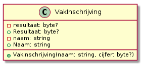
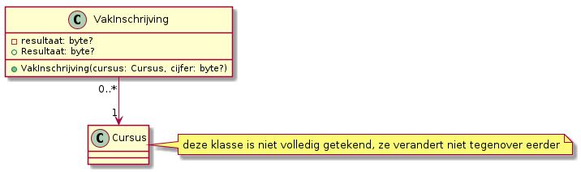

# Labo

## SchoolAdmin project: alle cursussen opvolgen

### Functionele analyse

We willen een lijst bijhouden met alle objecten van de klasse `Cursus`. Zorg dat deze lijst automatisch wordt ingevuld.

### Technische analyse

Voorzie op klasseniveau een array met plaats voor 10 `Cursus` objecten en noem hem `AlleCursussen`. Zorg ervoor dat een cursus bij aanmaak in de eerste vrije positie in deze array wordt geplaatst. Schrijf hiervoor een private hulpmethode `registreerCursus(Cursus cursus)`. Deze kan je uitvoeren zonder bestaand `Cursus` object. Ze gaat op zoek naar de eerste vrije positie in de array en slaat `cursus` op op deze positie.

Je kan `registreerCursus` als volgt implementeren:

* start met een variabele `vrijePositie` van type `int?` met waarde `null`
* controleer één voor één de posities in de array
  * onthoud de eerste positie waarop je `null` tegenkomt
* controleer nadat de array doorlopen is of er nog een vrije positie is
  * zo ja, sla de cursus daar op
  * zo nee, print `"Er zijn geen vrije posities meer"`


Commit je aanpassingen.


## SchoolAdmin project: cursussen opzoeken op Id

### Functionele analyse

We willen cursussen makkelijk kunnen opvragen via Id. Schrijf een methode `ZoekCursusOpId` die dit doet.

### Technische analyse

Deze methode werkt op klasseniveau, want je hebt geen cursus nodig om een andere cursus te vinden. Ze heeft één parameter, `id`. Het return type is `Cursus`, maar het kan zijn dat je geen cursus met het gevraagde Id kan terugvinden.

De methode werkt door `AlleCursussen` element per element te doorlopen en de waarde van het attribuut `Id` van elk element te vergelijken met het meegegeven argument. Als de gevraagde cursus niet bestaat, mag je programma niet crashen, maar krijg je `null` terug.


Commit je aanpassingen.


## SchoolAdmin project: gelinkte objecten

### Functionele analyse

Het is niet handig dat onze klasse `VakInschrijving` een cursus voorstelt als string. Dat maakt dat we de functionaliteit van `Cursus` niet kunnen gebruiken. Pas daarom VakInschrijving aan zodat de klasse echt gelinkt is aan `Cursus`. Dit vereist aanpassingen op een aantal plaatsen.

### Technische analyse

Voor de aanpassing heb je dit:



Erna heb je dit:



Controleer ook dat al je testmethodes nog dezelfde resultaten leveren als eerder.


Commit je aanpassingen.


## SchoolAdmin project: Studieprogramma (stap 1)

We wensen cursussen te groeperen in studieprogramma's.

### Functionele analyse

Schrijf een klasse `StudieProgramma`. Deze heeft een naam, bevat een aantal cursussen en kan getoond worden op het scherm.

### Technische analyse

Implementeer als volgt:

.png>)

Gebruik volgende code voor de demonstratiemethode:

```csharp
Cursus communicatie = new Cursus("Communicatie");
Cursus programmeren = new Cursus("Programmeren");
Cursus databanken = new Cursus("Databanken", new Student[7], 5);
Cursus[] cursussen = { communicatie, programmeren, databanken };
StudieProgramma programmerenProgramma = new StudieProgramma("Programmeren");
StudieProgramma snbProgramma = new StudieProgramma("Systeem- en netwerkbeheer");
programmerenProgramma.cursussen = cursussen;
snbProgramma.cursussen = cursussen;
// later wordt Databanken geschrapt uit het programma SNB
snbProgramma.cursussen[2] = null;
programmerenProgramma.ToonOverzicht();
snbProgramma.ToonOverzicht();
```

Hier loopt iets mis. Benoem zelf de oorzaak en corrigeer de fout.


Commit je aanpassing.


## Schooladmin project: Studieprogramma (stap 2)

Zoals boven, maar gebruik nu volgende code voor de demonstratiemethode:

```csharp
Cursus communicatie = new Cursus("Communicatie");
Cursus programmeren = new Cursus("Programmeren");
Cursus databanken = new Cursus("Databanken", new Student[7], 5);
Cursus[] cursussen1 = { communicatie, programmeren, databanken };
Cursus[] cursussen2 = { communicatie, programmeren, databanken };
StudieProgramma programmerenProgramma = new StudieProgramma("Programmeren");
StudieProgramma snbProgramma = new StudieProgramma("Systeem- en netwerkbeheer");
programmerenProgramma.cursussen = cursussen1;
snbProgramma.cursussen = cursussen2;
// later wordt Databanken geschrapt uit het programma SNB
// voor SNB wordt bovendien Programmeren hernoemd naar Scripting
snbProgramma.cursussen[2] = null;
snbProgramma.cursussen[1].Titel = "Scripting";
programmerenProgramma.ToonOverzicht();
snbProgramma.ToonOverzicht();
```

Opnieuw loopt het fout. Benoem zelf de oorzaak en corrigeer de fout.


Commit je aanpassing.

